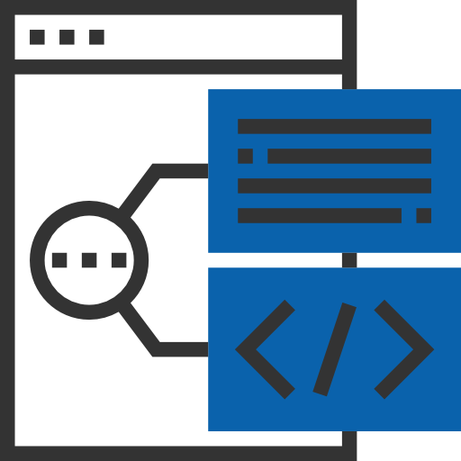
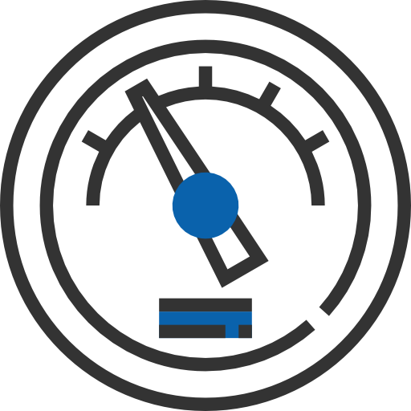
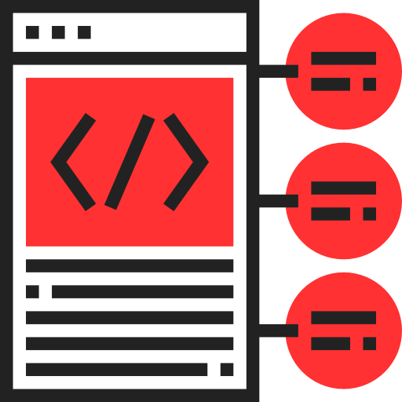
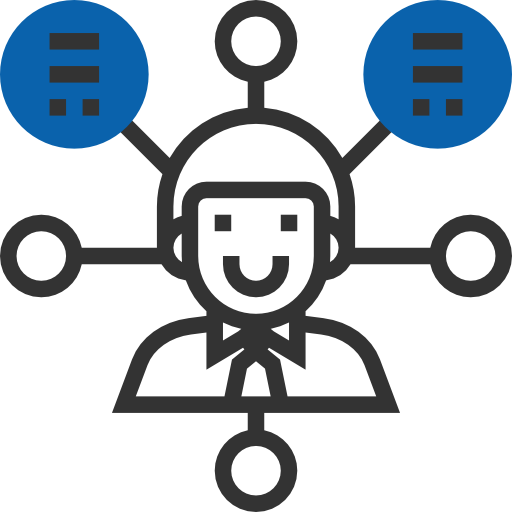
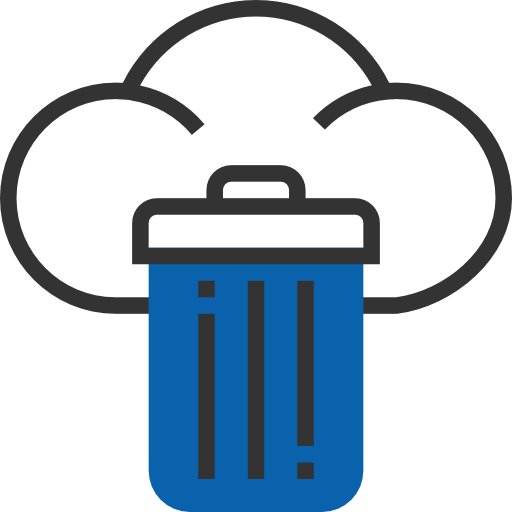

:slug: servicios/hacking-continuo/
:category: servicios
:description: Nuestro servicio de Hacking Continuo busca encontrar todas las vulnerabilidades y reportarlas lo antes posible. A través de la participación en el ciclo de vida de desarrollo, estamos en la capacidad de encontrar vulnerabilidades de forma paralela al desarrollo.
:keywords: FLUID, Servicios, Hacking, Continuo, Vulnerabilidad, Seguridad.
:translate: services/continuous-hacking/

= Hacking Continuo

Las pruebas continuas buscan detectar y reportar todas las vulnerabilidades
y problemas de seguridad de un sistema
durante todo el ciclo de desarrollo del mismo,
nuestra participación durante este ciclo
nos permite detectar vulnerabilidades de seguridad de forma continua
en múltiples versiones del sistema que se está desarrollando
sin reportar falsos positivos,
así como verificar su corrección efectiva
antes de la salida a producción del sistema.

[role="tb-alt"]
[cols=2, frame="none"]
|====

a|== Pruebas antes que exista ambiente

Se puede iniciar con las revisiones de seguridad
desde el inicio del desarrollo,
incluso antes de contar con un ambiente funcional.
Ya que se revisa el código fuente directamente
en el repositorio de código del proyecto.

^.^a|

^.^a|

a|== Tipos de prueba

* *Hacking Continuo Integral:*
Se realizan pruebas de aplicación (ambiente de integración),
infraestructura (si esta como código)
y análisis de código fuente (repositorio en +GIT+).

* *Hacking Continuo Limitado:* Se realizan pruebas de aplicación
o análisis de código fuente
cuando se tiene acceso solo al ambiente de integración
o al código fuente.

a|== Límite de prueba mensual

El alcance mensual para +1+ sistema coherente,
con +1+ equipo funcional y +1+ líder de proyecto,
es hasta +10+ repositorios y +10K+ deltas mes.
En caso de solo contar con el ambiente (aplicación)
el alcance mensual es hasta +10+ entradas nuevas mes.

^.^a|

^.^a|

a|== Cobertura

El propósito es probar la totalidad del sistema
durante el tiempo de la suscripción logrando una cobertura del +100%+.
Es posible finalizar las pruebas de seguridad en paralelo al desarrollo
si estas inician en conjunto con el desarrollo
y mientras el desarrollo no supere las +10K+ deltas al mes.
Cuando se superan las +10K+ deltas hay +2+ opciones:

* Solicitar la revisión de deltas adicionales.

* Desplazar la revisión en el tiempo.
Con esa última opción las pruebas de seguridad
no terminarían en forma paralela al desarrollo.

a|== Healthcheck

Si al iniciar una suscripción ya hay desarrollos previos
es necesario hacer un desatraso o +healthcheck+.
Esto se realiza con el fin de revisar la totalidad de las líneas
o entradas desarrolladas hasta el momento de la toma de la suscripción.
En los primeros +3+ meses se realiza el desatraso
y en los meses siguientes se continúa con la pruebas
de forma paralela al desarrollo
(El +healthcheck+ tendrá un costo adicional a la suscripción).

^.^a|

^.^a|image:img7.png[alt="img7", width="55%"]

a|== Rigurosidad

Es posible que el cliente decida cuáles requisitos de seguridad se revisarán
en el hacking (perfilamiento) a través de nuestro producto
[button]#link:../../productos/rules/[Rules]#.

Además sabrá la rigurosidad exacta del hackeo
(lo revisado y lo no revisado).

a|== Duración

La suscripción se contrata por espacio mínimo de un año

^.^a|

^.^a|

a|== Comunicación directa y ágil

Toda la comunicación del proyecto se hace a través de
[button]#link:../../productos/integrates/[Integrates]#,
mediante las funcionalidades de Chat y de comentarios.

a|== Ambientes de prueba

Es posible elegir un único ambiente de pruebas entre producción,
pruebas e integración con el servicio básico.
También es posible adicionar ambientes
para verificación de cierre de vulnerabilidades por un cargo adicional.

^.^a|

^.^a|

a|== Equipo de hacking altamente calificado

Personal con certificaciones prácticas
y estudios relacionados en temas de seguridad,
realiza pruebas manuales y con herramientas
para garantizar el reporte de vulnerabilidades de impacto específicos del negocio,
prácticas inseguras de programación,
alineación a estándares y regulaciones de seguridad sin falsos positivos,
posibilitando la detección de vulnerabilidades +Zero Day+.

a|== Explotación de vulnerabilidades

Siempre que se tenga acceso a la aplicación desplegada
y se cuente con autorización por parte del cliente
para la afectación de ambientes
usando nuestro motor de explotación propio
[button]#link:../../productos/asserts/[Asserts]#.

^.^a|

^.^a|

a|== Extracción de información crítica

En las vulnerabilidades donde sea posible se extraen todos los registros comprometidos
con el fin de maximizar el impacto generado
y comprometer información sensible.

a|== Seguimiento de vulnerabilidades a través de Integrates

Durante la ejecución del proyecto es posible verificar las vulnerabilidades reportados
en nuestra plataforma [button]#link:../../productos/integrates/[Integrates]#,
así como visualizar en tiempo real estadísticas del proyecto,
del estado de remediación de las vulnerabilidades,
clasificar las vulnerabilidades por edad, entre otros.

^.^a|

^.^a|

a|== Verificación de cierre

Se realizan múltiples ciclos de verificación
para actualizar el estado de una vulnerabilidad
durante la vigencia de la suscripción.
Se pueden hacer tantos ciclos de cierre como sean necesarios
para garantizar que el hallazgo sea solucionado efectivamente.

a|== Soporte de Remediación.

Durante el proyecto es posible solicitar aclaraciones
directamente a los hackers
mediante [button]#link:../../productos/integrates/[Integrates]#.

Es posible utilizar nuestras guias detalladas de remediación
mediante [button]#link:../../productos/defends/[Defends]#.

^.^a|

^.^a|image:img18.png[alt="img18", width="55%"]

a|== Generar Informes Técnicos y ejecutivos desde Integrates

En el informe técnico se encuentra
la información detallada de cada vulnerabilidad.
Es de gran utilidad para el personal técnico
a la hora de darle una solución a las fallas de seguridad reportadas.

En el informe ejecutivo se encuentra la información resumida y organizada.
De tal manera que pueda ser de utilidad
para todas las personas en la cadena de valor del proyecto.

a|== Borrado seguro de información

+7+ días hábiles luego de la aprobación final de los informes
se borra toda la información de nuestros sistemas.

^.^a|

|====

* Si desea conocer las diferencias entre nuestros servicios
y otros proveedores puede conocer nuestros diferenciadores
[button]#link:../diferenciadores/[aquí]#.

* Si desea conocer las diferencias entre nuestros servicios
puede ver nuestra tabla comparativa
[button]#link:../comparativo/[aquí]#.

~Íconos diseñados por Eucalyp de Flaticon~
