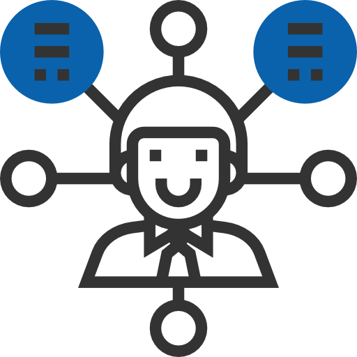

:slug: servicios/hacking-puntual/
:category: servicios
:description: En esta página presentamos nuestro servicio de Hacking Puntual, mediante el cual nuestro equipo de profesionales se encarga de encontrar y reportar todas las vulnerabilidades y hallazgos de seguridad existentes en la aplicación garantizando la ausencia de falsos positivos.
:keywords: FLUID, Servicios, Ethical Hacking, Seguridad, Aplicación, Hacking Puntual.
:translate: services/one-shot-hacking/

= Hacking Puntual

Las pruebas puntuales buscan detectar y reportar todas las vulnerabilidades
y problemas de seguridad de una versión específica de un sistema.
La inspección rigurosa de nuestro equipo
permite detectar todos los hallazgos de seguridad sin falsos positivos.

[role="aliados tb-alt"]
[cols=2, frame="none"]
|====

a|== Tipos de prueba
Es posible analizar código fuente,
aplicación e infraestructura correspondiente a un sistema específico,
el cliente puede decidir ejecutar todos los tipos de prueba,
o solo uno en específico.

^.^a|image:img2.png[alt="img2", width="55%"]

^.^a|image:img3.png[alt="img3", width="55%"]

a|== Cobertura

La cobertura puede ser específica,
cuando se hace una enumeración del total de campos/lineas/puertos
que componen el sistema a probar
y se define posteriormente solo cubrir un porcentaje específico del mismo.

Puede ser variable cuando no se hace enumeración de tamaño del sistema
y se define un tamaño de prueba específico
sin saber a que porcentaje corresponde del total.

Puede ser completa cuando se enumeran
y prueban el total de campos/líneas/puertos que componen el sistema.

a|== Rigurosidad

Es posible que el cliente decida los requisitos de seguridad
que se revisarán en el hacking (perfilamiento)
a través de nuestro producto [button]#link:../../productos/rules/[Rules]#.

Además sabrá la rigurosidad exacta del hackeo (lo revisado y lo no revisado).

^.^a|image:img4.png[alt="img4", width="55%"]

^.^a|

a|== Duración específica

Dependiendo del tamaño de la prueba típicamente estas
toman entre +1+ y +4+ semanas.

a|== Seguimiento personalizado

Cada proyecto tiene asignado un +project manager+
a través del cual los clientes pueden gestionar todo lo necesario
antes, durante y después de la ejecución.

^.^a|

^.^a|

a|== Ejecución programada

Se acuerda una fecha de inicio y una fecha de fin
previa confirmación de los insumos necesarios para el inicio.

a|== Ambientes de prueba

Es posible elegir un único ambiente de pruebas
entre producción, pruebas e integración.

^.^a|image:img8.png[alt="img8", width="55%"]

^.^a|

a|== Equipo de hacking altamente calificado

Personal con certificaciones prácticas
y estudios relacionados en temas de seguridad,
realiza pruebas manuales y con herramientas
para garantizar el reporte de hallazgos de impacto específicos del negocio,
prácticas inseguras de programación, alineación a estándares
y regulaciones de seguridad sin falsos positivos,
posibilitando la detección de vulnerabilidades +Zero Day+.

a|== Explotación de hallazgos

Siempre que se tenga acceso a la aplicación desplegada
y se cuente con autorización por parte del cliente
para la afectación de ambientes
usando nuestro motor de explotación propio [button]#link:../../productos/asserts/[Asserts]#.

^.^a|image:img10.png[alt="img10", width="55%"]

^.^a|

a|== Extracción de información crítica

En los hallazgos donde es posible se extraen todos los registros comprometidos
con el fin de maximizar el impacto generado y comprometer información sensible.

a|== Infección

De ser posible se compromete la infraestructura
con el uso de archivos maliciosos con el fin de obtener información adicional,
comprometer servidores y verificar controles a nivel de red.
Se hace uso de +shells+ y troyanos personalizados
con previa autorización por parte del cliente.

^.^a|

^.^a|image:img13.png[alt="img13", width="55%"]

a|== Envío diario de informes de avance

Informes de avance diarios al correo electrónico
con estadísticas de cobertura, rigurosidad,
resultados parciales y avance ponderado.

a|== Seguimiento de hallazgos a través de Integrates

Durante la ejecución del proyecto es posible verificar
los hallazgos reportados en nuestra plataforma
[button]#link:../../productos/integrates/[Integrates]#.

^.^a|image:img14.png[alt="img14", width="55%"]

^.^a|image:img15.png[alt="img15", width="55%"]

a|== Soporte de remediación.

Durante el proyecto es posible solicitar aclaraciones
directamente a los hackers mediante
[button]#link:../../productos/integrates/[Integrates]#.

Es posible utilizar nuestras guias detalladas de remediación
mediante [button]#link:../../productos/defends/[Defends]#.

a|== Entrega de informes vía bóveda segura

Entrega de versión definitiva de informes con evidencias
a través de un sitio de transferencia de archivos.

^.^a|image:img16.png[alt="img16", width="55%"]

^.^a|

a|== Reunión de validación de informes

Reunión con el equipo técnico para validar los informes
y atender observaciones, esta puede hacerse de forma presencial
o remota según las necesidades del cliente.

a|== Reunión de entrega

Presentación formal de informes ejecutivos a todos los interesados.
Consta de dos reuniones presenciales: una de validación
y una de socialización general.

^.^a|image:img18.png[alt="img18", width="55%"]

^.^a|image:img19.png[alt="img19", width="55%"]

a|== Borrado seguro de información

+7+ días hábiles luego de la aprobación final de los informes
se borra toda la información de nuestros sistemas

a|== Verificación de cierre (Opcional)

Se realiza un único ciclo validación de estado de los hallazgos
hasta +3+ meses luego de la aprobación final de los informes iniciales,
para esto es necesario que el cliente
comparta nuevamente los informes iniciales
y garantice el acceso al ambiente de pruebas.
No se buscan nuevas vulnerabilidades,
solo se valida lo ya encontrado previamente

^.^a|image:img20.png[alt="img20", width="55%"]

|====

* Si desea conocer las diferencias entre nuestros servicios
y otros proveedores puede conocer nuestros diferenciadores
[button]#link:../diferenciadores/[aquí]#.

* Si desea conocer las diferencias entre nuestros servicios
puede ver nuestra tabla comparativa
[button]#link:../comparativo/[aquí]#.

~Íconos diseñados por Eucalyp de Flaticon~
