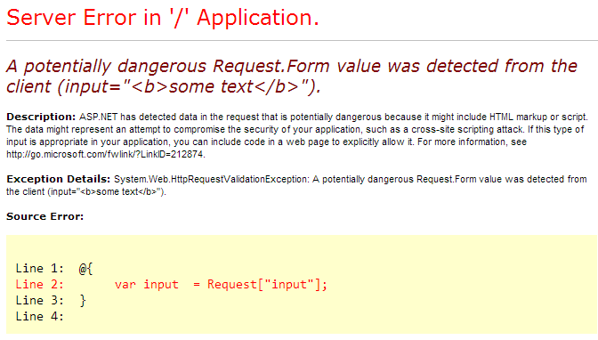

:slug: defends/aspnet/prevenir-ataque-xss/
:category: aspnet
:description:  Nuestros ethical hackers explican como evitar vulnerabilidades de seguridad mediante la programacion segura en ASPNET al prevenir ataques de tipo Cross Site Scripting (XSS). Éste es un tipo frecuente de ataque, es importante proteger nuestra aplicación al validar las entradas a la misma.
:keywords: ASPNET, Seguridad, XSS, Cross Site Scripting, Buenas Prácticas, Validación.
:defends: yes

= Prevenir ataque XSS

== Necesidad

Prevenir ataques tipo +Cross Site Scripting+ (XSS).

== Contexto

A continuación se describen las circunstancias
bajo las cuales la siguiente solución tiene sentido:

La aplicación está construida
con el lenguaje de programación +ASP.NET+.

== Solución

Si sigue estrictamente las siguientes reglas
podrá prevenir la mayoría de los ataques XSS en sus aplicaciones <<r1,^[1]^>>:

. Asegúrese de que todas las salidas
estén codificadas como +HTML+.

. No permita que el texto proporcionado por el usuario
termine en una cadena de un atributo de un elemento +HTML+.

. Prevenga el uso de +Internet Explorer+ 6
por parte de su aplicación.
Para esto, revise +Request.Browser+,
tal como se describe link:https://msdn.microsoft.com/library/3yekbd5b[aquí].

. Conozca el comportamiento de su control
y sepa si codifica la salida como +HTML+.
En caso contrario, codifique los datos que van hacia el control.

. Use la biblioteca +Anti-Cross Site Scripting+ (+AntiXSS+)
de +Microsoft+ y establézcala como el codificador predeterminado de HTML <<r2,^[2]^>>.

. Use el objeto AntiXSS +Sanitizer+
para llamar +GetSafeHtml+ o +GetSafeHtmlFragment+
antes de guardar datos +HTML+ en la base de datos.
No codifique los datos antes de guardarlos.

. Con +Web Forms+, no establezca
+EnableRequestValidation=false+ en las páginas web.
 Esta configuración tiene una justificación importante
y detendrá la solicitud si por ejemplo se registra
que la combinación de caracteres “+<X”+ vuelve al servidor.
Si sus controles registran +HTML+ de vuelta en el servidor
y reciben el error que aparece en la <<f1, figura 1>>
entonces idealmente debiera codificar los datos
antes de registrarlos en el servidor.
Esto es una situación común en los controles WYSIWYG,
y la mayoría de las versiones modernas
codificarán los datos +HTML+ correctamente
antes de volver a registrarlos en el servidor.
+
[[f1]]

. En el caso de las aplicaciones +ASP.NET MVC 3+,
cuando tiene que registrar el +HTML+
de vuelta en el modelo,
no se debe utilizar +ValidateInput(false)+
para desactivar +Request Validation+.
Simplemente agregue +[AllowHtml]+
a la propiedad de su modelo, del siguiente modo:
+
.test.py
[source, java, linenums]
----
public class BlogEntry
{
  public int UserId {get;set;}
  [AllowHtml]
  public string BlogText {get;set;}
}
----

. Algunos productos intentan detectar la etiqueta +<script>+
y otras combinaciones de palabras
o patrones regulares de expresiones
en una cadena para detectar el XSS.
Estos productos pueden entregar controles adicionales
pero no son completamente confiables,
debido a la enorme diversidad creada por los atacantes.

. Utilizar el codificador AntiXSS.
Para ello basta simplemente
con hacer la siguiente llamada:
+
[source, xml, linenums]
----
<%@ Import Namespace="Microsoft.Security.Application" %>
...
...
<%= Encoder.HtmlEncode(plainText)%>
----

== Referencias

. [[r1]] link:https://msdn.microsoft.com/es-es/magazine/hh708755.aspx[Protección contra XSS]
. [[r2]] link:https://www.codeproject.com/Articles/644736/Anti-Cross-Site-Scripting-Library-AntiXSS[Librería Anti-Cross Site Scripting]
