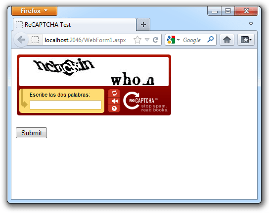
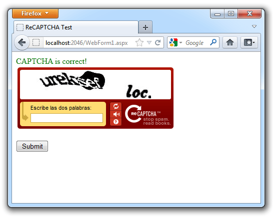
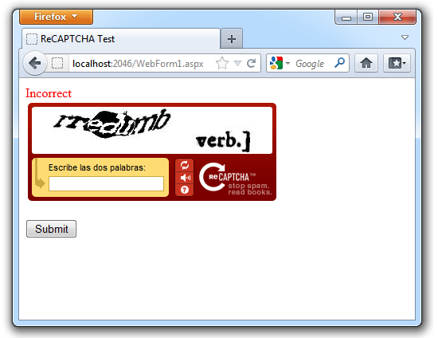

:slug: defends/aspnet/usar-recaptcha/
:category: aspnet
:description: Nuestros ethical hackers explican cómo evitar vulnerabilidades de seguridad mediante la programación segura en ASP.NET al implementar sistemas de recaptcha. Para mejorar la seguridad en la aplicación es recomendable restringir el uso de la misma únicamente a humanos mediante el uso de CAPTCHAS.
:keywords: ASP.NET, Recaptcha, Validación, Seguridad, Bots, Humanos.
:defends: yes

= Implementar reCAPTCHA

== Necesidad

Validación de llenado de formularios por un ser humano en +ASP.NET+.

== Contexto

A continuación se describen las circunstancias
bajo las cuales la siguiente solución tiene sentido:

. Se cuenta con una aplicación web desarrollada con +ASP.NET+.
. Se tiene una cuenta en el servicio on-line +reCAPTCHA+ <<r2, ^[2]^>>.
. Se desea validar que el usuario de la aplicación sea un humano.

== Solución

Para evitar posibles brechas de seguridad en el sistema,
es recomendable garantizar que únicamente los humanos
puedan llenar los formularios de la aplicación.
Una forma de lograr esto es utilizar un +CAPTCHA+
(+Completely Automated Public Turing test to tell Computers and Humans Apart+).
Al utilizar pruebas de reconocimiento de letras e imágenes,
es posible distinguir si el usuario es un humano o un robot.
En esta aplicación mostraremos
cómo utilizar la librería +reCAPTCHA+ de +ASP.NET+
para evitar que los +bots+ envíen formularios a nuestra aplicación,
restringiendo su uso únicamente a humanos.
Para ello debemos seguir la siguiente serie de pasos:

. Descargar la librería reCAPTCHA de +ASP.NET+ <<r1, ^[1]^>>-

. Se agrega la Referencia a +Recaptcha.dll+ en el proyecto.

. Dentro de la página, definimos el lenguaje a usar,
y luego asociamos el namespace de +reCAPTCHA+ con el +tagprefix+.
+
.captcha-validation.cs
[source, csharp, linenums]
----
<%@ Page Language="C#" %>
<%@ Register TagPrefix="recaptcha" Namespace="Recaptcha" Assembly="Recaptcha" %>
----

. En el evento +clic del botón+ usado para enviar el formulario,
verificamos la propiedad +IsValid+ del objeto +Page+.
En nuestro ejemplo modificamos las propiedades de un +Label+
para mostrar si es o no correcto el +CAPTCHA+.
+
[source, csharp, linenums]
----

----

. Completamos el código HTML del sitio:
+
.mypage.html
[source, html, linenums]
----
<html>
<head>
<title>ReCAPTCHA Test</title>
</head>
<body>
----

. Creamos un formulario al cual le incluimos el control de +reCAPTCHA+,
reemplazando +XXXXX+ y +YYYYY+
por nuestro +PublicKey+ y +PrivateKey+ respectivamente.
+
[source, html, linenums]
----
  <form id="Form1" runat="server">
    <asp:Label Visible="true" ID="lblResult" runat="server" />
    <recaptcha:RecaptchaControl
      ID="recaptcha"
      runat="server"
      Theme="red"
      PublicKey="XXXXX"
      PrivateKey="YYYYY"
    />
     
    <asp:Button ID="btnSubmit" runat="server" Text="Submit" OnClick="btnSubmit_Click" />
  </form>
----

. Por ultimo cerramos las etiquetas +HTML+ que teníamos abiertas.
+
[source, html, linenums]
----
</body>
</html>
----

. A continuación vemos el formulario en funcionamiento
con el control de +reCAPTCHA+:
+
.Apariencia del control reCAPTCHA

. Posteriormente procedemos a validar su funcionamiento
verificando que el comportamiento sea el esperado.

. En caso de que usuario realice el +CAPTCHA+ satisfactoriamente
se mostrará un mensaje indicando esto,
y se podrá proceder al envío del formulario.
A continuación se muestra en la figura, el escenario descrito anteriormente:
+
.reCAPTCHA exitoso

. Si por el contrario, el +reCAPTCHA+ falla,
se mostrará un mensaje de error y se pedirá al usuario volver a intentarlo.
A continuación se muestra en la figura, el escenario descrito anteriormente:
+
.reCAPTCHA Fallido

. De esta manera, se garantiza que el formulario sea enviado sí y sólo si
el CAPTCHA es realizado exitosamente, mejorando la seguridad del sistema al
prevenir posibles ataques de bots a la aplicación.

== Referencias

. [[r1]] link:https://www.google.com/recaptcha/intro/v3beta.html[reCAPTCHA v3 Beta: The new way to stop bots].

. [[r2]] link:https://developers.google.com/recaptcha/old/docs/aspnet[Using reCAPTCHA with ASP.NET ].

. [[r3]] link:../../../rules/237/[REQ.237 Establecer acciones de usuario seguras].
