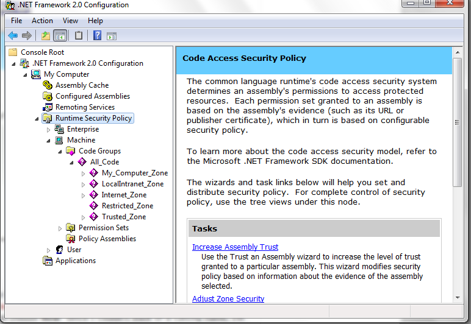
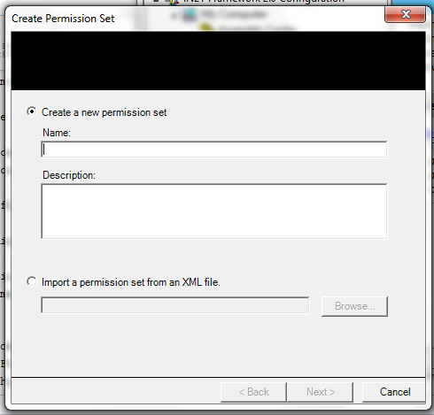
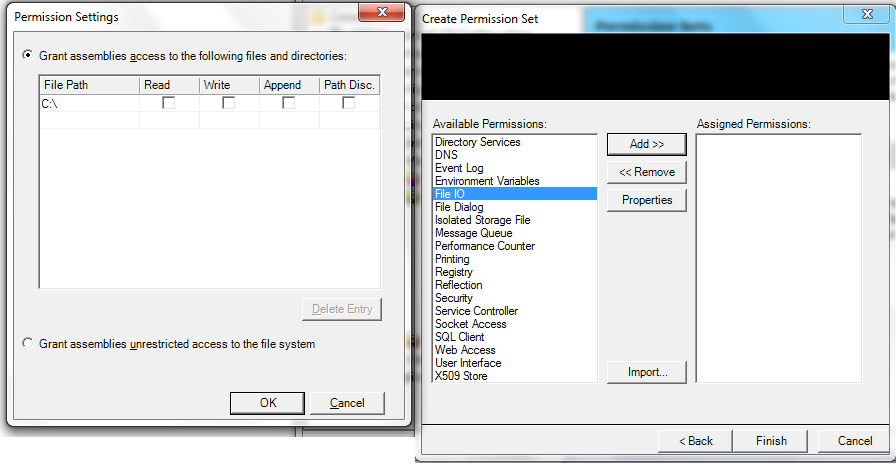
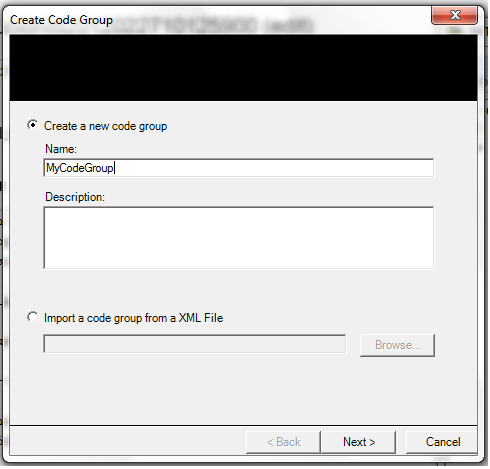
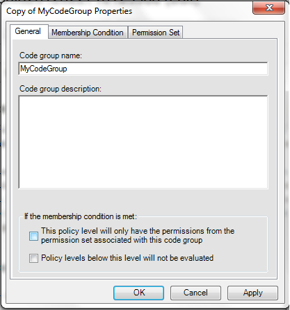

:slug: defends/csharp/aplicar-seguridad-codigo/
:category: csharp
:description: Nuestros ethical hackers explican cómo utilizando las herramientas provistas por el Framework de .NET  se pueden definir politicas, grupos, evidencias, permisos, grupos de politicas y grupos de código las cuales ayudaran a la creación de una protección a nivel de código.
:keywords: C Sharp, Buenas Prácticas, DotNet Framework, Politicas, Permisos, Grupos.
:defends: yes

= Aplicar seguridad a nivel de código

== Necesidad

. Aplicar seguridad a nivel de código en +C#+.

== Contexto

A continuación se describen las circunstancias
 bajo las cuales la siguiente solución tiene sentido:

. Se debe contar con el +kit+ de desarrollo +.NET Framework SDK+

== Solución

. En +ADO.NET+ se incluyen diferentes elementos
para lograr la seguridad a nivel de código:

.. Permisos
.. Grupos de permisos
.. Grupos de código
.. Evidencias
.. Políticas

--

.. Los permisos representan el acceso a recursos protegidos
o la habilidad de realizar operaciones protegidas.
El +framework+ de +.NET+ provee clases de permisos,
como +FileIOPermission+, +UIPermission+, +SecurityPermission+, etc...

.. Un grupo de permisos es una colección de permisos.
Se puede asignar +FileIOPermission+ y +UIPermission+
en grupos de permisos personalizados.
No existe limite en la cantidad de permisos.
+FullTrust+, +LocalIntranet+, +Internet+, +Execution+ y +Nothing+
son algunos de los grupos de permisos del +framework+.

.. Los grupos de código son una agrupación lógica de código
que cumplen ciertas condiciones de membresía.
Hay grupos de código creados por defecto
como +My_Computer_Zone+,+LocalIntranet_Zone+, +Internet_Zone+, etc.
Se pueden crear grupos de código.

.. Las evidencias incluyen firmas y la ubicación de origen del código.
Los objetos de cualquier tipo reconocidos
por una directiva de seguridad representan una evidencia.
La directiva de seguridad
está formada por grupos de código; un ensamblado determinado
(la unidad de código básica para conceder permisos de seguridad)
pertenece a un grupo de código
si satisface la condición de pertenencia del grupo.
Una evidencia es el conjunto de entradas para la directiva
utilizado por las condiciones de pertenencia
para determinar a qué grupos de código pertenece un ensamblado.
Esto lo determina el +framework+ de +.NET+.

.. La política de seguridad es un conjunto de reglas configurables
que se siguen cuando se determinan los permisos que se otorgaran al código.
Existen cuatro tipos de políticas
+Enterprise+, +Machine+, +User+ y +Application Domain+,
cada uno opera individualmente del otro.
Cada nivel tiene sus grupos de código y de permisos.

. Herramienta de configuración de +.NET Framework+
* Para hacer que un ensamblado pertenezca a un grupo de permisos
debemos usar la herramienta de configuración del +framework+ de +.NET+.
Para ejecutarla se puede ir a el panel de control->
herramientas administrativas->.NET Framework Configuration.
+

. Creando un nuevo grupo de permisos
* Expanda el nodo "+Runtime Security Policy+".
Se editaran las opciones de seguridad en la política +Machine+.
Primero, se van a crear un grupo de permisos personalizados.
Con el clic derecho en los grupos de permisos seleccione nuevo.
+

* Asigne un nombre para su nuevo grupo de permisos.
Luego, en el panel izquierdo,
se pueden ver los permisos soportados por +.NET+.
Ahora se pueden seleccionar los permisos,
si usted revisa las propiedades de +FileIO+
puede hacer que se lea o escriba en determinadas rutas.
+

* Puede asignar tantos permisos como desee y con las opciones que requiera.

. Se creará un grupo de código y se establecerán algunas condiciones,
de manera que los ensamblados requeridos
sean miembros de ese grupo de código.
Note que en el nodo de grupos de código,
el nodo padre es +All_code+. Escoja +new+
desde el clic derecho sobre +All_Code+.
+

* Se debe seleccionar una condición
para la membresía en ese grupo de código.
Estas son las evidencias bajo las cuales
se determina la pertenencia en un grupo de código.
Se puede usar el nombre fuerte del ensamblado.
Para esto debe firmar el ensamblado
con un nombre fuerte y construir el proyecto.
Presione importar y seleccione su ensamblado;
la clave pública el nombre y la versión serán extraídas del ensamblado.
Luego se vera la opción de establecer un grupo de permisos
para el grupo de código.

* Es probable que su ensamblado pertenezca a otros grupos del +framework+.
Cuando se calculan los permisos,
si un ensamblado particular cae en más de un grupo de código
dentro del mismo nivel de política,
los permisos finales serán la unión de todos los permisos en esos grupos.
Para limitar esto, se puede hacer uso
de los permisos del grupo de permisos asociado con el grupo de código.
Esto se llama atributo exclusivo.
Si se habilita esto, el entorno en tiempo de ejecución
sólo asignará los permisos asociados a este grupo de código.
+

--

== Referencias

. [[r1]] link:http://www.codeproject.com/Articles/5724/Understanding-NET-Code-Access-Security[Codeproject, Understanding NET Code Access Security]
. [[r2]] link:https://msdn.microsoft.com/en-us/library/5ayb8fx6(v=vs.100).aspx[How to: Modify Permissions in a Permission Set]
. [[r3]] link:../../../rules/269/[REQ.269 Usar principio mínimo privilegio]
. [[r4]] link:../../../rules/176/[REQ.176 Restringir objetos del sistema]
