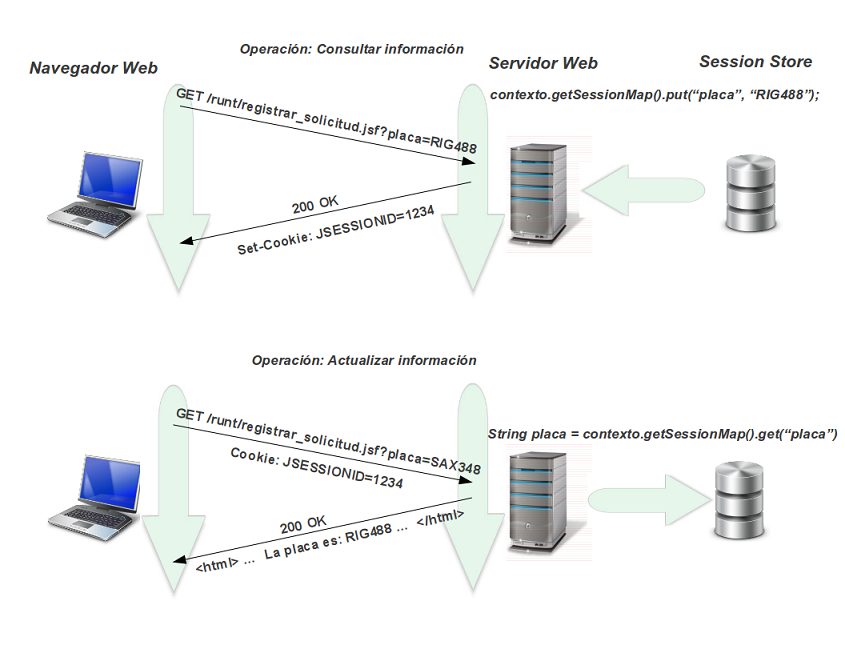

:slug: defends/java/almacenar-estado-sesion-jsf/
:category: java
:description: Nuestros ethical hackers explican cómo evitar vulnerabilidades de seguridad mediante la programación segura en Java al almacenar el estado de sesión utilizando Javaserver Faces. Las sesiones son frecuentemente utilizadas debido permiten guardar información accesible en diferentes páginas web.
:keywords: Java, Seguridad, Estado , Sesión, Estándar empresarial, Javaserver Faces.
:defends: yes

= Almacenar Estado de Sesión en Capa Web de Aplicación

== Necesidad

Almacenar estado de sesión en la capa web con +JSF+.

== Contexto

A continuación se describen las circunstancias
bajo las cuales la siguiente solución tiene sentido:

. Se dispone de una aplicación web
construida acorde al estándar empresarial de +Java+.
. Se dispone de un servidor de aplicaciones
que soporta el estándar empresarial de +Java+.
. Se está utilizando el +framework+ +JavaServer Faces+
versión +1.0+ en adelante.

== Solución

La conexión que se establece entre un usuario
y un servidor Web se denomina sesión.
Las sesiones permiten almacenar información
a lo largo de diferentes páginas,
permitiendo acceder a ella en el momento que se requiera.
Dentro de las sesiones es posible
guardar cierta información la primera vez que el usuario visita la página,
y dicha información puede ser mostrada en una visita posterior
sin necesidad de interactuar con una base de datos o un archivo externo.
Como estas sesiones son manejadas por lado del servidor,
no se corre el riesgo de que el usuario las pueda alterar.
Por lo general, dicha información contiene los datos del usuario,
y el estado de las diferentes operaciones
que el usuario realiza en la aplicación.
En otras palabras, una sesión puede abarcar múltiples páginas Web
y su seguimiento se realizará mediante la administración del estado
sin que el usuario tenga que intervenir en ello.

La administración del estado es el proceso por el cual
se mantiene la misma información a través de múltiples peticiones
para las mismas o distintas páginas web.

En esta solución se explorará la manera de almacenar
el estado de una sesión usando +JSF+.

. Para obtener una referencia de la sesión,
se establece, previamente, una referencia al objeto
+ExternalContext+ de la siguiente forma.
+
.sesion.java
[source, java, linenums]
----
import javax.faces.context.ExternalContext;
import javax.faces.context.FacesContext;
...
ExternalContext contexto =  FacesContext.getCurrentInstance().getExternalContext();
----

. Se ingresa información en la sesión mediante el siguiente código.
+
[source, java, linenums]
----
contexto.getSessionMap().put("par1", par1);
----

. Posteriormente, esta misma información puede ser recuperada mediante.
+
[source, java, linenums]
----
String par1 =contexto.getSessionMap().get("par1");
----

. Para el escenario en el cual no se requiere sobrescribir el valor
que tiene asignado una variable que contiene un +Managed Bean+,
debido a que inicialmente se realiza una operación de consulta
y posteriormente, se va a realizar una operación de actualización,
se sugiere utilizar variables de sesión
como lo ilustra la siguiente gráfica:

== Referencias

. [[r1]] link:http://www.javadocexamples.com/javax/faces/context/ExternalContext/getSessionMap().html[Demos and Usage]
. [[r2]] link:http://www.javamexico.org/foros/comunidad/manejo_de_session_en_jsf_20[Manejo de session en JSF 2.0]
. [[r3]] link:../../../rules/024/[REQ.024 Transferir información con objetos de sesión]
