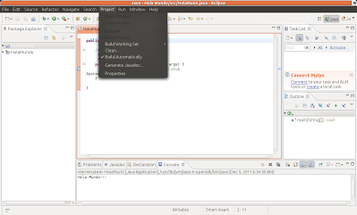
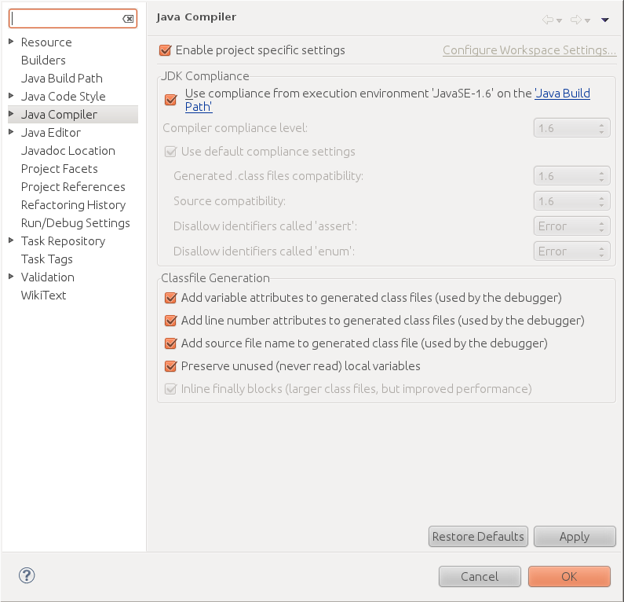

:slug: defends/java/compilar-archivo/
:category: java
:description: Nuestros ethical hackers explican cómo compilar un archivo en Java de manera optimizada cuando dichos archivos han sido codificados en diferentes plataformas o frameworks, esto con el fin de poder realizar un análisis del binario para buscar vulnerabilidades contenidas en estos.
:keywords: Java, Compilar, Código, Seguridad, Frameworks, Análisis.
:defends: yes

= Compilar Archivo

== Necesidad

Compilar un archivo +Java+ de manera optimizada
para su posterior análisis binario.

== Contexto

A continuación se describen las circunstancias
bajo las cuales la siguiente solución tiene sentido:

. Se tiene un archivo +Java+ con todas sus dependencias.
. Se requiere realizar un análisis binario
en búsqueda de posibles vulnerabilidades.
. Se requiere complementar el servicio de Análisis De Código fuente
con un análisis binario.
. Se cuenta con una aplicación desarrollada
en +Java J2SE+ versión +1.4+ en adelante.
. Se cuenta con una aplicación desarrollada
en +Java J2EE+ versión +1.4+ en adelante.
. Se cuenta con una aplicación desarrollada
en +Java+ para móviles.
. La aplicación debe de haber sido desarrollada
utilizando uno de los siguientes +frameworks:+

* +Apache Struts 1.x+.
* +Apache Struts 2.x+.
* +Hibernate+
* +JSTL+.
* +Spring MVC+.
* +Tiles+.
* Hay que tener en cuenta
que las aplicaciones que no sean desarrolladas
bajo los +frameworks+ enumerados anteriormente
pueden seguir siendo analizadas
pero sus resultados serán incompletos.

. Como regla, para poder realizar un análisis binario correctamente
la aplicación no puede estar ofuscada.

. En el caso de las aplicaciones Web
el +WAR+ de la aplicación debe contener
la estructura de directorios que se enumera a continuación.
+
.estructura.shell
[source, shell, linenums]
----
/WEB-INF/
/WEB-INF/classes/ (debe de contener todas las clases)
/WEB-INF/lib/ (debe de contener todas las librerías)
/WEB-INF/web.xml
----

. Si el +WAR+ contiene archivos +JSP+
éstos deben de estar referenciados
en el archivo +web.xml+ utilizando la ruta completa.

. Si la aplicación será instalada en +WebSphere Application Server+
debe de incluirse todas las librerías estándar del producto
que se encuentran presentes
en los directorios +lib/app+ y +ws.ext.dirs+.

== Solución

A continuación se describe la manera de como
se debe compilar la aplicación
según la herramienta en la cuál está siendo desarrollada:

. Desde la consola se debe de utilizar la opción +-g+
tal como se describe a continuación.
+
.consola.shell
[source, shell, linenums]
----
javac -g archivo.java
----

. Para compilar la aplicación desde +Eclipse+,
se debe hacer click en +Project+
y seleccionar la opción +Propiedades+.
+

. Luego, en la ventana que aparece,
hay que seleccionar la opción +Java Compiler+
y después escoger las opciones
+Add source file name to generated class files+,
+Add line number attributes to generated class files+ y
+Add variable attributes to generated class files+.
+

. Para compilar una aplicación usando +Maven+
se debe utilizar el parametro +-x+
para crear la salida con símbolos de depuración.
+
.maven.shell
[source, shell, linenums]
----
maven -x
----

. Para compilar una aplicación utilizando +Apache-Ant+
se debe utilizar la propiedad de +debug+
en el archivo +build.xml+ de la siguiente manera.
+
.maven.xml
[source, xml, linenums]
----
<javac debug="on">
  conjunto de clases
</javac>
----

== Referencias

. [[r1]] link:https://docs.oracle.com/cd/A91202_01/901_doc/java.901/a90213/war.htm[Oracle WAR Deployment]
. [[r2]] link:http://ant.apache.org/manual/Tasks/javac.html[Javac]
