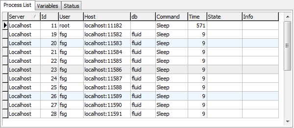

:slug: defends/java/mantener-conexiones-db/
:category: java
:description: Nuestros ethical hackers explican cómo evitar vulnerabilidades de seguridad mediante la programación segura en Java al mantener un agrupamiento de conexiones a bases de datos. Ésto permite la reutilización de conexiones para una petición, lo cual mejora el rendimiento de la aplicación.
:keywords: Java, Agrupamiento, Conexión, Seguridad, Base de datos, Servlet.
:defends: yes

= Mantener Agrupamiento de Conexiones a Base de Datos

== Necesidad

Se requiere mantener un agrupamiento de conexiones a bases de datos
con el fin de reutilizarlas y mejorar el rendimiento de la aplicación.

== Contexto

A continuación se describen las circunstancias
bajo las cuales la siguiente solución tiene sentido:

. Se está desarrollando una aplicación web
usando la tecnología de +servlets+ de +Java+.
. La aplicación hace uso de conexiones a bases de datos.

== Solución

El agrupamiento de conexiones o +Connection pool+ es, valga la redundancia,
un agrupamiento de conexiones de bases de datos que pueden ser reutilizadas
cuando futuras peticiones a la base de datos son requeridas.

Cuando la aplicación termina de realizar las operaciones sobre la conexión,
esta retorna al agrupamiento en espera de ser reutilizada ^<<r1,[1]>>^.

El uso de conexiones a la base de datos, al usar +servlets+,
se debe hacer por medio del +Connection pool JDBC+
nativo de +Tomcat+ ^<<r2,[2]>>^.

Algunas características que provee esta biblioteca son:

* Soporte para entornos altamente concurridos y sistemas +multicore/cpu+.
* Sentencias de un solo uso que son ejecutadas
cuando se establece la conexión por primera vez.
* Alto rendimiento
* Simplicidad

. Iniciamos el desarrollo de la solución creando el archivo +web.xml+.
+
.web.xml
[source, xml, linenums]
----
<?xml version="1.0" encoding="ISO-8859-1"?>
  <web-app xmlns="http://java.sun.com/xml/ns/javaee"
    xmlns:xsi="http://www.w3.org/2001/XMLSchema-instance"
    xsi:schemaLocation="http://java.sun.com/xml/ns/javaee
    http://java.sun.com/xml/ns/javaee/web-app_3_0.xsd"
    version="3.0"
    metadata-complete="true">
    <servlet>
      <servlet-name>ConnectionPool</servlet-name>
      <servlet-class>ConnectionPoolFSG</servlet-class>
    </servlet>
    <servlet-mapping>
      <servlet-name>ConnectionPool</servlet-name>
      <url-pattern>/EjemploReusoConexion</url-pattern>
    </servlet-mapping>
  </web-app>
----

. Creamos la clase +ConnectionPoolFSG.java+.
Empezamos importando las clases necesarias
y definiendo el nombre de la clase
recordar que al ser un +servlet+ se debe extender a +HttpServlet+.
+
[source, java, linenums]
----
import java.io.*;
import java.sql.*;
import javax.servlet.*;
import javax.servlet.http.*;
import org.apache.tomcat.jdbc.pool.*;

public class ConnectionPoolFSG extends HttpServlet {
----

. Se crea un atributo de tipo +Connection+
que puede ser usado por cualquier método
en el +servlet+ (+GET+, +POST+, +HEAD+, etc).
+
[source, java, linenums]
----
private Connection con = null;
----

. El método +init+ del +servlet+ es llamado
al momento en que el +servlet+ se carga en memoria, esto es,
al momento de iniciar el servidor.
Capturamos las excepciones necesarias.
+
[source, java, linenums]
----
public void init(ServletConfig config) throws ServletException {
  super.init(config);
  try {
----

. Creamos las nuevas propiedades del +pool+
+
** *Advertencia:* Las configuraciones de la base de datos
deben estar almacenadas en su configuración respectiva,
por simplicidad en la solución se ponen dentro del código
+
[source, java, linenums]
----
PoolProperties pool = new PoolProperties();
pool.setDriverClassName("com.mysql.jdbc.Driver");
pool.setUrl("jdbc:mysql://localhost:3306/fluid");
pool.setUsername("fsg");
pool.setPassword("fsg-test-2011");
pool.setInitialSize(10);
pool.setMaxActive(100);
----

. Se configura el protocolo, +hostname+, puerto,
nombre de la base de datos,
nombre de usuario y contraseña para la conexión.
+initialSize+ es el número de conexiones
que se establecerán cuando el +pool+ es creado
y +maxActive+ define el número máximo de conexiones
que puede tener la base de datos.

. Se obtiene la fuente de datos
y se obtiene una de las conexiones del +pool+.
+
[source, java, linenums]
----
DataSource dataSource = new DataSource();
dataSource.setPoolProperties(pool);
con = dataSource.getConnection();
----

. Se capturan las excepciones necesarias y se cierra el método +init+.
+
[source, java, linenums]
----
  }
  catch (SQLException e) {
    throw new ServletException(e);
  }
}
----

. Creamos el método +doGet+ que contiene
una sentencia simple a la base de datos.
Observemos que en la clase +HtmlSQLResult+, en el segundo parámetro,
se usa la conexión que se inició en el método +init+.
+
[source, java, linenums]
----
public void doGet(HttpServletRequest request, HttpServletResponse response)
 throws IOException, ServletException {
   response.setContentType("text/html");
   HtmlSQLResult result = new HtmlSQLResult("SELECT id, name, password FROM users",con);
   PrintWriter out = response.getWriter();
   out.println(result);
 }
----

. Finalmente se crea el método +destroy+,
que es llamado al momento en el que el servlet es destruido, es decir,
al momento de detener el servidor.
+
[source, java, linenums]
----
public void destroy() {
  try {
    if (con != null) {
      con.close();
    }
  }
  catch (SQLException e) {
    // Silently ignore -- there's nothing to be done.
  }
}}
----

. Compilamos la clase con la utilidad +javac+.
El +CLASSPATH+ debe contener las dos librerías usadas en la aplicación:
+ervlet-api.jar+ y +tomcat-jdbc.jar+.
+
[source, shell, linenums]
----
WEB-INF/classes$ /
javac -cp .:RUTA_TOMCAT/lib/servlet-api.jar:RUTA_TOMCAT/lib/tomcat-jdbc.jar
ConnectionPoolFSG.java
----

. Antes de iniciar el servidor y ejecutar el +servlet+
podemos observar que no hay conexiones activas en la base de datos.
+

. Al ejecutar el +servlet+, observamos que se crearon diez nuevas conexiones
a la base de datos en espera de ser utilizadas.
Tal como se indicó con el método +setInitialSize+,
estas conexiones se mantienen durante el tiempo de vida del servidor,
por lo cual garantiza un alto rendimiento y soporte para alta concurrencia.
+

== Descargas

Puedes descargar el código fuente
pulsando en los siguientes enlaces:

[button]#link:src/connectionpoolfsg.java[ConnectionPoolFSG.java]#
Clase ConnectionPoolFSG.

== Referencias

. [[r1]] link:https://en.wikipedia.org/wiki/Connection_pool[Connection pool]
. [[r2]] link:http://people.apache.org/~fhanik/jdbc-pool/jdbc-pool.html[The Tomcat JDBC Connection Pool]
. [[r3]] link:http://www.tomcatexpert.com/blog/2010/03/22/understanding-jdbc-pool-performance-improvements[Understanding the jdbc-pool]
. [[r4]] link:http://www.tomcatexpert.com/blog/2010/04/01/configuring-jdbc-pool-high-concurrency[Configuring jdbc-pool]
. [[r5]] link:../../../rules/152/[REQ.152 Reutilizar conexiones a bases de datos]
