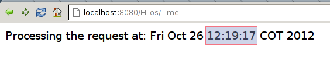
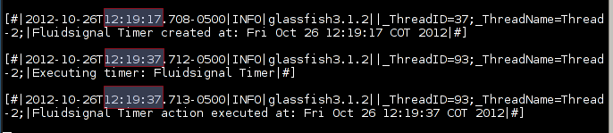

:slug: defends/java/usar-ejb-time-service/
:category: java
:description: Nuestros ethical hackers explican cómo evitar vulnerabilidades de seguridad mediante la programación segura en Java al utilizar el servicio EJB Timer. Esto resulta particularmente útil cuando no es posible manejar hilos en la aplicación web, debido a su susceptibilidad para los errores.
:keywords: Java, EJB Timer, JEE, Seguridad, Optimización, Buenas prácticas.
:defends: yes

= Usar EJB Timer Service

== Necesidad

Uso de +EJB Timer Service+ en +Java EE+.

== Contexto

A continuación se describen las circunstancias
bajo las cuales la siguiente solución tiene sentido:

. Se está desarrollando una aplicación +JEE+
con soporte para +EJB 2.1+ o superior.

== Solución

En ciertas circunstancias, el manejo de hilos en una aplicación web
está prohibido por el estándar +Java EE+
puesto que siempre está altamente propenso a generar errores
debido a que es probable que los hilos interfieran
con el contenedor de aplicaciones y pueden dar origen a problemas
que son difíciles de detectar y diagnosticar.

Estos problemas pueden ser interbloqueos, condiciones de carrera
y otros relacionados con la sincronización.
Un antipatrón común es utilizar, en +servlets+,
instancias de la clase +java.lang.Thread+ invocando sobre ellas
métodos como +start+ o +sleep+ entre otros.

. Por tanto, se recomienda, en cambio,
delegar la responsabilidad directamente
al servidor de aplicaciones
usado a través de +APIs+ ofrecidas para ello ^<<r1,[1]>>,<<r2,[2]>>^.

. En el siguiente ejemplo
se ilustra como utilizar la interfaz +TimerService+ ^<<r3,[3]>>^
para indicar a un servidor de aplicaciones +JEE+
que debe retrasar la ejecución de un llamado por 20 segundos.

. Para esto inicialmente se crea un +EJB+
que posee el método +startTimer+
que crea un temporizador del siguiente modo +src/fsg/TimeService.java+
+
.TimeService.java
[source, java, linenums]
----
package fsg;

import java.util.logging.Logger;
import javax.annotation.PostConstruct;
import javax.annotation.Resource;
import javax.ejb.Startup;
import javax.ejb.Timeout;
import javax.ejb.Timer;
import javax.ejb.Singleton;

@Singleton

@Startup

public class TimeService {
  static Logger log = Logger.getLogger("");

  @Resource
  javax.ejb.TimerService timerService;
  public void startTimer(){
    timerService.createTimer(20000, "Fluid Attacks Timer");
    log.info("Fluid Attacks Timer created at: " + new java.util.Date());
  }
----

. Note que no se instancia el servicio directamente,
sino que la instancia será inyectada cuando se requiera.

. Pasados esos 20 segundos, se llamará el método +delayedAction+,
dado que está marcado con la anotación +@Timeout+.
+
[source, java, linenums]
----
@Timeout
  public void delayedAction(Timer timer) {
    try {
      log.info("Executing timer: " + timer.getInfo());
      log.info("Fluid Attacks Timer action executed at: " + new java.util.Date());
    }
    catch (Exception e) {
      log.warning("Exception while getting timer information");
    }
  }
}
----

. Ahora se crea un servlet que atenderá la petición del usuario
e inicializará el +EJB+ (dependencia que también es inyectada
y no requiere ser instanciada directamente)
+src/fsg/TimeServlet.java+
+
[source, java, linenums]
----
package fsg;

import java.io.IOException;
import javax.ejb.EJB;
import javax.ejb.EJBs;
import javax.servlet.ServletException;
import javax.servlet.annotation.WebServlet;
import javax.servlet.http.HttpServlet;
import javax.servlet.http.HttpServletRequest;
import javax.servlet.http.HttpServletResponse;

@WebServlet("/Time")
public class TimeServlet extends HttpServlet {
  private static final long serialVersionUID = 1L;

  @EJB
  private TimeService timerEJB;
  public TimeServlet() {
    super();
  }
----

. Al recibir una petición +GET+,
el +servlet+ llamará el método +startTimer+ del +EJB+.
+
[source, java, linenums]
----
  protected void doGet(HttpServletRequest request, HttpServletResponse response) throws
     ServletException, IOException {
       response.setContentType("text/html;charset=UTF-8");
       java.io.PrintWriter out = response.getWriter();
       timerEJB.startTimer();
       out.println("Processing the request at: " + new java.util.Date());
       out.close();
    }
}
----

. Luego de desplegar la aplicación y acceder a +/Time+,
tal como fue especificado en el +servlet+,
puede observarse el tiempo exacto en el que se hace la petición.
+

. Al consultar los +logs+ de la aplicación
puede comprobarse que en ese mismo instante
se crea una entrada, y pasados 20 segundos
aparecen dos nuevas entradas correspondientes
a lo ejecutado en +delayedAction+.
+
[source, shell, linenums]
----
% tail -F /home/ryepes/workspace/glassfish3122eclipsedefaultdomain/logs/server.log
----

== Descargas

Puedes descargar el código fuente
pulsando en los siguientes enlaces:

[button]#link:src/timeservice.java[TimeService.java]#
Clase TimeService.

[button]#link:src/timeservlet.java[TimeServlet.java]#
Clase TimeServlet.

== Referencias

. [[r1]] link:http://cwe.mitre.org/data/definitions/383.html[CWE-383: J2EE Bad Practices: Direct Use of Threads]
. [[r2]] link:http://cwe.mitre.org/data/definitions/381.html[CWE CATEGORY: J2EE Time and State Issues]
. [[r3]] link:https://docs.oracle.com/javaee/6/api/javax/ejb/TimerService.html[javax.ejb Interface TimerService]
. [[r4]] link:../../../rules/158/[REQ.158 Codificación Actualizada]
