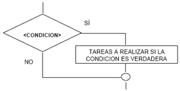
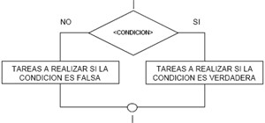
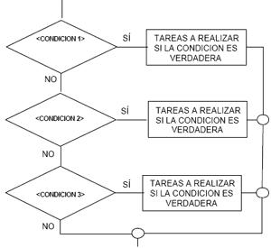
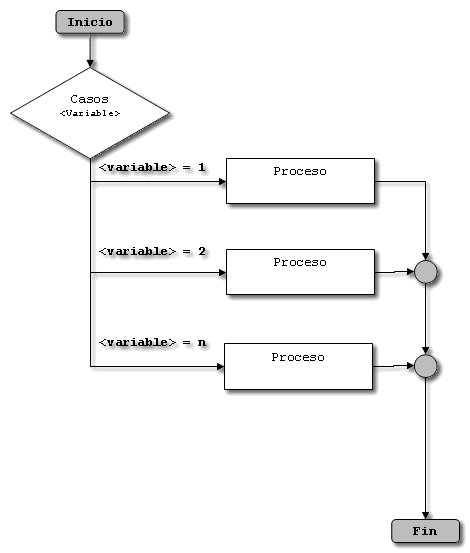

:slug: defends/javascript/implementar-condicional/
:category: javascript
:description: Nuestros ethical hackers explican cómo evitar vulnerabilidades de seguridad mediante la programación segura en JavaScript al establecer opciones seguras en estructuras condicionales. Las opciones por defecto se deben implementar en todos los condicionales para evitar brechas de seguridad.
:keywords: JavaScript, Seguridad, Buenas Prácticas, Condicional, Opciones, Defecto.
:defends: yes

= Implementar Estructura Condicional

== Necesidad

Estructura condicional en +JavaScript+.

== Contexto

A continuación se describen las circunstancias
bajo las cuales la siguiente solución tiene sentido:

. Se utiliza el lenguaje +JavaScript+.
. Se necesitan implementar estructuras condicionales de manera segura.

== Solución

En programación, las estructuras condicionales se utilizan
para lograr que un algoritmo analice los datos y tome ciertas decisiones.
Es decir, comparan una variable contra determinado valor o valores,
para que en base al resultado de esta comparación,
se siga un curso de acción dentro del programa.
Estas pueden ser simples, dobles, múltiples y +case+.

*Simples:* En este tipo de estructuras
se limita la ejecución de un bloque de código
dependiendo el resultado de una condición.

*Dobles:* Son aquellas que ofrecen dos posibles alternativas
para continuar la ejecución del código.
Una de ellas se ejecutará si la condición se cumple
y la otra alternativa se ejecutará si la condición no se cumple.

*Múltiples:* son tomas de decisión especializadas
que permiten comparar una variable contra distintos posibles resultados.
Esto se hace ejecutando para cada caso
una serie de instrucciones especificas.
Es decir, se plantean múltiples condiciones simultáneamente,
si se cumple la condición 1
se ejecutan las instrucciones específicas para dicha condición.
En caso contrario se comprueba la condición 2;
si es cierta se ejecutan sus respectivas instrucciones,
y así sucesivamente hasta evaluar todas las condiciones.

*Case:* Al igual que la múltiple,
esta sentencia permite ejecutar una de entre varias acciones
en función del valor de una expresión.
En pocas palabras, es una alternativa
a las estructuras condicionales múltiples.

. En esta solución se mirará la manera adecuada
de utilizar estas estructuras en el lenguaje +JavaScript+.

. En cada estructura condicional empleada en una aplicación +JavaScript+,
se recomienda contemplar todos los posibles escenarios.
* Para sentencias +if+ debe usarse su correspondiente +else+ ^<<r1,[1]>>^.
* Para sentencias +switch+ debe usarse
su correspondiente +default+ ^<<r2,[2]>>^.

. El siguiente código muestra el uso correcto de la sentencia +if+.
Primero creamos una función que nos retornará un número aleatorio
entre un rango especificado.
+
.getRandomInt.js
[source, js, linenums]
----
function getRandomInt(min, max) {
  return Math.floor(Math.random() * (max - min + 1)) + min;
}
----

. Obtenemos un valor aleatorio entre 0 y 2,
y comparamos dicho valor utilizando +if/else+.
+
[source, js, linenums]
----
var args = getRandomInt(0,2);
if (args <= 1)
{
  console.log("args is smaller than one");
} else {
   console.log("args is bigger than one ");
}
----

. El siguiente código muestra el uso correcto de la sentencia +switch+,
se debe incluir el caso +default+.
+
[source, js, linenums]
----
var val = getRandomInt(1,4);
switch(val) {
 case 1:
  console.log("val is 1");
  break;
 case 2:
  console.log("val is 2");
  break;
 default:
  console.log("val is not 1 or 2");
}
----

== Referencias

. [[r1]] link:https://developer.mozilla.org/es/docs/Web/JavaScript/Referencia/Sentencias/switch[switch - JavaScript MDN]
. [[r2]] link:https://developer.mozilla.org/es/docs/Web/JavaScript/Referencia/Sentencias/if%2E%2E%2Eelse[if...else - JavaScript MDN]
. [[r3]] link:https://es.wikipedia.org/wiki/Sentencia_condicional[Sentencia condicional]
. [[r4]] link:../../../rules/161/[REQ.161 Opciones por defecto seguras]
