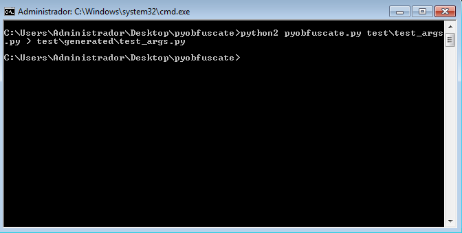
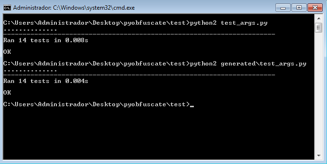

:slug: defends/python/ofuscar-codigo-fuente/
:category: python
:description: Nuestros ethical hackers explican cómo evitar vulnerabilidades de seguridad mediante la programación segura en Phyton al ocultar el código fuente. La ofuscación del código dificulta que los atacantes puedan encontrar y explotar vulnerabilidades basándose en el funcionamiento de la aplicación.
:keywords: Python, Ofuscar, Código, Seguridad, Buenas Prácticas, Ocultar.
:defends: yes

= Ofuscar Código Fuente

== Necesidad

Se requiere ofuscar el código +Python+
para evitar la legibilidad del código fuente.

== Contexto

A continuación se describen las circunstancias
bajo las cuales la siguiente solución tiene sentido:

. Se tiene una aplicación programada en +Python+
. Se desea entregar archivos +.py+ con el código no legible.

== Solución

. La +ofuscación+ de código consiste en realizar cambios
que no afecten el funcionamiento del código fuente de la aplicación,
pero evita que este sea fácilmente visualizado
y comprendido por un atacante.
Esto solo debe ser hecho
con los archivos que vayan a ser publicados
en el entorno de producción
y no en etapas de desarrollo.

. Hay que tener en cuenta que todos los mecanismos de +ofuscación+
pueden ser reversados, por lo cual
no intente ocultar información confidencial dentro del código fuente.

. En esta solución se verá la manera de +ofuscar+ el código
de una aplicación realizada en +Python+.

. Primero, hay que descargar la herramienta
link:https://github.com/astrand/pyobfuscate[pyobfuscate]

. La herramienta anterior transforma el código fuente
de las siguientes formas:

* Elimina los comentarios y +docstrings+.
* Cambia la +identación+ del código.
* Agrega espacios en blanco entre los +tokens+.
* Renombra las +funciones+, las +clases+ y +variables+.
* Inserta líneas de código falsas en lugar de líneas en blanco.

. Se prepara el archivo con código +Python+ que se quiere ofuscar.
+
.test.py
[source, py, linenums]
----
import unittest

def function none():
  pass

def function_args(a, b, c):
  assert a == 1
  assert b == 2
  assert c == 3
  assert "a" in locals()
  assert "b" in locals()
  assert "c" in locals()

def function_default(expected. arg=12):
  assert expected == arg
  assert "expected" in locals()
  assert "arg" in locals()

def function_posargs(*args)
  pass
----

. Se ejecuta el siguiente comando desde una +consola+ de comandos.
+
[source, bash, linenums]
----
python pyobfuscate.py archivo.py > archivo.ofuscado.py
----
+

. Se procede a verificar que el nuevo archivo generado esta +ofuscado+.
+
image::ofuscado.png[codigo ofuscado]

. Se verifica que el nuevo archivo generado
funcione exactamente igual que el original.
+

. En conclusión, la +ofuscación+ de código tiene varias ventajas,
sobre todo en cuanto a la seguridad,
ya que evita que un atacante
comprenda el funcionamiento del código
y por tanto, no logre alterarlo con malos propósitos.

. Otra razón para usar +ofuscación+
es la protección de la propiedad intelectual.
Puesto que muchas veces se quiere que terceras personas
no sepan la manera en que está programada determinada aplicación
y así evitar su reproducción
sin que sean reconocidos los respectivos derechos intelectuales.

. El único inconveniente que puede tener,
es que debido a que el código final es completamente ilegible
la mantenibilidad del código se hace un poco laboriosa
en caso de que el archivo original llegase a perderse
obligando a trabajar directamente sobre el comprimido.

== Referencias

. [[r1]] link:https://github.com/astrand/pyobfuscate[pyobfuscate]
. [[r2]] link:https://es.wikipedia.org/wiki/Ofuscaci%C3%B3n[Ofuscación]
. [[r3]] link:../../../rules/159/[REQ.159 Código ofuscado]
