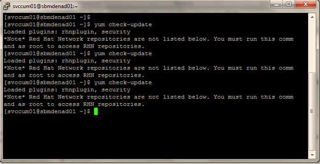

:slug: defends/redhat/actualizar-software/
:category: redhat
:description: Nuestros ethical hackers explican como evitar vulnerabilidades de seguridad mediante la configuracion segura de Linux Red Hat al actualizar el software. Es de vital importancia mantener el software del servidor actualizado para evitar que sea afectado por fallas de seguridad de versiones previas.
:keywords: Linux, Red Hat, Actualizar, Software, Paquetes, Servidor
:defends: yes

= Actualizar Software en Red Hat

== Necesidad

Actualización de +software+ en +Red Hat+.

== Contexto

A continuación se describen las circunstancias
bajo las cuales la siguiente solución tiene sentido:

. Para dar cumplimiento a la línea base de seguridad
del sistema operativo +Linux Red Hat+.
. Se tiene un servidor con sistema operativo +Linux Red Hat V.5.7+.
. El servidor debe tener acceso a internet.
. Se tienen credenciales de súper usuario en el servidor.

==  Solución

Para actualizar el sistema operativo
se debe tener en cuenta lo siguiente:

. +Red Hat Network+ permite automatizar
la mayoría de los procesos de actualización.
Esto lo hace determinando cuáles paquetes +RPM+
son necesarios para el sistema,
los descarga desde repositorios seguros,
verifica la firma del +RPM+
para asegurarse de que no han sido dañados y los actualiza.
La instalación del paquete puede ocurrir de inmediato
o puede ser planificada durante cierto período de tiempo.

. +Red Hat Network+ requiere un perfil del sistema
para cada máquina que desea actualizar.
El perfil del sistema contiene
la información del hardware y software del sistema.
Esa información se mantiene como confidencial
y no se entrega a nadie más,
sólo se utiliza para determinar
cuales actualizaciones de errata son aplicables a cada sistema.
Sin esta información, +Red Hat Network+
no puede determinar si su sistema necesita actualizaciones.

. Cuando una errata de seguridad
(o cualquier tipo de errata) es publicada,
+Red Hat Network+ envía un correo electrónico,
este correo tendrá una descripción de la errata,
así como también cuáles de sus sistemas son afectados.

. Para aplicar la actualización,
puede utilizar el agente de actualización de +Red Hat+
o planificar para que el paquete sea actualizado
a través del sitio web
link:http://rhn.redhat.com[Red Hat].

. Cuando se lanzan los informes de errata,
estos son publicados en el sitio web de erratas ^<<r1,[1]>>^ de +Red Hat+.
Desde esta página, seleccione el producto y la versión de su sistema
y luego seleccione +security+
en la parte superior de la página
para sólo desplegar los +Security Advisories+ de +Red Hat Enterprise Linux+.

. Si la sinopsis de algunas de las recomendaciones
describe un paquete usado en su sistema,
pulse en la sinopsis para ver más detalles.

. La página de detalles describe las violaciones de seguridad
y cualquier instrucción especial
que se deba llevar a cabo adicionalmente
para actualizar el paquete y reparar el hueco de seguridad.

. Para descargar el paquete actualizado,
pulse en el enlace para iniciar una sesión a +Red Hat Network+,
luego pulse el nombre del paquete y guárdelo en el disco duro.
Se recomienda que cree un nuevo directorio
tal como +/tmp/updates+
y guarde todos los paquetes descargados en él.

. Ejecutar el siguiente comando y verificar que no haya ningún resultado.
+
.update.bash
[source, bash, linenums]
yum check-update

== Referencias

. [[r1]] link:http://www.redhat.com/security/[Red Hat].
. [[r2]] link:https://www.cyberciti.biz/faq/rhel-centos-fedora-linux-yum-command-howto/[How to use yum command on CentOS RHEL].
. [[r3]] link:../../../rules/262/[REQ.262 Verificar componentes de terceros]
