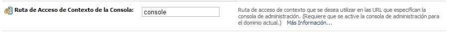

:slug: defends/weblogic/cambiar-dir-admin/
:category: weblogic
:description: Nuestros ethical hackers explican cómo evitar vulnerabilidades de seguridad mediante la programación segura en WebLogic 11g al cambiar la ruta predeterminada de la consola de administración. Las configuraciones por defecto no deben mantenerse debido a que suponen una vulnerabilidad para sistema.
:keywords: WebLogic 11g, Servidor, Oracle, Dirección, Administración, Consola.
:defends: yes

= Cambiar Dirección de Administración

== Necesidad

Cambiar dirección predeterminada de la consola de administración +WebLogic+.

== Contexto

A continuación se describe las circunstancias
bajo las cuales la siguiente solución tiene sentido:

. Se utiliza el servidor de aplicaciones +Oracle WebLogic 11g+.
. Se desea cambiar la ruta predeterminada de la consola de administración.

== Solución

La consola de administración permite configurar y personalizar
las opciones del servidor.
Debido a esto sus privilegios de acceso deben estar limitados
únicamente a personal autorizado.
Las configuraciones por defecto, por otra parte,
representan una vulnerabilidad potencial en cualquier sistema.
Esto se debe a que normalmente son conocidas,
con lo cual, si se mantienen,
pueden facilitar la labor de un atacante de conocer mejor el sistema
y planear un ataque o explotación de vulnerabilidades.
En este artículo nos centraremos en cómo cambiar
algunas de las configuraciones por defecto de +Oracle WebLogic 11g+.
Nos centraremos específicamente en la ruta predeterminada
de la consola de administración.

El siguiente patrón de dirección +URL+
se utiliza para acceder a la Consola de Administración:

----
http://dirección-recepción:puerto-recepción/console.
----

Para especificar la dirección de recepción
y el puerto de recepción utilizados
para acceder a la Consola de Administración,
configure la dirección de recepción
y el puerto de recepción del servidor de administración.
Para especificar la ruta de acceso de contexto
que se utiliza para acceder a la Consola de Administración
se deben seguir los siguientes pasos:

. Abra centro de cambios de la Consola de Administración.
Luego, haga clic en +Bloquear y Editar+.

. En el panel izquierdo de la consola,
en +Estructura de Dominio+, seleccione el nombre del dominio.

. Seleccione +Configuración+ > +General+.
Luego haga clic en +Avanzada+ en la parte inferior de la página.

. En +Ruta de Acceso de Contexto de la Consola+,
introduzca la ruta de acceso de contexto que desea utilizar.
La ventana anterior debe verse así:
+
.Ruta de Acceso de Contexto.

. Por ejemplo, si define la ruta de acceso de contexto en +myconsole+,
utilice la siguiente dirección +URL+
para acceder a la Consola de Administración:
+
----
http://localhost:7001/myconsole
----

. Para activar estos cambios,
abra el centro de cambios de la Consola de Administración.
Luego haga clic en +Activar Cambios+.

. No todos los cambios se aplican de manera inmediata.
Para que algunos se apliquen,
es necesario reiniciar el servidor de aplicaciones.

. Reinicie el servidor de administración.

== Referencias

. [[r1]] link:../../../rules/033/[REQ.033 Restringir acceso administrativo].

. [[r2]] link:http://164.156.186.112/_ocsh/help/topics/help_for_translation_urm_user_es_urm_user_html_help_l10n_rmdug_l10n/help_for_translation/cs_admin/es/cs_sysadmin_html_l10n/c01_introduction005.htm?tp=true&locale=es[Consola de Administración de Oracle WebLogic Server].
