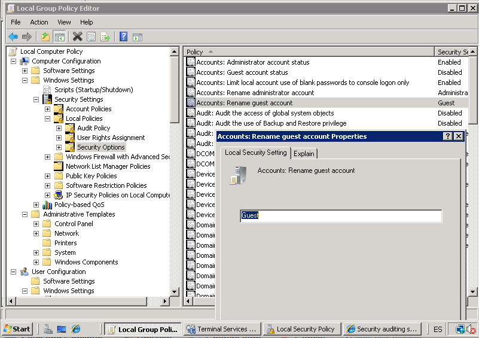

:slug: defends/windows-server/cambiar-usuarios/
:category: windowsserver
:description: Nuestros ethical hackers explican cómo evitar vulnerabilidades de seguridad en Windows Server 2012 al cambiar los nombres de usuario predeterminados. Las configuraciones iniciales son inseguras debido a que son conocidas, por ello, modificarlas es una buena practica de seguridad.
:keywords: Windows Server 2012, Usuarios, Predeterminados, Configuración, Seguridad, Credenciales
:defends: yes

= Cambiar Usuarios Predeterminados

== Necesidad

Cambiar credenciales por omisión modificando nombres de usuario.

== Contexto

A continuación se describen las circunstancias
bajo las cuales la siguiente solución tiene sentido:

. Se tiene una máquina que utiliza
el sistema operativo +Windows Server 2012+.

. La máquina mantiene las credenciales por defecto del sistema operativo.

. Si desea que las políticas apliquen a todo el dominio
bajo un esquema de directorio activo,
es necesario utilizar el editor de políticas de grupo.
El procedimiento en el editor de políticas de grupo es análogo
al que se explica a continuación para el editor de políticas local.

== Solución

A la hora de desarrollar una aplicación,
existen muchas prácticas de programación segura
y configuraciones recomendadas
que buscan aumentar el nivel de seguridad general del sistema.
Mantener las configuraciones por defecto en las aplicaciones finales
es una práctica insegura que no debe realizarse.
Esto se debe a que los usuarios, contraseñas,
y otras configuraciones iniciales
normalmente son conocidas,
por lo que suponen un riesgo
para la confidencialidad de la información del sistema,
y un blanco común para los atacantes.
Un usuario malicioso podría realizar un ataque
de diccionario con usuarios por defecto,
resultando en un robo de credenciales.
En este artículo mostraremos
cómo cambiar los nombres de las cuentas de usuario y administrador,
que vienen por defecto en +Microsoft Windows Server 2012+,
mejorando la seguridad del sistema,
y evitando el accesos no autorizados a la aplicación
a través de credenciales por defecto.
Para ello debemos seguir el siguiente procedimiento:

. Abrir la función de ejecutar de +Windows+.
Para ello pulsar las teclas de Teclas de +Windows+R+.

. Una vez abierto escribir +gpedit.msc+.
Esto abrirá el +Local Group Policy Editor+
(Editor de políticas de grupo).

. En el +Local Group Policy Editor+ dirigirse a
la sección +Computer configuration+ (Configuración del Equipo),
luego a +Windows Settings+ (Configuración de Windows),
+Security Settings+ (Configuraciones de Seguridad),
+Local Policies+ (Políticas Locales), +Security Options+ (Opciones de Seguridad)
y finalmente a +Accounts Rename+ (Renombrar Cuentas).

. En este punto, dar clic secundario en +Properties+
y se abrirá una nueva ventana.

. Presionar la pestaña de +Local Security Settings+
(Configuraciones Locales de Seguridad)
para modificar el nombre de +guest+ (invitado).
A continuación se muestra el procedimiento anteriormente descrito:
+
.Modificación de usuario guest

. Para modificar el nombre de administrador,
se repite el paso anterior para el usuario +administrator+.

. El cambio surtirá efecto en el próximo reinicio.

== Referencias

. [[r1]] link:https://social.technet.microsoft.com/wiki/contents/articles/24962.renombrar-las-cuentas-administrador-e-invitado-en-windows-server-es-es.aspx[Renombrar las cuentas Administrador e Invitado en Windows Server].

. [[r2]] link:../../../rules/142/[REQ.142 Modificar credenciales de acceso por defecto]
