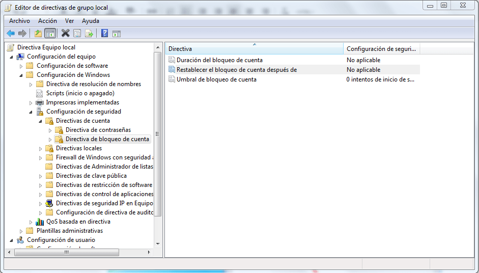

:slug: defends/windows/bloquear-temporalmente/
:category: windows
:description: Nuestros ethical hackers explican cómo evitar vulnerabilidades de seguridad mediante la configuración segura en Windows 7 al bloquear temporalmente una cuenta. Los ataques de fuerza bruta con diccionario pueden resultar en un robo de credenciales si la aplicación no está debidamente configurada.
:keywords: Windows 7, Bloquear, Temporalmente, Cuenta, Prevenir, Fuerza Bruta.
:defends: yes

= Bloquear cuentas temporalmente

== Necesidad

Bloquear temporalmente una cuenta de +Windows 7+
cuando se realizan varios intentos de autenticación fallidos.

== Contexto

A continuación se describen las circunstancias
bajo las cuales la siguiente solución tiene sentido:

. Se tiene una máquina instalada con el sistema operativo +Windows 7+.
. Se desea evitar ataques de fuerza bruta o con diccionario
bloqueando temporalmente la cuenta atacada.
. Opcionalmente se desea propagar la configuración
a equipos pertenecientes a un dominio +Windows+.

== Solución

Los ataques de fuerza bruta consisten en hacer intentos sucesivos
(por ejemplo de autenticación), hasta encontrar valores
que retornen la respuesta esperada
(por ejemplo credenciales de autenticación válidas).

Entre los controles para este vector de ataque,
se encuentra implementar retardos o bloqueos temporales,
sin embargo estos últimos no deben ser permanentes,
porque representarían también una vulnerabilidad
(denegación de servicio a una cuenta arbitraria).

Para modificar parámetros relacionados
al tiempo que debe bloquearse una cuenta ante intentos fallidos,
siga las siguientes instrucciones:

. Para aplicar la solución de modo local, ir a la barra de tareas,
hacer clic en Inicio e ingrese +gpedit.msc+.
Esto abrirá el Editor de Directivas de Grupo Local de +Windows+.

. En el Directiva de Equipo Local, dirigirse a +Configuración de Equipo+,
luego a +Configuración de Windows+, +Configuración de Seguridad+,
+Directivas de Cuenta+ y finalmente +Directiva de Bloqueo de Cuenta+.
Una vez allí dar clic secundario sobre la opción deseada
y luego seleccionar +Propiedades+, cambiar el nombre y pulsar en +Aceptar+.
A continuación se muestra una imagen del procedimiento descrito anteriormente:
+
.Editor de Directivas de Grupo Local

+
Las opciones recomendadas a ser cambiadas son:
+
* Duración del bloqueo de la cuenta:
Número de intentos antes de que la cuenta sea bloqueada.
Se recomienda un valor de +3+ a +5+.

. De forma análoga puede configurar el tiempo
que la cuenta va permanecer bloqueada.
Para esto se sugiere escoger un valor de +30+ (minutos).
Puede configurar el tiempo de bloqueo asignándole un valor
a los siguientes parámetros:
+
* Umbral de bloqueo de cuenta:
Hace referencia al tiempo durante el cual la cuenta permanece bloqueada.

* Restablecer el bloqueo de la cuenta después de:
Hace referencia al tiempo que tarda el contador de intentos fallidos
en volver a cero después de alcanzar el umbral.

== Referencias

. [[r1]] link:https://omicrono.elespanol.com/2016/11/bloquear-pc-temporalmente/[Cómo bloquear tu PC si alguien falla la contraseña varias veces].

. [[r2]] link:../../../rules/226/[REQ.226 Evitar bloquear cuenta de usuario].

. [[r3]] link:../../../rules/237/[REQ.237 Establecer acciones de usuario seguras].
