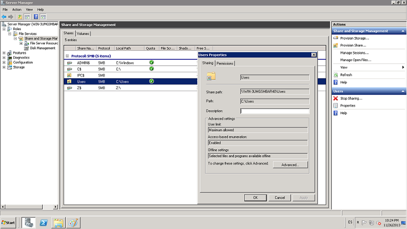
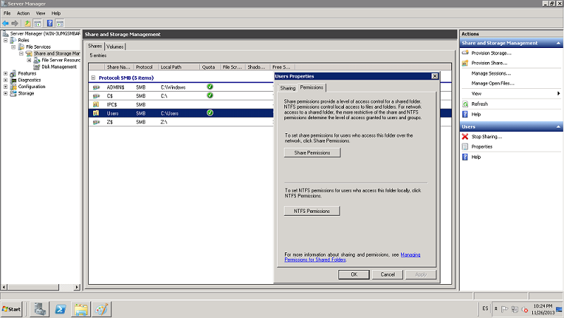
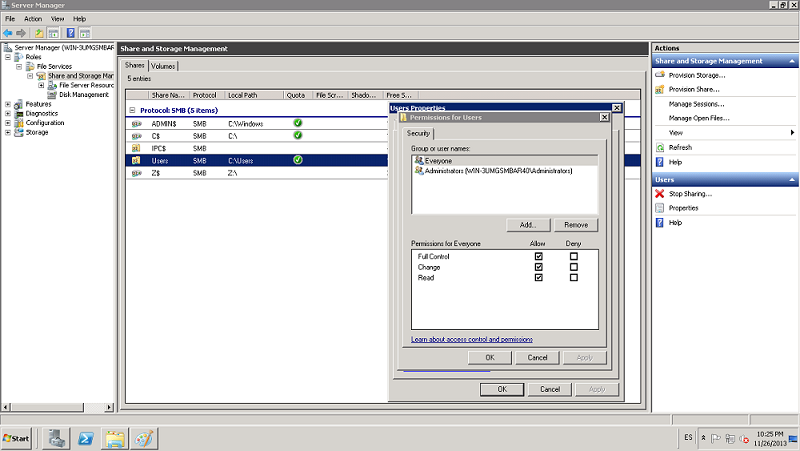
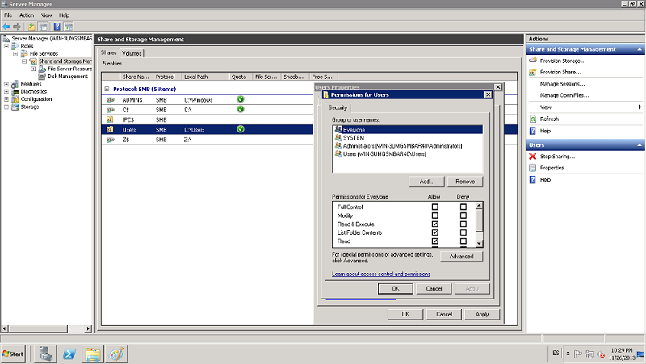

:slug: defends/windows/brindar-acceso-recursos/
:category: windows
:description: Nuestros ethical hackers explican cómo evitar vulnerabilidades de seguridad mediante la configuración segura de permisos en Windows. En este instructivo, explicaremos paso a paso cómo dar permisos de acceso sobre recursos de Windows Server 2008 de forma centralizada.
:keywords: Seguridad, Permisos, Windows, Windows server 2008, Buenas prácticas, Acceso.
:defends: yes

= Brindar Permisos de Acceso Sobre Recursos

== Necesidad

Dar los permisos de acceso sobre los recursos de forma centralizada.

== Contexto

A continuación se describen las circunstancias
bajo las cuales la siguiente solución tiene sentido:

. Se tiene una máquina con sistema operativo +Windows Server 2008+.

== Solución

Para brindar o dar permisos de una manera centralizada
sobre los recursos del servidor,
se deben seguir los siguientes pasos:

. Se ingresa al +Server Manager+
y se hace clic en +File Services+ y +Share and Storage Manager+.
Luego se da doble clic sobre el recurso compartido.
Tal como se ve en la imagen.
+

. Allí damos clic sobre las pestaña +Permissions+.
+

. Aquí debemos definir y diferenciar
los tipos de permisos para los recursos,
los cuales pueden ser:

. *Permisos +SMB+*.
El control de acceso basado en +SMB+ de un recurso compartido
se determina a través de dos conjuntos de permisos:
permisos +NTFS+ y permisos de recurso compartido.
Normalmente, los permisos de recurso compartido
sólo se usan para el control de acceso en equipos
que no usan el sistema de archivos +NTFS+.

. Los permisos +NTFS+ y los permisos de recurso compartido son independientes
en el sentido de que ninguno afecta al otro.
* *Nota:* el más restrictivo de los dos
será el que se aplique al recurso compartido.

. Si usa Administración de almacenamiento y recursos compartidos,
puede especificar permisos compartidos
para los recursos compartidos basados en +SMB+
de la siguiente forma:

* *Nuevos recursos compartidos*.
En el Asistente aprovisionar carpetas compartidas.
Si selecciona +SMB+ como protocolo de uso compartido,
puede especificar los siguientes permisos de acceso basados en +SMB+
en la página permisos +SMB+.

. Todos los usuarios y grupos sólo tienen acceso de lectura.
El permiso resultante será el permiso +LECTURA+ para el grupo +TODOS+.

. Los administradores tienen control total.
Todos los otros usuarios y grupos sólo tienen acceso de +LECTURA+.
El grupo +ADMINISTRADORES+ tendrá el permiso +CONTROL TOTAL+,
mientras que al grupo +TODOS+ se le concederá el permiso +LECTURA+.

. Todos los demás usuarios y grupos
sólo tienen acceso de +LECTURA+ y de +ESCRITURA+.
El grupo +ADMINISTRADORES+ tendrá el permiso +CONTROL TOTAL+,
mientras que al grupo +TODOS+
se le concederá tanto el permiso +LECTURA+
como el permiso +ESCRITURA+.

. Los usuarios y grupos
tienen permisos de los recursos compartidos personalizados.
Para usar esta opción,
debe especificar todos los grupos y usuarios
que vayan a tener acceso compartido,
así como los permisos específicos de recursos compartidos
(+CONTROL TOTAL+, +CAMBIAR+, +LECTURA+)
que se concederán o denegarán a cada uno de ellos.

. Recursos compartidos existentes.
Puede cambiar los permisos de recurso compartido
de una carpeta o volumen compartidos
que aparecen enumerados en el protocolo +SMB+
en la ficha recursos compartidos.
Para modificar los permisos de recurso compartido,
seleccione la carpeta o volumen.
En el panel +Actions+, haga clic en +Properties+
y en la ficha Permissions+, haga clic en +Share Permissions+.
+

. Puede configurar los permisos +NTFS+ locales
para una carpeta o volumen compartido
mediante la administración de almacenamiento y recursos compartidos
de las formas que se indican a continuación:

* *Nuevos recursos compartidos*.
En el Asistente para aprovisionar carpetas compartidas,
antes de seleccionar un protocolo de uso compartido de red,
puede modificar los permisos +NTFS+
para la carpeta o volumen que va a compartir.
Estos permisos +NTFS+ se aplicarán tanto de forma local
como al obtener acceso al recurso a través de la red.
Para modificar los permisos +NTFS+,
en la página permisos +NTFS+, seleccione +Sí+,
cambiar los permisos +NTFS+
y, a continuación, haga clic en +Editar permisos+.

. Recursos compartidos existentes.
Puede modificar los permisos +NTFS+
de una de  las carpetas o volúmenes compartidos
de los que aparecen en la ficha recursos compartidos.
Para modificar los permisos +NTFS+,
seleccione la carpeta o volumen,
en el panel +Actions+, haga clic en +Properties+
y en la ficha +Permissions+, haga clic en +NTFS Permissions+.

== Referencias

. [[r1]] link:https://technet.microsoft.com/es-es/library/cc770962.aspx[Administrar permisos sobre los recursos]
. [[r2]] link:https://technet.microsoft.com/es-es/library/cc772501(v=ws.11).aspx[Establecer los permisos de un recurso compartido]
. [[r3]] link:../../../rules/035/[REQ.035 Administrar modificaciones de privilegios]
