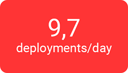
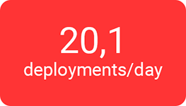

:slug: events/breaking-the-build/
:subtitle: Our SecDevOps Habits
:category: events
:description: This page aims to inform the customer about the different talks offered by Fluid Attacks. In the Breaking the Build conference we talk about our SecDevOps habits that allow us to keep improving and changing every day, and the first steps to implement these habits on your company.
:keywords: Fluid Attacks, SecDevOps, Security, Development, Technology, CI-CD.

= Breaking the build

== 1. Objective

The term +SecDevOps+ has grown in popularity in recent years;
however, every Webinar that addresses the topic
only focuses on its benefits, or possibles use cases,
ignoring the people’s main reason to assist in this kind of events.

It can be deduced that people want to know at least
*how does this work?* and *where to start?*.
The speaker may show us how to perform tests
over an extremely simple environment,
completely unrelatable to our everyday tasks,
and in this case, new questions emerge, such as
*does this work?* Alternatively, *how can I apply it to my company?*

Based on the above,
in this talk, we seek to answer the posed questions,
through the socialization of our methodologies and work practices
or *habits* that allow us to implement a +SecDevOps+ culture
in the execution of our projects;
from the infrastructure management
to the development of our orchestration platform
for vulnerabilities remediation:
[button]#link:../../products/integrates/[Integrates]#.

These habits allow us not only to increase our productivity,
and daily generate value to our customers,
but to increase the security of our production deployments.
Thereby, we could reach, in the last six months, an average of:

[role="tb-alt"]
[frame="none",cols=2,caption=""]
|====
a|[caption=""]
.Average of all systems 2018/01/01 - 2019/04/24

a|[caption=""]
.Systems with higher average 2018/01/01 - 2019/04/24

|====

== 2. Content

This *seminar/workshop* aims to implement
the concepts and techniques saw in
[button]#link:../burn-the-datacenter/[Burn the Datacenter]#.
Everything is performed *live*
over real infrastructure and applications,
taking a look into the backstage of the process:
The tools used,
the logs that allow us to identify issues,
and even the source code that defines each step
for the correct deployment of our applications,
always focusing on how our infrastructure and products
are updated in *real time*.

To understand how everything happens
and demonstrate how to take the first step to reach this configuration,
we also explain all the work habits
that have allowed us to reach this point and keep improving daily.
These habits address topics such as:

* Source code management inside repositories,
following a *monorepo* structure
(say goodbye to multirepo)

* Keep a clean and small environment for the developers,
including the changes to the master branch,
avoiding code accumulation
and reaching *zero inventory* (leaving +gitflow+ behind)

* Generate daily value to the customers
through a *micro changes* methodology
(instead of big changes every +3+ weeks or more).

* Migrate and manage all the infrastructure as versioned source code,
turning it into *immutable infrastructure*
(avoiding management consoles and unauthorized changes).

* Define  Continuous Integration environments as source code,
+*pipeline as code*+,
in a way that can easily be configured
and modified for all kind of tests
(avoiding graphical interface limitations
for pipeline configurations).

* Avoid servers at any cost,
migrating to cloud services
and reaching a *serverless* infrastructure.

* Safe password management when deploying an application
avoiding sensitive information disclosure in source code
and *keeping the secrets protected*.

* Deploy *ephemeral environments*
that allow testing all the developed features
before passing to production
(reducing project complexity by avoiding development environments,
testing, +QA+, and others)

* *Breaking the build* even before making a +commit+ to the repository
using +*pre-commit*+ for checking the source code.

* Perform tests over the source code and over the deployment
that *break the build* as a result for the smallest error
(not only notify and allow the error to keep evolving/growing):

** Multiplatform integration.
** Unit testing.
** Coverage.
** Strict +Linters+.
** +Security Gates (SAST y DAST)+.

* Extreme reduction of +build+ times
by using the *cache* correctly.

*  Take advantage of the features presented
in the version control client +Git+:

** +Peer Review+.
** +Squashing+.
** +Rebasing+.
** +Rollback+
** +Trigger builds+.

* *Telemetry* accessible to developers
(not logs, only available for infrastructure area)

Each point previously described is explained
while accessing +Fluid Attacks+ systems
to look at its implementation and operation.
According to the needs or interest of the assistants,
it is possible to focus on the topics they deem most important.

== 3. Experience

This *workshop* has been presented to professionals
in technology and auditing areas, for companies such as:
link:https://www.accenture.com/co-es/new-applied-now[+Accenture+],
link:https://www.arus.com.co/[+Arus+],
link:https://www.avianca.com/co/es/[+Avianca+],
link:https://www.grupobancolombia.com/wps/portal/personas[+Bancolombia+],
link:https://www.banistmo.com/[+Banitsmo+],
link:https://www.biva.mx/en/web/portal-biva/home[+BIVA+],
link:http://www.cadena.com.co/es/home.aspx[+Cadena+],
link:http://cidenet.com.co/[+Cidenet+],
link:http://www.cognox.co[+Cognox+],
link:https://www.corona.co/[+Corona+]
link:http://www.eafit.edu.co/[+EAFIT+],
link:https://evendidigital.com/[+Evendi Digital+],
link:https://www.f2x.com.co/[+F2X+], link:http://www.gco.com.co/[+GCO+],
link:https://www.grupoexito.com.co/es/[+Grupo Éxito+],
link:https://www.kometsales.com/[+Komet Sales+],
link:https://www.payvalida.com/co/es/[+Pay valida+],
link:https://www.proteccion.com/wps/portal/proteccion/[+Protección+],
link:http://www.seti.com.co/sitios/seti/Paginas/HomePageSeti.aspx[+Seti+]
and link:http://www.techandsolve.com/[+Tech and Solve+].

== 4. Where?

The presentation can be hosted
at your company's facilities or an external venue.

== 5. Duration

The *workshop* has a duration of *6 hours*
(it is not possible to reduce its duration).
It comprises a live demonstration of our practices,
a morning break, and a lunch break.

== 6. When

The *workshop* is designed to be performed from *9 A.M.* to *3 P.M.*,
with a *30 minutes* break at *12 m*
The event date must be scheduled by agreement
between the attendants and +Fluid Attacks+.

== 7. Details

. *Investment*: The space and food for this workshop
are completely covered by +Fluid Attacks+.
The attendance must commit themselves with their time
and their transportation expenses
including vehicles parking costs
in case the facility exceeds its capacity.

. *Material*: As well as the other events
offered by +Fluid Attacks+
the event material is sent to the attendance
once *all* the assistants have completed the
[button]#link:https://fluidsignal.formstack.com/forms/talk[online satisfaction survey]#
*before leaving* the auditorium.

== 8. Public

The *workshop* is suitable for both technical and managerial personnel,
and the satisfaction rate for both profiles is equally high.
However, if you wish to promote new changes
and experimentation inside your company,
considering people that can make decisions is important.

The *workshop* is designed for an audience
between *12 and 14* persons on the customer side,
besides +4+ additional assistants on +Fluid Attacks+ side.

== 9. Requirements

[button]#link:../#requirements[Requirements]#

== 10. Speakers

* [button]#link:../../people/jrestrepo/[Juan Restrepo]#
* [button]#link:../../people/ralvarez/[Rafael Álvarez]#
* [button]#link:../../people/dsalazar/[Daniel Salazar]#
