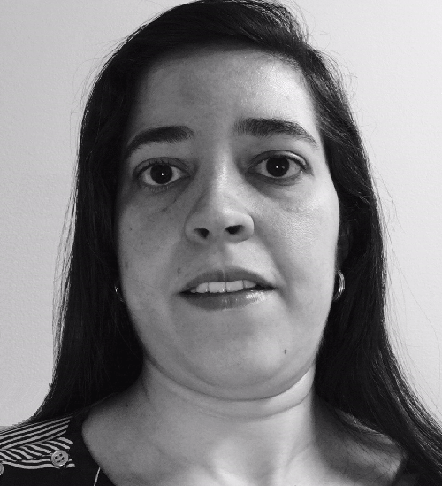

:slug: people/ccarrasco/
:category: people
:description: Fluid Attacks is a company focused on ethical hacking and pentesting in applications with over 18 year of experience providing our services to the Colombian market. The purpose of this page is to present a small overview about the experience, education and achievements of Carolina Carrasco.
:keywords: Fluid Attacks, Team, People, Members, Carolina, Carrasco

= Carolina Carrasco

[role="img-ppl"]

Electronic Engineer specialized in Management.
`Fluid Attacks` Senior Project Manager;
she is responsible for the project management team
and also for the management of projects
related to the operation of the red team.
Carolina has been part of our team for almost four years
and has also helped in the security architecture area.
She has over eight years of experience in project management,
four years specifically managing information security-related projects.
Carolina has managed projects in English and Spanish
as she is fluent in both languages;
she also has an intermediate level of French.

Before being part of `Fluid Attacks`,
she was project manager for a telecommunication company.
She worked in the telecommunication industry
in both technical and coordination activities.
