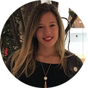
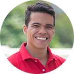
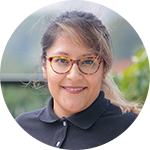
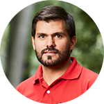
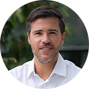
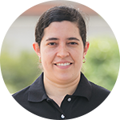
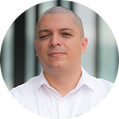

:slug: people/
:category: about-us
:description: Fluid Attacks is a company focused on ethical hacking, pentesting and vulnerabilities detection in applications with over 18 year of experience providing our services to the Colombian market. The purpose of this page is to present the members that make up our work team.
:keywords: Fluid Attacks, Team, People, Profiles, Experience, Members.

= People

We are a dedicated and enthusiastic team focused on software hacking,
finding vulnerabilities, and passionate about our work.
Technology and security is part of our DNA;
we are always attacking, testing, and developing new applications.
Meet some of our team:

[role= "tb-ppl"]
[cols=3]
|===

a|=== Paula Vélez

Architecture Team +
link:https://www.linkedin.com/in/pauveelez/[LinkedIn]

a|=== link:ralvarez/[Rafael Alvarez]
image::ralvarez.png[alt="Rafael Álvarez", width=100 ]
Operations Team +
link:https://www.linkedin.com/in/rafael-alvarez-7b04a2177/[LinkedIn]

a|=== link:jarmas/[Jonathan Armas]

Testing Team +
link:https://www.linkedin.com/in/jonathan-armas[LinkedIn]

a|=== Diana Naspirán

Projects Team +
link:https://www.linkedin.com/in/dianacarolinanaspiran/[LinkedIn]

a|=== Juan Restrepo

Development Team +
link:https://www.linkedin.com/in/juancrestrepo[LinkedIn]

a|=== Felipe Gómez

Sales Team +
link:https://www.linkedin.com/in/felipegomezarango[LinkedIn]

a|=== Vladimir Villa

Management Team +
link:https://www.linkedin.com/in/vladimir-villa-g%C3%B3mez-31a23b5/[LinkedIn]

a|=== Mauricio Gómez

Management Team +
link:https://www.linkedin.com/in/mgomezarango/[LinkedIn]

a|=== link:ccarrasco/[Carolina Carrasco]

Project Team +
link:https://www.linkedin.com/in/carolina-carrasco-01612767/[LinkedIn]

a|=== link:aroldan/[Andrés Roldán]

Architecture Team +
link:https://www.linkedin.com/in/andr%C3%A9s-rold%C3%A1n-0602702/[LinkedIn]

a|=== David Cardona

Operations Team +
link:https://www.linkedin.com/in/david-145843146/[LinkedIn]

a|=== Elkin Echeverri

Board Team +
link:https://www.linkedin.com/in/elkin-echeverri-garcia-bb81505/[LinkedIn]

a|=== Juan Echeverri

Board Team +
link:https://www.linkedin.com/in/juan-carlos-echeverri-cia-ccsa-29a6829a/[LinkedIn]

a|=== John Gómez
Board Team +
link:https://www.linkedin.com/in/john-g%C3%B3mez-594a3727/[LinkedIn]

|===
