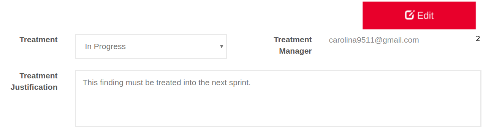

:slug: products/integrates/
:category: products
:description: Integrates is a system which provides all interested parties information and updates about the current state of the project, the number of security findings discovered and its criticality, occurrences, among other information in order to keep close contact with our customers.
:keywords: Fluid Attacks, Products, Integrates, Ethical Hacking, Pentesting, Security.
:template: salesforce

= Integrates

[role="tb-product"]
[cols="^.^", frame="none"]
|====

a|At Integrates a project’s stakeholders
(developers, technicians, management, etc.) can interface
with +Fluid Attacks+ hackers.
Through Integrates, +Fluid Attacks+ communicates all identified security risks
to a client’s systems for prompt,
efficient and effective remediation by the client company.
It also provides the client company’s decision-makers
with real time information regarding their systems’ security
and +Fluid Attacks+ project progress.

a|[button]#link:../../contact-us/[Request a Demo]#
|====

[role="tb-alt"]
[cols=3, frame="topbot"]
|====

2+a|== Project Indicators

Project Indicators inform a client company
about the current status of a project,
using information including:

* Number of identified security vulnerabilities.
* Current threat level vulnerabilities pose to a client company’s systems.
* Vulnerabilities that have been remediated.

a|image::indicators.svg[Ethical Hacking Indicators]

a|image::graphs.svg[Ethical Hacking Graphs]
2+a|== Project Status Graphs

In Project Status Graphs a client company can see
the current status of reported security vulnerabilities.
This allows a client company to:

* Prioritize security vulnerabilities by the threat level they pose
to a client company’s systems.

* Differentiate between real vulnerabilities,
simple security issues, and hygiene issues.

* See a project’s progress based on the number of vulnerabilities remediated,
in the process of being remediated,
or that are waiting to be remediated.

2+a|== View Real-Time Events

All events that inhibit the execution of the project
can be viewed in real time.
a|image::eventualities.svg[Events]

a|image::prioritize-remediation.svg[Ethical Hacking Remediation]

2+a|== Prioritize Remediation

Prioritizing remediation helps a client company
determine which vulnerabilities require immediate attention.
Security vulnerabilities are prioritized based on parameters including:

* *Age:* Time between the report of an identified vulnerability
and the repair by a client company’s technical team.

*  *Severity:* level of threat posed by a vulnerability
according to the +CVSS+ (Common Vulnerability Scoring System) standard.

* *Status:* *OPEN* (a current, active threat),
*CLOSED* (no longer an active threat),
*PARTIALLY CLOSED* (poses a lowered threat level).

* *Resolution options:* *ASSUMED* (client company assumes any security risks
stemming from inaction), *PENDING* (client company has not yet decided
on any further action), *REMEDIATE* (client company will resolve
the security risk posed by the vulnerability).

2+a|== View Vulnerabilities, their description, severity, evidence, and timeline

* View Vulnerabilities allows the client company
to see vulnerabilities and information on their current status,
including severity of the threat,
type of threat posed, and identification/report date.

* The Vulnerability Description
contains technical information about each vulnerability.
Information includes their location, security risks they pose,
and recommendations on how to eliminate them.

* Vulnerability Severity indicates the risk level
an identified vulnerability poses to a client company’s systems
using the international Common Vulnerability Scoring System (+CVSS+) standard.

* In Vulnerability Evidence proof that a security vulnerability exists
is shown graphically and includes a descriptive explanation.

* The Vulnerability Timeline
shows the evolution of a particular vulnerability over time.
Using report dates and different closing cycles
it illustrates the effectiveness of the closing cycles
performed by the client company.

a|image::vulnerability-evidence.png[Ethical Hacking Vulnerability Evidence]

2+a|== Request Verification / Treatment

Clients may request a revision ^1^ of a vulnerability
they have remediated and ask +Fluid Attacks+ for documentation ^2^
of their remediation or treatment.
For documentation purposes, a client has the following options:

* *Accepted:* The client assumes the risk
that implies not solving the security issue.
* *New:* The client still has not decided whether to assume
or to remediate the vulnerability.
* *In Progress:* The client will solve the security issue.
a|image::request-verification.png[Request Verification]

a|image::exploitation-animation.gif[Ethical Hacking Exploitation Animation]
2+a|== Exploitation Animation

In Exploitation-Animation you can see an animated representation
of the process used to exploit a vulnerability through +gif+.

2+a|== Exploit

Exploit shows the diagnostic script used to expose,
or exploit, a security vulnerability.
This same script can also be used to verify a client company’s solution
for a particular problem has been successful.

If the client company is licensed to use our product,
[inner]#link:../asserts/[Asserts]#, they may reproduce a mock attack
that targets the vulnerability to determine independently
if they have eliminated the vulnerability.

a|image::vulnerability-exploitation.png[Ethical Hacking Exploitation]

a|image::technical-report.svg[Ethical Hacking Technical Report]

2+a|== Generate Technical and Executive Reports

Executive Reports are a summary version of the technical report
specifically written so that non-technical stakeholders
and decision-makers can understand a client company’s vulnerabilities,
the threats they pose, the steps taken to insure system security,
and to track progress toward an endpoint.

2+a|== Compromised Records

Compromised Records shows the client company
the information such as names, identifiers, balances, products, etc.
that would be vulnerable to a security breach in a real attack.
This information is revealed during the execution
of +Fluid Attacks+ security tests.

a|image::records.png[Compromised Records]

a|image::vulnerability-comments.png[Ethical Hacking Vulnerability Comments]

2+a|== Communication Exchange/Chat with Us

At times it is necessary for +Fluid Attacks+ and a client company
to exchange insights, discuss questions or concerns,
and to clarify information flowing both ways.
Chat with Us provides a private forum on which a client company
and +Fluid Attacks+ can post messages concerning any aspect
of a client company’s project.
+Fluid Attacks+ engineering team will post a reply within +4+ hours
between +8 a.m.+ and +5 p.m.+ (Eastern Time, +U.S.A.+).
To insure a client company receives timely communication,
a notification will also be sent via email
when a reply to a client message has been posted.

2+a|== Notifications via e-mail

Notifications are sent via e-mail to the project's stakeholders.
Some of them are:

* Weekly, regarding changes in vulnerabilities.
* When a user comments in a specific vulnerability.
* When a user reports that a vulnerability has been remediated.
* When a validation of the remediation of a vulnerability is made.
* When a vulnerability reaches a certain age
(+15+, +30+, +60+ days old ...) and has not been treated.

a|image::mail.png[Mail]

|====
