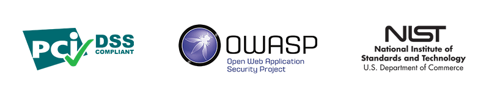
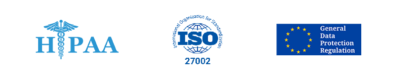

:slug: products/rules/
:category: products
:description: Rules is a compilation of several security criteria, developed by Fluid Attacks, based on different international standards to ensure the security of systems.
:keywords: Fluid Attacks, Products, Rules, Criteria, Security, Applications.

= Rules

[role="tb-product"]
[cols="^.^", frame="none"]
|====

a|`Rules` is a set of security requirements
that allows you to parameterize a pentest
according to the risk appetite of your organization.
`Rules` allows you to determine what is tested and what is not,
and what is considered a vulnerability and what is not.
It is also the basis for determining how rigorous a pentest was,
based on tested and untested requirements.
The security requirements are independent of the type of technology being used
and are written as specific and understandable objectives.
They are the security demands that you agree to follow and comply with.
In our hacking services, we determine if these are met or not.

|====
[role="tc"]
[button]#link:../../rules/[Access Rules, role="button-rules"]#

== Standards

Rules is based on several standards
related to information security, including the following:

. [inner]#link:../../search.html?q=ASVS[ASVS]#.
link:https://www.owasp.org/index.php/Category:OWASP_Application_Security_Verification_Standard_Project[`OWASP` Application Security Verification Standard].

. [inner]#link:../../search.html?q=pci[PCI]#.
link:https://www.pcisecuritystandards.org/[`PCI` Security Standards Council].

. [inner]#link:../../search.html?q=bsimm9[BSIMM9]#.
link:https://www.bsimm.com/download.html[Building Security In Maturity Model].

. [inner]#link:../../search.html?q=CWE[CWE]#.
link:https://cwe.mitre.org/[Common Weakness Enumeration].

. [inner]#link:../../search.html?q=directive[EPR]#.
link:https://edps.europa.eu/data-protection/our-work/subjects/eprivacy-directive_en[E-privacy Directive].

. [inner]#link:../../search.html?q=GDPR[GDPR]#.
link:https://gdpr-info.eu/[General Data Protection Regulation].

. [inner]#link:../../search.html?q=HIPAA[HIPAA]#.
link:https://www.hhs.gov/hipaa/for-professionals/security/laws-regulations/index.html[Health Insurance Portability and Accountability Act].

. [inner]#link:../../search.html?q=NIST+800-53[NIST]#.
link:https://nvd.nist.gov/800-53/Rev4[`NIST` Special Publication 800-53 (Rev. 4)].

== Categories

. [inner]#link:../../rules#credentials[Credentials]#: Rules regarding the creation and management of passwords and
other tokens used in authentication and authorization processes.

. [inner]#link:../../rules#authentication[Authentication]#: Rules regarding authentication and identity verification
mechanisms.

. [inner]#link:../../rules#authorization[Authorization]#: Rules regarding access control mechanisms and account
management.

. [inner]#link:../../rules#session[Session]#: Rules regarding the management of session and session information.

. [inner]#link:../../rules#legal[Legal]#: Rules regarding the compliance with legal requirements.

. [inner]#link:../../rules#privacy[Privacy]#: Rules regarding the management of sensitive personally
identifiable information (*PII*).

. [inner]#link:../../rules#data[Data]#: Rules regarding the protection and management of business
information.

. [inner]#link:../../rules#source[Source]#: Rules regarding the protection, management and content of source
code.

. [inner]#link:../../rules#system[System]#: Rules regarding the management of corporate systems.

. [inner]#link:../../rules#files[Files]#: Rules regarding the management of files in systems and applications.

. [inner]#link:../../rules#logs[Logs]#: Rules regarding the protection, management and content of logs.

. [inner]#link:../../rules#emails[Emails]#: Rules regarding the protection and management of email accounts and
services.

. [inner]#link:../../rules#services[Services]#: Rules regarding the management of corporate services and the
usage of third-party services.

. [inner]#link:../../rules#certificates[Certificates]#: Rules regarding the management and content of digital
certificates.

. [inner]#link:../../rules#cryptography[Cryptography]#: Rules regarding the management of cryptographic keys and the
usage of cryptographic algorithms and protocols.

. [inner]#link:../../rules#architecture[Architecture]#: Rules regarding configurations and mechanisms for system
architecture hardening.

. [inner]#link:../../rules#network[Network]#: Rules regarding the protection, management and configuration of
computer networks.

. [inner]#link:../../rules#virtualization[Virtualization]#: Rules regarding the configuration and management of virtual
environments.

. [inner]#link:../../rules#devices[Devices]#: Rules regarding the configuration and protection of mobile and *IoT* devices
and applications.

. [inner]#link:../../rules#social[Social]#: Rules regarding the usage of social networks and publicly
accessible websites.

Want to know more about our products?
Do not hesitate to [inner]#link:../../contact-us/[contact us]#.
