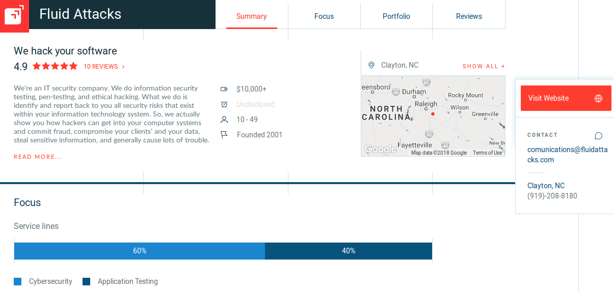

:slug: reviews/
:category: reviews
:description: Fluid Attacks is a company focused on information security, ethical hacking, penetration testing and vulnerabilities detection in applications with over 18 years of experience in the Colombian market. In this page we present our customer reviews related to our services and products.
:keywords: Fluid Attacks, Customers, Reviews, Services, Products, Evaluation.

= Reviews

`Fluid Attacks` does everything in its power
to make sure your business has the resources it needs
to protect its digital assets and to run smoothly
without having to worry about the possibility of a security breach.
With our experience in cybersecurity,
we know how to prevent your valuable information
from getting into the wrong hands.
We are proud to have recently been recognized by Clutch
as one of the link:https://clutch.co/it-services/cybersecurity[Top Cybersecurity Consulting Companies]
in the world!.

link:https://clutch.co/[Clutch] is an emerging `B2B` ratings
and reviews platform based in Washington, DC.
They are renowned for their ability to facilitate the networking process
between companies in different industries.
Clutch helps companies efficiently find partners for business,
marketing, technology, design, and related digital services projects.
They provide the most accurate information
on potential partners and coupled with verified client reviews,
match one business's needs with another business's expertise.

At Fluid Attacks we value the personal relationships
we build with our clients.
We are willing to show you any part of our process
you would like to see
so that you may fully understand how `Fluid Attacks`
keeps your company safe and secure.
Read reviews on our company
written by previous clients at Clutch's website.

++++

++++

Clutch maintains a profile on each company
with past-client reviews and other information gathered by Clutch’s team.
The reputation of a firm is enhanced by client reviews,
high ratings, awards, and leaderboard mentions.
Thanks to the reviews left by Fluid Attacks' past clients,
we have attained a rating of `4.9` out of `5` stars.

We look forward to adding your company to `Fluid Attacks'` client list
and safeguarding your company's future.
For more great reviews about us,
take a look at our link:https://clutch.co/profile/fluid-attacks[`Fluid Attacks` profile] on Clutch.
