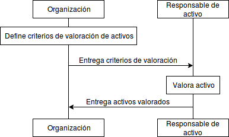

:slug: rules/005/
:category: information-assets
:description: This document contains the details of the security requirements related to a company's information assets. Information assets must be appraised and a monetary value set for each of them thus allowing the organization to know the importance and cost of loss and to determine cost effective controls.
:keywords: Requirement, Security, Assets, Information, Value, Monetary.
:rules: yes
:extended: yes

= REQ.005 Monetary Value of Assets is Defined

== Name

All information assets must be valued in monetary terms

== Description

The organization must value all previously identified assets
in monetary terms,
keeping in mind the value it represents to the business.
This will allow the organization
to know the importance of assets
as well as the cost of loss
and also allow them to determine and establish cost effective controls.

== Implementation

Defining the value of the information assets
is a complex topic due to the fact
that information assets are intangible.
Intangible information assets include
but are not limited to:

* Knowledge.
* Relations.
* Corporate secrets.
* Licenses.
* Patents.
* Experience.
* Technical knowledge.
* Corporate image.
* Brand.
* Comercial reputation.
* Client's trust.
* Competitive advantage.
* Ethics.
* Productivity.

Initially in immature asset management processes,
an organization may choose to define a qualitative value for their assets
according to a previously defined classification criteria,
however, as the organization betters their processes
It is strongly recommended that the organization
uses a monetary model to value their information assets.

To establish the value of an asset
the following items should be taken into account:

* The commercial value of the information.

* The cost of reposition in case of loss.

* The cost of the business impact in case of loss.

* The value of the preservation of the information.

With these variables in mind
the organization can define a formula
to establish the monetary value of their assets.

== Diagram

== Solutions

* Consulting - Determine the Value of Information.

* Consulting - Define the Information Asset Inventory.

* ISO 27005 - Risk management for an ISMS with ISO 27005.

* Consulting - Establishing the Owner of an Information Asset​.

* Consulting - Answering the Information Asset Inventory Questionnaire​.

* ISO 27003 - ​​ISO 27003 Guide.

== Abuse Cases

An anonymous person or employee executes actions
that attempt against the security
of any of the organization’s information assets.
Given the previous scenario
it is not possible to determine the value of the controls
that must be implemented
in order to protect the information assets
in a cost efficient manner.

== Attributes

* Layer: Resource Layer.

* Asset: Information Assets.

* Scope: Adherence.

* Phase: Analysis.

* Type of Control: Procedure.

== References

. link:https://es.wikipedia.org/wiki/ISO/IEC_27000-series[Wikipedia - ISO/IEC 27000 Norms].
. link:https://www.iso.org/isoiec-27001-information-security.html[ISO/IEC 27000 Norms and Standards].
