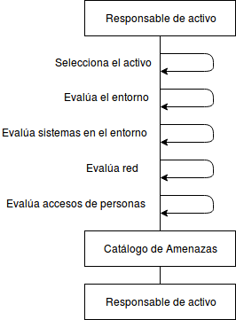

:slug: rules/006/
:category: information-assets
:description: This document contains the details of the security requirements related to a company's information assets. All threats to the information assets must be clearly identified and documented in order to make informed decisions regarding the asset's security risks.
:keywords: Requirement, Security, Assets, Information, Documentation, Threats.
:rules: yes

= REQ.006 Identify threats to assets

== Name

Threats to information assets must be identified and documented

== Description

The organization must model a representative structure
that includes all the information that impacts the assets’
integrity, availability and confidentiality.
Once the information is collected, organized and processed,
the organization will be empowered
to make informed decisions
about the assets’ security risks.

== Implementation

. A threat is an external factor
that can take advantage of a weakness
to inflict damage.
When threats are known
they can be monitored
in order to allow for an immediate reaction
in case the threat becomes a reality.
In the same manner,
it is possible to identify
possible weaknesses or vulnerabilities
that can be leveraged by the threat
and define controls to mitigate it.

. The existing threats are usually divided according to their scope of action:

* Environmental threats (Physical Security).
* System threats (Logical Security).
* Network threats (Communications).
* Human threats (Internal personnel and External).

The identification of threats is done
for each of the previously identified assets.
The organization can identify threats
by first evaluating the historical record of incidents
and deciding which were the external causes
that were established and put the asset’s integrity at risk.
After identifying the causes,
it is highly recommended to document them in a threat catalog.

It is recommended that threats be classified according to the types of assets
in such a way that the catalog
can be easily used to identify risks.

It is important that the threat catalog
be kept updated
so it can be used in the risks assessment.

== Diagram

== Solutions

* Consulting - Learn Basic Risk Theory
* ISO 27005 - Risk management for an ISMS with ISO 27005

== Abuse Cases

An anonymous person or employee executes actions
that attempt against the security
of any of the organization’s information assets.
Due to this situation
the controls that were put in place for their protection
are not effective since the current threat
was not previously identified.

== Attributes

* Layer: Resource Layer.
* Asset: Information Assets.
* Scope: Adherence.
* Phase: Analysis.
* Type of Control: Procedure.

== References

. link:https://www.iso.org/isoiec-27001-information-security.html[ISO/IEC 27000 Norms and Standards].
. link:https://www.microsoft.com/en-us/sdl/adopt/threatmodeling.aspx[Microsoft: Threat Model].
