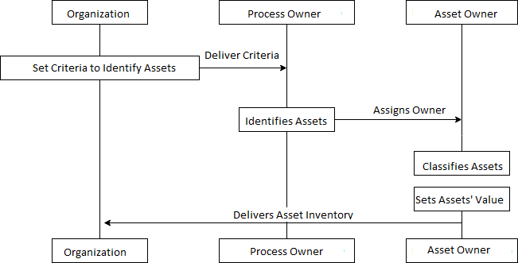

:slug: rules/001/
:category: assets
:description: This document contains the details of the security requirements related to a company's information assets. All the information assets must be properly identified in order to protect them from potential risks and allow for implementation of security controls.
:keywords: Requirement, Security, Assets, Information, Identification, Classification.
:rules: yes
:extended: yes

= REQ.001 Identify information assets

== Name

All the system´s information assets must be identified.

== Description

The organization must identify all their information assets
with the purpose of classifying them
in order to protect them from potential risks
and implement controls according to their value.

== Implementation

. It is recommended to set the scope
for the asset identification activity,
ideally this identification is set in the scope
of an Information Security Management System (ISMS).

. When the organization doesn't have an ISMS,
It is possible to set the scope of the activity
by first identifying the assets
that correspond to the organization's most important processes
and gradually broaden the scope to the remaining processes.

. The identification of assets may contain the following information:

* Asset ID.

* Asset name.

* Asset description.

* Asset group
(If a grouping parameter has been set, which is recommended.)

* Name of the process it belongs to.

* Severity of the process it belongs to.

* Owner, person in charge of the asset (link:../004/[REQ. 004]).

* Asset classification in terms of confidentiality, availability and integrity.

* Asset value according to its classification (link:../005/[REQ. 005]).

. It is recommended that the asset identification
be done by the responsible of each process of the organization
thus allowing for a proper classification of the asset
as shown in the following diagram:

== Solutions

* Consulting - Define the Information Asset Inventory.
* Consulting - Defining the Information Asset Granularity.
* Consulting - Establishing the Owner of an Information Asset.
* Consulting - Answering the Information Asset Inventory Questionnaire.
* ISO 27005 - Risk Management for ISMS with ISO 27005.
* ISO 27003 - ​ISO 27003 Guide.

== Abuse Cases

An anonymous person or employee executes actions
that attempt against the security
of any of the organization's information assets,
since the impact of the assets is unknown
the incident can´t be put in terms of value/cost.
In consequence, the incident´s solution
can come late or cause a greater impact to the organization.

== Attributes

. Layer: Resource Layer
. Asset: Information Assets
. Scope: Adherence
. Phase: Analysis
. Type of Control: Procedure

== References

. link:https://www.iso.org/isoiec-27001-information-security.html[ISO/IEC 27000 Norms and Standards].
. link:https://www.pmg-ssi.com/2017/02/realizar-inventario-activos-de-informacion/[How to make an inventory of information assets?].
