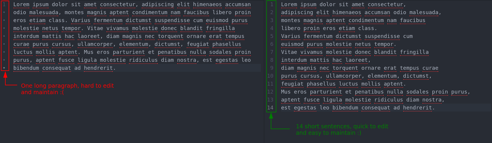

:slug: style/
:description: The purpose of this page is to establish the main guidelines for the articles and documents published in our website. Also, we present the acceptance criteria, the format and structure requirements and all the information you may need if you wish to share your opinion in our blog.
:keywords: Fluid Attacks, Style, AsciiDoc, Articles, Requirement, Website.
:category: blog

= Writer's Guidelines

Our target audience is everyone with an interest in +IT+ security,
whether they have advanced technical knowledge or not.
We suggest to use as much non-technical English as possible.
It is always best to be clear, concise, and to-the-point.

== Topics

Check our link:../topics/[list of topics].

== Acceptance Criteria

=== 1. Title

The title of the article must grab the reader's attention.
*It must not exceed 35 characters*

. Make the topic something fun or interesting.
It can be in the form of a question.
+
*Examples:*

* Wanting the +Cookie+.
* Information Security, an expense or an investment?

. Absolutely no generic titles.
+
*Examples:*

* SQL Injection.
* XSS Vulnerability.

=== 2. Structure

The document must have a +LIX+ complexity *below 50*.
This guarantees that the document is easy to read.
All documents must have:

. An introduction that tells the reader
what your article is about and what they can expect.

. A body containing specific information (details)
that supports or elaborates on your introduction.

. A short conclusion that wraps up or restates
the important points from the introduction.

=== 3. Format

Documents will only be accepted in an +AsciiDoc+ format.
For more information check out our
link:../format/[format page], the
link:http://asciidoctor.org/docs/asciidoc-writers-guide/[+AsciiDoc+ guide],
or a link:http://asciidoctor.org/docs/asciidoc-syntax-quick-reference/[quick reference].

=== 4. Word limit

Documents have strict length limits:

. *For Posts:*
between +800+ and +1200+ words.

. *For pages (sites):*
Between +400+ and +1200+ words.

=== 5. Semantic Line Breaks

Documents must have Semantic Line Breaks
(link:http://sembr.org/[SLB]),
in order to facilitate editing and
keep an organized record of modifications
in our version control system (+Gitlab+).
To do this, we define the following rules:

. Minimum words before a SLB: +4+.
. Maximum number of characters before a SLB: +80+.
. A SLB *must* be added after a period (.).
. A SLB *can* be added after
link:https://emedia.rmit.edu.au/learninglab/content/common-linking-words-0[linking  words and connectors], depending on the context and
respecting the previous rules.

Exceptions to the rule are:

. Links.
. Source Code.

*Example:*

.SLB Example.

For more information regarding +SLB+ and their use,
you can check out the link:http://rhodesmill.org/brandon/2012/one-sentence-per-line/[semantic linefeeds guide],
link:https://scott.mn/2014/02/21/semantic_linewrapping/[semantic line wrapping guide],
or the link:http://asciidoctor.org/docs/asciidoc-recommended-practices/#one-sentence[+AsciiDoc+ documentation]

=== 6. Images

. All documents must include at least
one image related to the topic being presented.

. All documents covers must be from
link:https://unsplash.com/[unsplash].

. All documents must include at least one image
from link:https://unsplash.com/[unsplash] and
ideally another graphic reference (it can be from
link:https://unsplash.com/[unsplash] or any other webpage).

. Use free professional images from
link:https://unsplash.com/[unsplash].

. Images that are not yours
must include a reference.

. Include a description of the image.

=== 7. Source

Unless the language forces you to do otherwise,
the source code must comply with the following:

. Be in English (even the comments).
. Indent using +2+ spaces instead of tabs,
unless the language requires otherwise.
. Use the +brace style+ seen in
link:https://en.wikipedia.org/wiki/Indentation_style#Variant:_Stroustrup[stroustrup]
(+no one liners+).
link:https://eslint.org/docs/rules/brace-style#stroustrup[Example].
. Lines must not exceed +80+ characters in length.
. Lines must not contain
link:https://en.wikipedia.org/wiki/Comment_(computer_programming)#Debugging[+debug+ comments]
left behind.
. Function definition must be separated by +1+ empty line,
unless the linter or the language requires otherwise.

Embedded code snippets must comply with the following:

. Be enumerated. To do so add the parameter +linenums+
to the +source+ block.
. Not have more than +8+ lines.
. No repeating a snippet that has already been used in the guide.
. Add the lines of code to the +post+ using a code block,
don’t use images.

*Example:*

.example.c
[source, C, linenums]
----
function cool(x) {
  /*Please use SHORT comments in english when necessary.
  You must explain your code in the document*/
  int y;
  y = x + 1;
  return y;
  //And remember, do NOT exceed 8 lines ;)
}
----

=== 8. Exploit Explanations

In the case of documents focused on exploitation,
once the procedure is explained,
we recommend including a short +gif+
showing the result of what was explained.
Add a description for the +gif+.

.Exploit description example.
image::exploitation.gif[gif]

=== 9. Not permitted

. Code snippets that are not your own.

. Technical explanations not relevant to security:
+
*Example:* Introduction to a programming language
without mentioning how to securely program in said language.

=== 10. Metadata

Metadata are variables which influence the final rendering of the pages
and how the search engine indexes them.
Below is a table
with the mandatory metadata for a document:

.List of metadata present in a document.

[cols="25,10,10,55"]
|===
|*Metadata* | *Page* | *Post* | *Description*

|+:slug:+| Yes | Yes
| Link where the document can be found once it has been accepted.
The +slug+ must be the name of the article in lowercase,
with no spaces, prepositions, conjunctions or connectors and
separated by a dash "-".

|+:description:+ | Yes | Yes
| Brief summary of the main idea of the document
(*250 to 300 characters long*).
This description will appear in the search engine search results.

|+:keywords:+ | Yes | Yes
| Keywords through which a search engine can find the document.
The document must include 6 +keywords+.

|+:subtitle:+ | Yes | Yes
| Short subtitle that specifically indicates the purpose of the document.
*It must not exceed 55 characters*.

| +:date:+ | No | Yes
| Date the document was created.

| +:category:+ | No | Yes
| Category to which the document falls under.
Example: Security opinions, Best practices, etc.

| +:tags:+ | No | Yes
| Similar to the metadata +:keywords:+
Noteworthy words that index the document internally.

| +:image:+ | No | Yes
| Image that will appear in the article preview.
This image must have certain dimensions, 600 x 200 px and
must not exceed 300 Kb in size.

| +:alt:+ | No | Yes
| Description of the image in the article preview.

| +:author:+ | No | Yes
| Name of the author that will appear at the top of the document.
Name and last name only.

| +:writer:+ | No | Yes
| Name and extension of the image that represents you as the author.
The only extension permitted is +PNG+.

| +:name:+ | No | Yes
| Name that will appear under the author’s image/picture.
It can be your full name or +nickname+.

| +:about1:+ | No | Yes
| Main information about the author:
scholarship, experience, role (if it applies).

| +:about2:+ | No | Yes
| Additional information about the author:
likes, interests, links to personal blogs or profiles.

| +:source:+ | No | Yes
| Link to the cover image from link:https://unsplash.com/[unsplash].

|===

=== 11. Additional Information

. If acronyms are used, their meaning should be included in parentheses.

. Include references when using fragments from external sources.

. Paragraphs *must* be original;
don’t use text from other sites
unless they are specific phrases.

. Foreign and reserved words
used outside of blocks of code
must use +monospace+.

. Make sure to include the +link:+
before adding a link.

. When writing the company name (+Fluid Attacks+),
consider the following cases:

* *Case 1:* If the name is placed next to the company logo,
it must be written as follows:
+
----
 ___
| >>|> fluid
|___|  attacks

----

* *Case 2:* If the name is used as part of a domain, +URL+
or file path, it must be written in lowercase without spaces:
+
----
path/fluidattacks/file

www.fluidattacks.com
----

* *Case 3:* In any other case,
it must be written in Title Case and separated:
+
----
Fluid Attacks: We hack your software, zero false positives
----

. When including a reference,
use the letter "r" as an +anchor_ID+
followed by the reference number.
Use superscript to quote it.

*Example:*

----
I'm talking about some topic
and now I need to cite a reference <<r# ,^[#]^>>

== References

. [[r#]] link:https://my-url[Fancy name for url].
----

== Authors

*Do not forget* to send with it a paragraph telling us
a little bit about yourself and an image that represents you
because at the end of the post
the authors’s profile will be included.

image::guest.png[guest]

. Author’s first and last name.
. Short description, minimum 15 words – maximum 30.
You may include: What you do for a living,
years of experience, certifications, likes and interests.
. Optional: Link to personal blog – +github+ – +linkedin+

=== Requests

If you are not part of the +Fluid Attacks+ team,
you just have to send your document to communications@fluidattacks.com
attaching all the required files in order to create the +post+.
Once the document is sent,
it is evaluated to determine if it will be published.

== Terms and Conditions

. +Fluid Attacks+ reserves the right to accept or reject any document sent in.
+Fluid Attacks+ does not pay for articles
accepted for publication on the blog.

. We perform a non-substantive review of the document.
+Fluid Attacks+ doesn’t evaluate if we agree or not
with the author’s opinion as expressed in the document,
but only that the document meets the required criteria described above.

. Once a draft is completed
you must request the revision of the document
through a +Merge Request+
so that we can evaluate the content.

If the document is accepted and published,
the author retains the copyright to the draft submitted to +Fluid Attacks+.
However, +Fluid Attacks+ *retains* the right to make changes to the draft,
if necessary,
and these may be made without the author's consent or notification.
