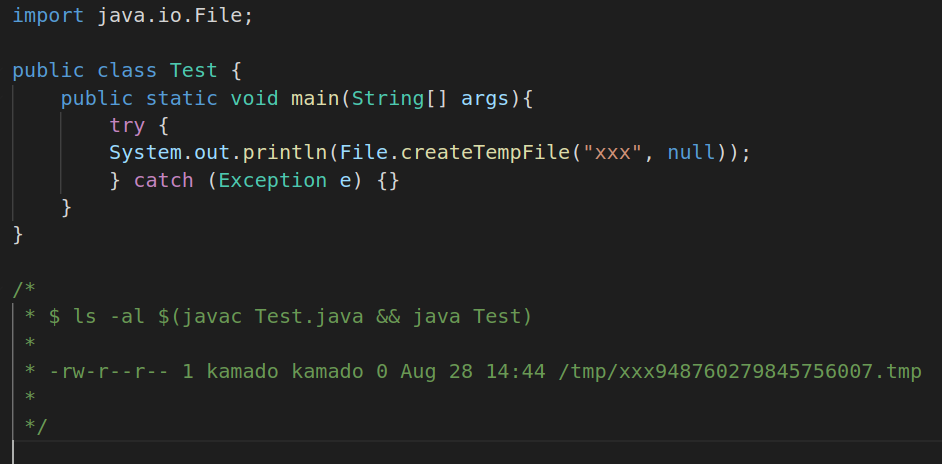

## Description

The **File.createTempFile** Java function works as follows:

`public static File createTempFile(String prefix, String suffix, File directory)`

  ***prefix*** − The prefix string defines the files name;
  must be at least three characters long

  ***suffix*** − The suffix string defines the file's extension;
  if null the suffix ".tmp" will be used

  ***directory*** − The directory in which the file is to be created.
  For default temporary-file directory null is to passed.

The first two arguments do not affect the security of the created file,
in Linux the files and directories are different entities,
they have their own permissions
and are isolated from other files and directories.

Protections you apply to the directory do not affect the files inside of it,
for example if I protect the directory
I can prevent that someone executes the `ls` command,
but nothing impedes to the attacker to execute `cat directory/file` command.

To prevent the access to the file I must protect the file, not the directory.

- *moment A:* create a **File.createTempFile** file
- *moment B:* add secure permissions to the file

Between moment A and moment B the file has insecure permissions
and an attacker can execute the `cat` command.

## Noncompliant

The **java.io.File.createTempFile** method creates files
with write permissions in groups and other:

The use of File.createTempFile is even vulnerable
if the permissions are added after because it is not atomic.

## Compliant solution

- Use Files.createTempFile instead of File.createTempFile.
Note that has an additional `s` letter.

- Use the `attrs` argument (an optional list of file attributes
to set atomically when creating the file).

## References

- [CWE-378: Creation of Temporary File With Insecure Permissions:](https://cwe.mitre.org/data/definitions/378.html)
Opening temporary files without appropriate measures or controls can leave the file, its contents and any function that it impacts vulnerable to attack.

- [CWE-379: Creation of Temporary File in Directory with Insecure Permissions:](https://cwe.mitre.org/data/definitions/379.html)
The software creates a temporary file in a directory whose permissions allow unintended actors to determine the file's existence or otherwise access that file.
