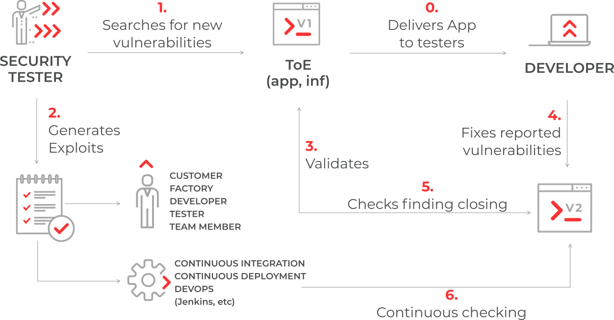

:slug: asserts/
:description: The purpose of this page is to present the Fluid Attacks's tool, Asserts. Asserts is an open-source tool that looks for deterministic and peripheral vulnerabilities, and that automates attacks to verify the status of vulnerabilities on different systems.
:keywords: Fluid Attacks, Products, Asserts, Ethical Hacking, Pentesting, Security.
:assertsindex: yes

= Asserts

link:https://pypi.org/project/fluidasserts/[PyPI] - link:https://libraries.io/pypi/FLUIDAsserts/[Libraries.io] - link:https://hub.docker.com/r/fluidattacks/asserts/[DockerHub]

== General description

*Asserts* is an open-source tool
that looks for deterministic and peripheral vulnerabilities
performing Dynamic and Static Application Security Testing (`DAST` - `SAST`).
*Asserts* also automates attacks to verify the status (*open*/*closed*)
of vulnerabilities on your system
and gives you fast feedback on the proposed solutions.
Therefore, *Asserts* can be included in `CI`/`CD` environments
as a security gate.

.Graphical representation

=== Technology stack

- Python for the source code.
- `AWS` to host the infrastructure.
- Terraform to define as Code the infrastructure.
- Docker to pack environments.
- `PGP`, `KMS`, and `SOPS` to encrypt secrets
and ensure safe-transport and storage of critical information.

== Key benefits

*Asserts* will allow you to

- perform generic security tests during the software life cycle;
- perform custom security tests during the software life cycle;
- encapsulate organization security policies as code,
and enforce them across your software life cycle;
- identify the status of deterministic vulnerabilities on your system;
- recognize the exact moment a vulnerability appeared
(for every vulnerability check, *Asserts* prints the `ToE` fingerprint);
- have an interactive cycle of vulnerability closing.

== What kind of technologies can Asserts test?

- [_New in v18.6_] link:../blog/stand-shoulders-giants/[Software composition analysis] (SCA):
*Asserts* inspects your project dependencies for known vulnerabilities,
including Bower, Chocolatey, Maven, NPM, NuGet, and PyPI.
- Clouds: *Asserts* includes checks for the 3 most popular clouds:
AWS (terraform and cloudformation), Azure, and GCP.
- Operating systems: Linux and Windows Server.
- Code: *Asserts* supports the following languages:
proprietary (C#), open source (Python, Java, Javascript, and Typescript),
markup (HTML), legacy (RPG), web configuration files,
and even the Dockerfile syntax!
- Formats: *Asserts* tests formats ranging from regular text
to CAPTCHAs and Cookies, as well as PDF files and X.509 certificates.
- Protocols: The heart of *Asserts*,
since most vulnerabilities are network-borne.
The main network protocols are covered:
SSL, HTTP, TCP, LDAP, SSH, DNS, FTP, REST, SMB, SMTP.

As of (date), 2020, *Asserts* provides (number) checks in the scenarios above.
Use the search box in the sidebar,
peruse the Index for a bird's eye view of all the checks,
or dive into the Reference.

== Data usage

*Asserts* collects some user data like public `IP` address,
operating system, Python version, and the name of the checks that you use.
We do this to analyze what are the most common platforms
and the most used functions.
This helps us develop more useful tests in the future.
You can disable the gathering of this information
setting an environment variable named "FA_NOTRACK"
and setting its value to "true."
You can enable the tracking later
by deleting that environment variable or changing its value to "false."
*Asserts* does not collect sensitive data
like targets of evaluation (`URLs`, `IPs`) or results of the tests.
