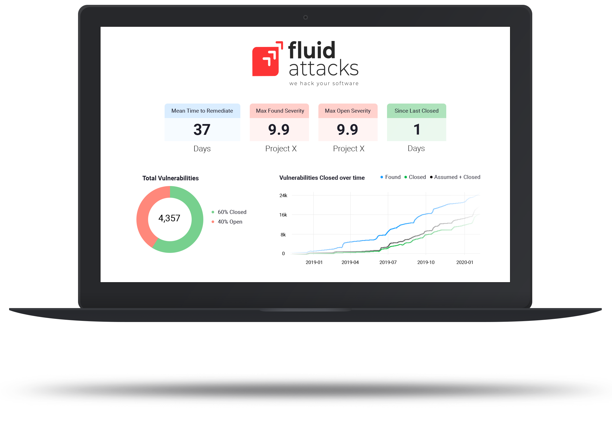
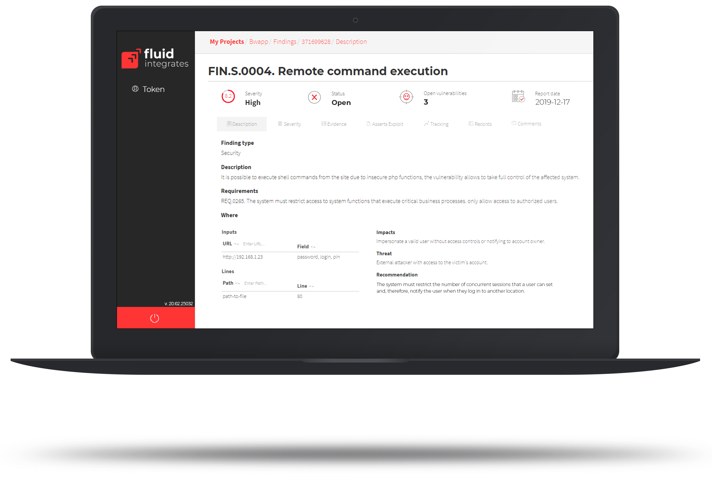
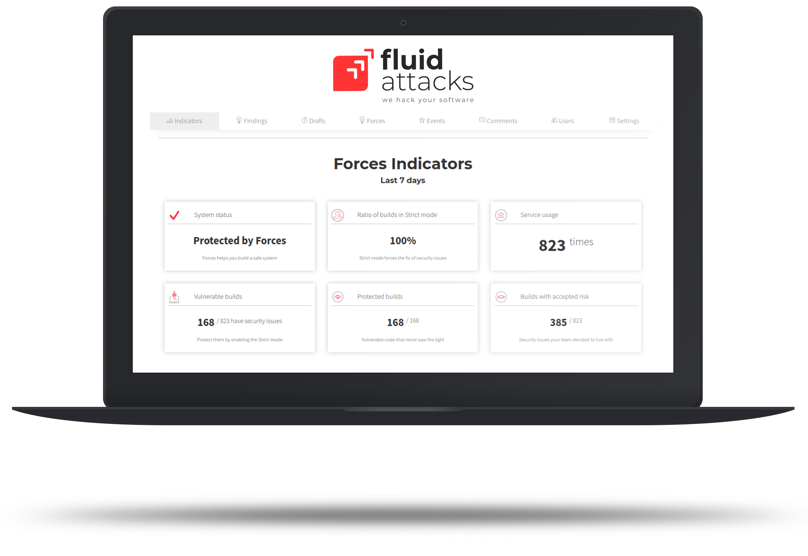

:slug: products/
:description: The purpose of this page is to present the products offered by Fluid Attacks, which focus on helping customers in the security testing process, aiming to improve their experience and allowing us to keep close contact with them. Our star products are Integrates and Asserts.
:keywords: Fluid Attacks, Products, Ethical Hacking, Pentesting, Security, Information.
:template: products/products

= Products

[role="w6 center pt5"]

== Integrates

*Integrates* is constituted as a platform to control all the remediation
processes in any stage of the software development life cycle.
This is a red team management tool for reporting all project findings in the
different phases and in real-time.

[role="w6 center pt3"]

== Drills

All vulnerabilities and security issues are continuously detected and reported
at high speed during the entire software development life cycle.
*Drills* performs ethical hacking of applications and infrastructure,
along with source code analysis.

[role="w6 center pt3"]

== Forces

*Forces* automates attacks with the goal of verifying the status
(open or closed) of vulnerabilities, and breaks the build to force the
remediation of open vulnerabilities.
Fluid Attacks creates personalized exploits that perform these attacks.

[role="w6 center pt3"]

== Rules

*Rules* is a set of security requirements that allows you to parameterize a
pentest according to the risk appetite of your organization.
Rules allows you to determine what is tested and what is not,
and what is considered a vulnerability or not.
It is also the basis for determining how rigorous a pentest was,
based on tested and untested requirements.
