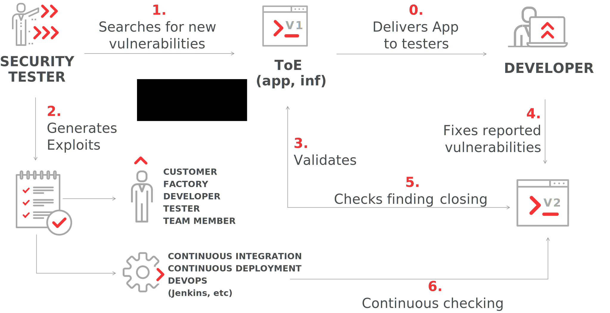
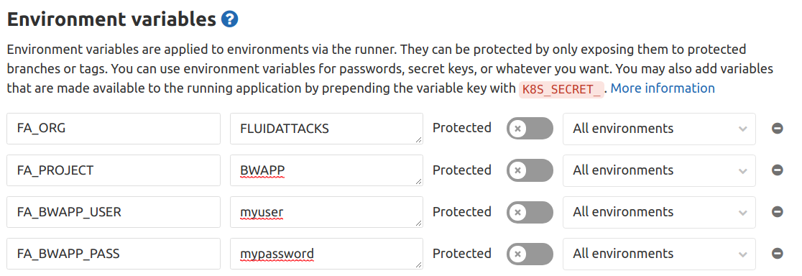

:slug: products/asserts/
:category: products
:description: In this page we present the products offered by Fluid Attacks. Asserts is an engine to automate the closing of security findings over execution environments.
:keywords: Fluid Attacks, Products, Asserts, Ethical Hacking, Pentesting, Security.
:template: salesforce

= Asserts

== 1. Description

`Asserts` is an engine that automates attacks
to verify the status (`open` or `closed`)
of vulnerabilities found by a security analyst.
`Asserts` can be included in `CI/CD` environments as security gate.

.Use case

Read the [button]#link:https://fluidattacks.com/asserts/[API documentation]#

== 2. Installation

`Asserts` is hosted on `PyPI`,
so you can install it easily using `pip3` on a system with `Python 3`:

[source, bash, linenums]
.asserts installation
----
$ pip3 install -U fluidasserts
----

For normal/interactive usage,
you should set the environment variable `FA_STRICT` to `false` (see below).
In an `UNIX` -like `OS`:

[source, bash, linenums]
----
$ export FA_STRICT="false"
----

In `Windows`:

[source, bash, linenums]
----
> set FA_STRICT="false"
----

Now you’re ready to begin link:https://fluidattacks.com/asserts/usage/[testing]
vulnerabilities’ closings.

=== Inside a Docker Container

If you have `Docker` you can check out
and run `Asserts` inside a container. Just:

[source, bash, linenums]
----
$ docker pull fluidattacks/asserts
----

And then go inside the container:

[source, bash, linenums]
----
$ docker run -it fluidattacks/asserts sh
/ # asserts

#  ___
# | >>|> fluid
# |___|  attacks, we hack your software
#
# Loading attack modules ...
----

Make sure to do the `docker pull`
before every docker run to ensure
you are running the latest `Asserts` version.

From inside the container you could run `Asserts`
from the `Python` interactive shell,
or quickly whip up a script using `vi`.
But it would be much more useful
to mount the directory where your exploits live into the container:

[source, bash, linenums]
----
$ docker run -v /home/me/myexploits/:/exploits/ -it fluidattacks/asserts sh
/ # asserts /exploits/open-sqli.py

#  ___
# | >>|> fluid
# |___|  attacks, we hack your software
#
# Loading attack modules ...

check: fluidasserts.proto.http.has_sqli
status: OPEN
message: A bad text was present
details:
  bad_text: Warning.*mysql_.*
  fingerprint:
    banner: "Server: nginx/1.4.1\r\nContent-Type: text/xml\r\nTransfer-Encoding: chunked\r\
      \nConnection: keep-alive\r\nX-Powered-By: PHP/5.3.10-1~lucid+2uwsgi2"
    sha256: 588702eb0b53294654f934d86664956e9739db47c34ffd8d703550cd5fd670a0
  url: http://testphp.vulnweb.com/AJAX/infoartist.php?id=3%27
when: 2018-09-06 08:33:08.781518
----

=== Usage in a CI (Continuous Integration) pipeline

If you have an application subscribed to our [inner]#link:../../use-cases/continuous-hacking/[Continuous Hacking Service ]#
which includes the use of `Asserts`,
you can integrate it into your `CI` pipeline
to ensure that your software builds and ships with no open vulnerabilities.
We will provide a custom `Docker` container
with the specific tests you need and maintain the build-breaking exploit.

To achieve this, follow these steps:

. Add the required environment variables `FA_ORG` and `FA_PROJECT`,
`FA_$\{FA_PROJECT\}_USER`, `FA_$\{FA_PROJECT\}_PASS`.
Don’t worry, the values will be provided by us!:
+
* `FA_ORG:` The name of the organization.
* `FA_PROJECT:` The name of the continuous hacking project.
* `FA_$\{FA_PROJECT\}_USER:` Name of the user from our Container Registry.
* `FA_$\{FA_PROJECT\}_PASS:` The password of the user.
+
For example, in Gitlab, and assuming `FA_ORG=FLUIDATTACKS` and
`FA_PROJECT=BWAPP`, the environment of the pipeline would look like this:
+

. Add a job to run `Asserts`.
For example, in `Gitlab`,
you would add these commands to your `.gitlab-ci.yml`:
+
.asserts in gitlab
[source, bash, linenums]
----
fluidasserts-static:
  script:
    - export STAGE="${FA_PROJECT}_static"
    - docker login fluid-docker.jfrog.io
        -u "$FA_BWAPP_USER"
        -p "$FA_BWAPP_PASS"
    - docker pull fluid-docker.jfrog.io/"$FA_ORG":"$STAGE"
    - docker run
        -e USER="$FA_BWAPP_USER"
        -e PASS="$FA_BWAPP_PASS"
        -e FA_STRICT=true
        -v "$PWD":/code
        fluid-docker.jfrog.io/"$FA_ORG":"$STAGE"
    - docker logout fluid-docker.jfrog.io

fluidasserts-dynamic:
    - export STAGE="${FA_PROJECT}_dynamic"
    - docker login fluid-docker.jfrog.io
        -u "$FA_BWAPP_USER"
        -p "$FA_BWAPP_PASS"
    - docker pull fluid-docker.jfrog.io/"$FA_ORG":"$STAGE"
    - docker run
        -e USER="$FA_BWAPP_USER"
        -e PASS="$FA_BWAPP_PASS"
        -e FA_STRICT=true
        fluid-docker.jfrog.io/"$FA_ORG":"$STAGE"
    - docker logout fluid-docker.jfrog.io
----
