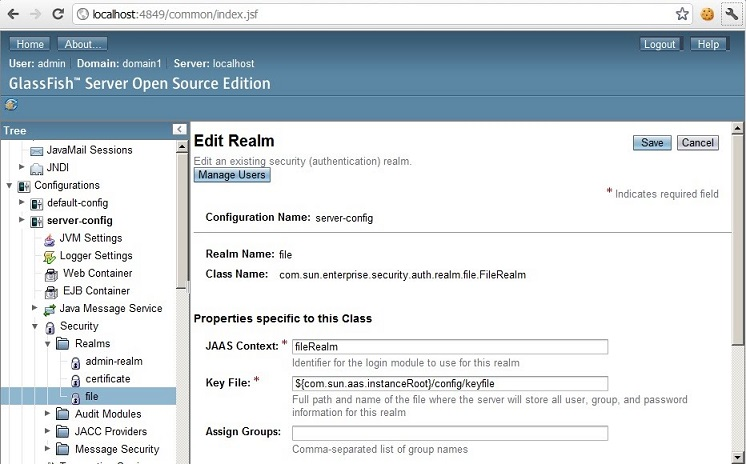
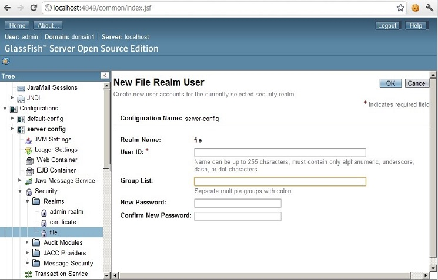

:slug: defends/glassfish/definir-rol-seguridad/
:category: glassfish
:description: Nuestros ethical hackers explican como evitar vulnerabilidades de seguridad mediante la configuracion segura en Glassfish al definir roles de seguridad. En las aplicaciones en general es necesario establecer los permisos de los usuarios para evitar posibles ataques o fugas de información.
:keywords: Glassfish, Definir, Roles, Seguridad, Usuarios, GPL.
:defends: yes

= Definir Roles de Seguridad

== Necesidad

Definir usuarios y roles en +GlassFish+.

== Contexto

A continuación se describen las circunstancias
bajo las cuales la siguiente solución tiene sentido:

. Se utiliza el servidor de aplicaciones +GlassFish+.
. Se desea configurar usuarios y roles en el +Realm+ de +GlassFish+.
. El sistema debe restringir el acceso a objetos del sistema
que tengan contenido sensible.<<r1,[1]>>

==   Solución

+GlassFish+ es un servidor de aplicaciones de +software+ libre
desarrollado por +Sun Microsystems+
y que implementa las tecnologías definidas en la plataforma +Java EE+
además permite ejecutar aplicaciones que siguen esta especificación.
Es gratuito, de código libre y se distribuye bajo un licenciamiento dual
a través de la licencia +CDDL+ y la +GNU GPL+ <<r2,[2]>>.

Cuando se está diseñando una aplicación web, o sistema en general,
se debe conocer los tipos de usuarios que tendrán acceso al mismo,
y una vez determinados quienes serán los usuarios, hay que definir
cuáles serán los roles que tendrán en la aplicación.

Según lo anterior, es posible decir que un usuario,
en general, es una persona, un componente de +software+ o incluso un servicio.<<r3,[3]>>

Por otra parte, un rol es un nivel de autorización definido para la aplicación
el cual será asignado a uno o varios usuarios
para que interactúen con la aplicación.
En otras palabras, define qué aplicaciones y qué partes de cada aplicación
pueden tener acceso los usuarios y qué pueden hacer.

Por ejemplo, una aplicación que administra
los empleados de una organización.
En ésta, los empleados podrían tener acceso
a toda su información personal,
pero no podrían ver la información de otros empleados,
ni editar la de ellos.
Pero los administradores, tendrían acceso
a la información de todos los empleados,
así como permisos para editarla.

En este ejemplo se podrían definir, al menos,
dos roles: empleado y administrador;
Los usuarios con el rol de empleado
solo podrán ver su propia información.
No obstante, los usuarios bajo el rol de administrador,
pueden ver y editar toda la información de todos los empleados.

Para crear un nuevo usuario seguimos los siguientes pasos:

. Iniciamos sesión en la link:https://docs.oracle.com/cd/E19798-01/821-1841/bnbxr/index.html[consola de administrador] de +GlassFish+.

. Expandimos el nodo de +Security -> Realms -> File+.
+

. Seleccionamos la opción de +Manage Users+, y luego +New user+.
+

. Creamos un usuario nuevo.

== Referencias

. [[r1]] link:../../../rules/176/[REQ.176 Restringir objetos del sistema].
. [[r2]] link:https://es.wikipedia.org/wiki/GlassFish[GlassFish].
. [[r3]] link:https://docs.oracle.com/cd/E19316-01/820-4335/abloe/index.html[Understanding Users, Groups, Roles, and Realms].
