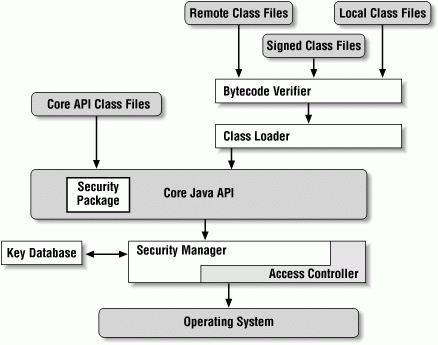
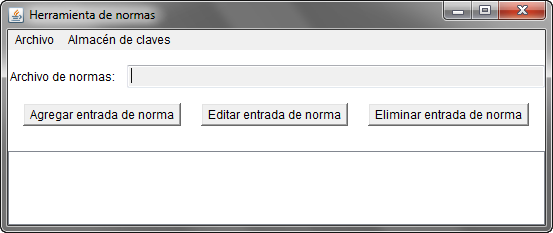
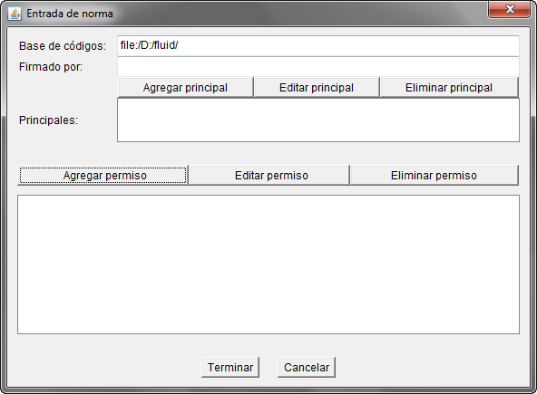

:slug: defends/java/establecer-politica-gui/
:category: java
:description: Nuestros ethical hackers explican como evitar vulnerabilidades de seguridad mediante la programacion segura en Java al establecer políticas de seguridad a través de la interfaz gráfica manteniendo el principio de mínimo privilegio, permitiendo disminuir las posibles brechas de seguridad.
:keywords: Java, Política, Seguridad, GUI, Mínimo Privilegio, Interfaz.
:defends: yes

= Establecer Política de Seguridad Por GUI

== Necesidad

Establecer políticas de seguridad mediante interfaz gráfica en +Java+
para mantener el principio del mínimo privilegio.

== Contexto

A continuación se describen las circunstancias
bajo las cuales la siguiente solución tiene sentido:

. Se está desarrollando una aplicación en +Java+.
. Se desea establecer una política de seguridad
para mantener el principio del mínimo privilegio.

== Solución

La plataforma +Java+ fue diseñada con un fuerte énfasis en seguridad.
En esencia, el lenguaje +Java+ en sí es de tipo seguro
y provee un recolector de basura automático,
mejorando la robustez del código de la aplicación.
Una carga de clases segura y un mecanismo de verificación
aseguran que solo código legítimo se ejecute ^<<r1,[1]>>^.

. De acuerdo al principio del mínimo privilegio,
el código no puede tener más privilegios
que aquellos que se tiene para ejecutar una determinada tarea.
Debe limitarse el uso de secciones de código que requieran elevar privilegios
y establecer políticas de seguridad sobre las clases de la aplicación ^<<r2,[2]>>^.

. La arquitectura de +Java+ permite establecer políticas de seguridad
sobre funcionalidades potencialmente peligrosas,
existen permisos sobre: audio, autenticación, entorno gráfico, delegación,
manejo de archivos, registro de eventos, administración de red, credenciales,
+sockets+, +SSL+, entre otros.

. En el siguiente diagrama se muestra la arquitectura de +Java+ ^<<r3,[3]>>^.
+

. Las clases pasan por un primer control
donde se verifica que el +bytecode+ esté bien formado.
Luego, el cargador de clase
busca y carga dinámicamente la clase si ésta existe,
el programador puede usar el paquete de seguridad de +Java+
para establecer permisos en tiempo de ejecución ^<<r4,[4]>>^.
Finalmente, y antes de que se haga la llamada al sistema operativo,
el administrador de seguridad y el controlador de acceso,
verifican que la aplicación tenga los privilegios necesarios
para ejecutar determinadas acciones.

. Este último filtro es definido por la política de seguridad
que establece el navegador,
la máquina virtual o el administrador del sistema ^<<r5,[5]>>^.

. A continuación un pequeño ejemplo para evidenciar la política de seguridad.

. Empezamos importando las clases que pertenecen a la biblioteca +io+
y definiendo el nombre de la clase principal.
+
.Politica.java
[source, java, linenums]
----
import java.io.*;

public class Politica {
----

. Desarrollamos el método principal, el cual llama al método +readFile+,
pasándole como ruta un archivo sensible que debería ser de solo lectura.
+
[source, java, linenums]
----
public static void main(String[] args) {
  readFile("D:\\fluid\\sensible.txt");
}
----

. Construimos el método +readFile+
e inicializamos los +buffer+ de lectura y escritura.
+
[source, java, linenums]
----
public static void readFile(String path) {
  BufferedReader reader = null;
  BufferedWriter writer = null;
----

. Agregamos un bloque +try-catch+, para capturar las excepciones necesarias.
Creamos el objeto +file+ con la ruta del archivo sensible.
+
[source, java, linenums]
----
try {
  File file = new File(path);
----

. Leemos el archivo y mostramos su contenido.
Finalmente, y para la demostración,
agregamos una línea con un nombre de usuario y contraseña.
+
[source, java, linenums]
----
writer.write("harold:admin\n");
String text;
while ((text = reader.readLine()) != null) {
   System.out.println(text);
}
----

. Capturamos las excepciones necesarias,
cerramos los recursos y terminamos el desarrollo de la aplicación:
+
[source, java, linenums]
----
   }
   catch (FileNotFoundException e) {
     System.err.println("File not found");
   }
   catch (IOException e) {
     System.err.println("I/O Exception");
   }
   catch (SecurityException e) {
     System.err.println("Write Denied");
   }
   finally {
     try {
       if (reader != null) {
         reader.close();
       }
       if (writer != null) {
         writer.close();
       }
     }
   catch (IOException e) {
       System.err.println("I/O Exception");
     }
   }
  }
}
----

. El contenido del archivo sensible es el mostrado a continuación.
+
[source, shell, linenums]
----
Este documento contiene informacion sensible
dcorrea:123456
----

. Al ejecutar por consola la aplicación,
nos muestra el contenido y finaliza normalmente.
+
[source, shell, linenums]
----
java Politica

Este documento contiene informacion sensible
dcorrea:123456
harold:admin
----

. El problema radica en que se ha escrito contenido
en el archivo sensible +harold:admin+,
y esto puede generar problemas de seguridad
si la entrada de datos no es correctamente validada.

. Para eliminar el problema se establecerá la política de seguridad
de solo lectura para el archivo sensible,
para esto se usará la herramienta +policytool+ que viene con el +JDK+ ^<<r6,[6]>>.

. En el pantallazo inicial vamos a la opción archivo,
y creamos un archivo que contendrá las políticas de seguridad.
+

. El siguiente paso es agregar una entrada, para ello,
damos clic en +Agregar entrada de norma+.
La base de códigos es la ruta de las clases
sobre las cuales aplicaremos la política de seguridad.
+

. Aplicaremos una política para el manejo de archivos +FilePermission+.
El nombre de destino es la ruta del archivo o los archivos
sobre los cuales la política tiene efecto,
y las acciones +read+, +write+, +delete+, +execute+.
+
image::policytool-2.png[permisos]

. La nueva política de seguridad se ha creado con el siguiente contenido:
+
[source, java, linenums]
----
/* AUTOMATICALLY GENERATED ON Wed Nov 30 10:39:30 COT 2011*/
/* DO NOT EDIT */
grant codeBase "file:/D:/fluidattacks/" {
  permission java.io.FilePermission "D:\\fluidattacks\\sensible.txt", "read";};
----

. Para ejecutar la aplicación con la política,
se deben especificar los parámetros
+java.security.manager+ y +java.security.policy+.
+
[source, shell, linenums]
----
java -Djava.security.manager -Djava.security.policy==politica.seguridad Politica
----

. El resultado tal como se esperaba es una violación de seguridad,
se captura la excepción y se muestra el error:
+
[source, shell, linenums]
----
Write Denied
----

== Descargas

Puedes descargar el código fuente
pulsando en el siguiente enlace:

[button]#link:src/politica.java[Politica.java]#
Archivo para mostrar como funciona las restricciones de seguridad.

== Referencias

. [[r1]] link:https://docs.oracle.com/javase/7/docs/technotes/guides/security/overview/jsoverview.html[Java Security Overview]
. [[r2]] link:https://en.wikipedia.org/wiki/Principle_of_least_privilege[Principle of least privilege]
. [[r3]] link:https://docstore.mik.ua/orelly/java-ent/security/ch02_01.htm[Chapter 2. Java Language Security]
. [[r4]] link:https://docs.oracle.com/javase/7/docs/technotes/guides/security/permissions.html[Permissions in the Java Development Kit]
. [[r5]] link:https://docs.oracle.com/javase/7/docs/technotes/guides/security/PolicyFiles.html[Default Policy Implementation and Policy File Syntax]
. [[r6]] link:https://docs.oracle.com/javase/tutorial/security/tour1/wstep1.html[Start Policy Tool]
. [[r7]] REQ.0264: Los privilegios para objetos nuevos
deben establecerse según el principio de mínimo privilegio.
