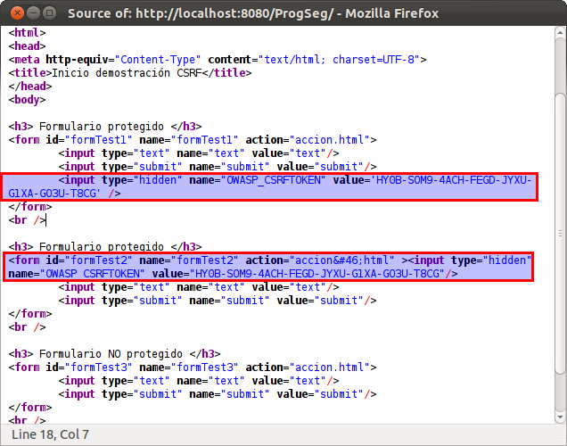

:slug: defends/java/prevenir-csrf-taglibs/
:category: java
:description: Nuestros ethical hackers explican como evitar vulnerabilidades de seguridad mediante la programacion segura en Java al prevenir ataques de tipo Cross Site Request Forgery utilizando taglibs de CSRFGuard.Esto resulta util cuando se tiene un contenedor de Servlets.
:keywords: Java, Seguridad, Buenas Prácticas, CSRF, Taglibs, Servlet.
:defends: yes

= Prevenir Cross Site Request Forgery Usando Taglibs

== Necesidad

Prevenir ataques +CSRF+ usando +taglibs+ de +CSRFGuard+ en +Java EE+.

== Contexto

A continuación se describen las circunstancias
bajo las cuales la siguiente solución tiene sentido:

. Se está desarrollando una aplicación +Java EE+.
. Se tiene instalado un contenedor de +servlets+.
. Se desea utilizar la versión +v3+ de la herramienta +CSRFGuard+.
. Se cuenta con la herramienta
+CSRFGuard v3+ ^<<r1,[1]>>^ instalada y configurada
. Se entiende el ataque +CSRF+.

== Solución

+Cross Site Request Forgery+ o por sus siglas +CSRF+,
es un ataque contra sitios web que fuerza a un usuario,
previamente registrado en la aplicación,
a ejecutar acciónes de forma no intencionada en la página.
Es decir, fuerza al navegador web de la víctima a enviar
una petición a una aplicación web vulnerable, entonces,
dicha aplicación se encarga de realizar
la acción elegida por el atacante a través de la víctima,
debido a que la actividad maliciosa
será procesada en nombre del usuario legitimo.
En pocas palabras, un atacante engaña
a un usuario legitimo para que envíe
peticiones maliciosas a la aplicación.

Al contrario de los ataques +XSS+,
los cuales explotan la confianza del usuario
para con un sitio particular;
el +Cross Site Request Forgery+
explota la confianza que un sitio web tiene
en un usuario particular.

Se describirá a continuación como emplear
la biblioteca +CSRFGuard+ ^<<r2,[2]>>^
para proteger el recurso +accion.html+
de peticiones no generadas desde formularios de la aplicación,
los cuales se encuentran en +index.jsp+.

. Primero, hay que definir aspectos generales de la página
como lo es el lenguaje, el tipo de contenido
y la forma de codificación.
Acto seguido, se incluye el +taglib+ de +CSRFGuard+,
usando como prefijo +csrf+
para que pueda ser utilizado,
de forma abreviada, en las líneas siguientes.
+
.accion.html
[source, html, linenums]
----
<%@ page language="java" contentType="text/html; charset=UTF-8" pageEncoding="UTF-8"%>
<%@ taglib uri="http://www.owasp.org/index.php/Category:OWASP_CSRFGuard_Project/Owasp.CsrfGuard.tld"
   prefix="csrf" %>
<html>
----

. En el primer formulario, se debe incluir un campo oculto
cuyo nombre y valor serán generados dinámicamente por la biblioteca.
+
[source, html, linenums]
----
<h3> Formulario protegido </h3>
<form id="formTest1" name="formTest1" action="accion.html">
  <input type="text" name="text" value="text"/>
  <input type="submit" name="submit" value="submit"/>
  <input type="hidden" name="<csrf:token-name/>"
    value='<csrf:token-value uri="accion.html"/>' />
</form>
 
----

. El segundo formulario se define usando el +taglib+ +csrf:form+,
el cual, automáticamente, se encarga de agregar
un campo oculto análogo al del primer formulario.
+
[source, html, linenums]
----
<h3> Formulario protegido </h3>
<csrf:form id="formTest2" name="formTest2" action="accion.html">
  <input type="text" name="text" value="text"/>
  <input type="submit" name="submit" value="submit"/>
</csrf:form>
 
----

. Ambos formularios intentarán hacer una petición +GET+ a +accion.html+
enviando el campo oculto que permitirá
comprobar la validez de la solicitud.

. Finalmente se cierran los +tags+ aún abiertos
+
[source, html, linenums]
----
 </body>
</html>
----

. Examinando el código fuente generado para los formularios,
se puede apreciar el valor de los campos ocultos.

== Referencias

. [[r1]] link:https://www.owasp.org/index.php/Cross-Site_Request_Forgery_(CSRF)[Cross-Site Request Forgery (CSRF)]
. [[r2]] link:https://www.owasp.org/index.php/Category:OWASP_CSRFGuard_Project[CSRFGuard Project]
. [[r3]] link:../../../rules/174/[REQ.174 Transacciones sin patrón discernible]
