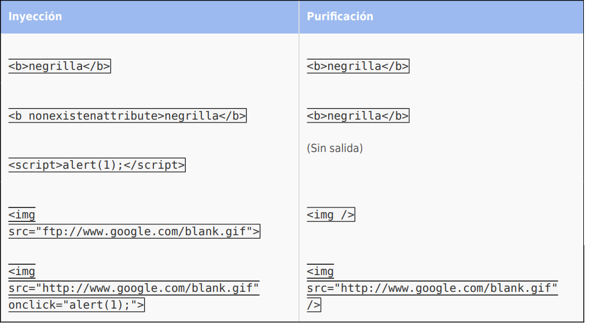

:slug: defends/java/purificar-html/
:category: java
:description: Nuestros ethical hackers explican como evitar vulnerabilidades de seguridad mediante la programacion segura en Java utilizando Jsoup para purificar el código HTML. Jsoup es una biblioteca especializada en seguridad que define una lista blanca de atributos, evitando inyecciones de código malicioso.
:keywords: Java, Seguridad, Buenas Prácticas, HTML, Jsoup, Servlet.
:defends: yes

= Purificar HTML

== Necesidad

Purificar HTML en Java usando Jsoup

== Contexto

A continuación se describen las circunstancias
bajo las cuales la siguiente solución tiene sentido:

. Se está desarrollando una aplicación en +Java+ usando +servlets+

. El código debe estar codificado
según el lenguaje correspondiente (ej: +HTML+, +JS+, +escaping+). ^<<r3,[3]>>^

== Solución

La purificación de código +HTML+
es el proceso de examinar un documento +HTML+
con el fin de buscar etiquetas o +tags+ que se consideran seguros
(por lo general, estos +tags+ son previamente definidos
en una lista blanca o +whitelist+).
Una vez se ha identificado las etiquetas seguras,
se procede a eliminar los tags considerados como inseguros.
Por último, se genera un nuevo documento +HTML+
donde se incluyen solo los +tags+ resultantes.

La purificación del +HTML+ se hace
con el fin de evitar el uso de etiquetas
que podrían permitir la inyección de código malicioso
lo cual podría generar diversas vulnerabilidades,
por ejemplo, +Cross Site Scripting+.

Para purificar el código +HTML+
y así evitar las inyecciones de código malicioso
se debe usar bibliotecas especializadas.
Éste es el caso de +Jsoup+ ^<<r1,[1]>>^.

+Jsoup+ es un analizador de +HTML+ que, entre sus características,
encontramos la capacidad de limpiar código +HTML+
definiendo una lista blanca de atributos.

En la siguiente aplicación se hará uso de la biblioteca
la cual purificará el código +HTML+
cuando encuentre etiquetas o valores
que no se encuentren en la lista blanca.

. Comenzamos desarrollando la aplicación
importando las clases necesarias
para la correcta ejecución del +servlet+.
+
.purify.java
[source, java, linenums]
----
import java.io.*;
import java.util.*;
import javax.servlet.*;
import javax.servlet.http.*;
----

. Importamos las clases de la biblioteca +jsoup+ y el paquete +safety+.
+
[source, java, linenums]
----
import org.jsoup.*;
import org.jsoup.safety.*;
----

. Definimos el nombre de la clase y el método +doGet+.
+
[source, java, linenums]
----
public class Purify extends HttpServlet {
  public void doGet(HttpServletRequest request, HttpServletResponse response)
    throws IOException, ServletException {
----

. Obtenemos el +writer+ para escribir la respuesta al cliente
y el contenido del atributo +content+.
+
[source, java, linenums]
----
PrintWriter out = response.getWriter();
String unsafe = request.getParameter("content");
----

. Definimos la lista blanca, la cual permite el uso de etiquetas básicas.
+
[source, java, linenums]
----
Whitelist basicWithImages = Whitelist.basic()
----

. Extendemos la lista blanca agregando la etiqueta +img+.
+
[source, java, linenums]
----
.addTags(new String[] { "img" })
----

. A dicha etiqueta le agregamos los atributos permitidos.
+
[source, java, linenums]
----
.addAttributes("img", new String[] { "align", "alt", "height", "src", "title", "width" })
----

. Finalmente, para el atributo +src+, agregamos los protocolos permitidos.
+
[source, java, linenums]
----
.addProtocols("img", "src", new String[] { "http", "https" });
----

. Llamamos al método +clean+ de la clase +Jsoup+
pasándole como parámetro el contenido inseguro y la lista blanca.
El contenido seguro es asignado al atributo +safe+.
+
[source, java, linenums]
----
String safe = Jsoup.clean(unsafe, basicWithImages);
----

. Establecemos el tipo de contenido como +HTML+
e imprimimos el resultado de la purificación.
+
[source, java, linenums]
----
response.setContentType("text/html");
out.println(safe); }}
----

. Las listas blancas que trae la herramienta por defecto son:
+
[source, shell, linenums]
----
*Whitelist.simpleText()*
"b", "em", "i", "strong", "u"
----
+
[source, shell, linenums]
----
*Whitelist.basic()*
"a", "b", "blockquote", "br", "cite", "code", "dd", "dl",
"dt", "em", "i", "li", "ol", "p", "pre", "q", "small",
"strike", "strong", "sub", "sup", "u", "ul"
----
+
[source, shell, linenums]
----
*Whitelist.basicWithImages()*
basic()."img"
----
+
[source, shell, linenums]
----
*Whitelist.relaxed()*
"a", "b", "blockquote", "br", "caption", "cite", "code", "col", "colgroup",
"dd", "div", "dl", "dt", "em", "h1", "h2", "h3", "h4", "h5", "h6", "i", "img",
"li", "ol", "p", "pre", "q", "small", "strike", "strong", "sub", "sup",
"table", "tbody", "td", "tfoot", "th", "thead", "tr", "u", "ul"
----

. A continuación observe algunos ataques de inyección
y su resultado luego de la purificación.

== Descargas

Puedes descargar el código fuente
pulsando en el siguiente enlace:

. [button]#link:src/purify.java[purify.java]#
contiene la manera en que se debe usar la biblioteca +Jsoup+.

== Referencias

. [[r1]] link:https://jsoup.org/[JSOUP]
. [[r2]] link:https://en.wikipedia.org/wiki/HTML_sanitization[HTML sanitization]
. [[r3]] link:../../../rules/160/[REQ.160 Salidas codificadas]
