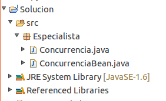
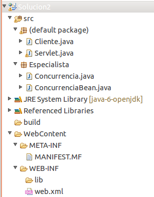

:slug: defends/java/utilizar-concurrencia-ejb/
:category: java
:description: Nuestros ethical hackers explican como evitar vulnerabilidades de seguridad mediante la programacion segura en Java al utilizar concurrencia utilizando Enterprise JavaBeans. EJB le proporciona al programador un modelo en donde se detalla cómo los servidores de aplicaciones web proveen objetos.
:keywords: Java, Seguridad, EJB, Weblogic, JavaBeans, Concurrencia.
:defends: yes

= Utilizar Concurrencia Usando EJB

== Necesidad

Utilizar concurrencia en una aplicación usando +EJB+ en +Java+

== Contexto

A continuación se describen las circunstancias
bajo las cuales la siguiente solución tiene sentido:

. Se tiene una aplicación en +Java EE 1.6+.
. Se tiene un servidor de aplicaciones +WebLogic 10.3+.
. Se desea implementar la tecnología +EJB+.

== Solución

+EJB+ o +Enterprise JavaBeans+
son una de las interfaces de programación de aplicaciones
que forman parte del estándar
de construcción de aplicaciones empresariales +J2EE+.
Estas proporcionan un modelo de componente distribuido estándar
del lado del servidor con el objetivo de dotar al programador
de un modelo que le permita abstraerse
de los problemas generales de una aplicación empresarial.

. Se generará un +EJB+ de sesión sin estado
utilizando las anotaciones de +EJB3+.

. Lo primero que se hará es crear el +EJB+, este necesita dos clases,
la +interface+ y el +Bean+ como tal,
que serán incluidas en el paquete +Especialista+.

. Clase de la interface de negocio: +Concurrencia.java+.
+
.Concurrencia.java
[source, java,linenums]
----
package Especialista;

import javax.ejb.*;

@Remote
// se dice que utilizara conexión remota.
//interface de el ejb

public interface Concurrencia {
  public long Proceso1(long tipo);//declaración de proceso1
  public String Proceso2(long tipo);//declaración de proceso2
}
----

. Clase del +EJB+: +ConcurrenciaBean+,
aquí es donde se ejecutara toda la lógica transaccional.
+
[source, java,linenums]
----
package Especialista;

import javax.ejb.*;

@Remote(Concurrencia.class)

@Stateless (mappedName="Especialista/Concurrencia" )

public class ConcurrenciaBean {

 //proceso de prueba numero 1, hace un retardo en tiempo para simular una transacción
  public long Proceso1(long tipo){
    boolean evento = false;
    while(evento==false)
    {
      if (System.currentTimeMillis() >= tipo)
      {
        evento=true;
      }
    else{
        System.out.println("Procesando......");
      }
    }
    long milis =System.currentTimeMillis();
    return milis;
  }

   //proceso de prueba numero 2, hace un retardo en tiempo para simular una transacción
   public String Proceso2(long tipo){
     boolean evento = false;
     while(evento==false)
     {
       if (System.currentTimeMillis() >= tipo)
       {
         evento=true;
       }
     else {
         System.out.println("Procesando222222......");
       }
     }
     return "Fin Proceso";
   }
}
----

. *ACLARACIÓN:* Los +System.out.println()+ constituyen una situación
en una auditoría de código fuente, en este caso,
esta función se hace para ver el funcionamiento de los +EJB+ en la solución.

. Para que el proyecto funcione
hay que agregarle la librería de el +weblogic+ para el manejo de +EJB+,
por lo general esta librería se encuentra en la ruta.
+
[source, shell,linenums]
----
/DirectorioDeInstalación/Oracle/Middleware/wlserver_10.3/server/lib/weblogic.jar
----

. Estructura del proyecto:
+

. Una vez el proyecto esté sin errores se exporta a un +JAR+.

. Se despliega el +EJB+ en el servidor de aplicaciones y se inicia el mismo.

. Ahora se creará una aplicación web +Java+,
que en este caso tendrá un +servlet+
y una clase encargada de llamar el +EJB+
haciendo conexión con el +WebLogic+.

. Clase Servlet:
+
[source, java,linenums]
----
//imports necesarios para el servlet
import java.io.*;
import javax.servlet.*;
import javax.servlet.http.*;

public class Servlet extends HttpServlet {

    public void doGet(HttpServletRequest request, HttpServletResponse response)
    throws IOException, ServletException
    {
        response.setContentType("text/html; charset=ISO-8859-1");

        PrintWriter out = response.getWriter();
        //se instancia la clase Cliente que es la que se comunica con el EJB.
        Cliente cl = new Cliente();
        out.println("iniciaProceso");
        cl.Inicio();
        out.close();
    }
}
----

. Clase +Cliente+: esta clase es la que se encarga
de hacer el llamado al +EJB+.
+
[source, java,linenums]
----
//imports necesarios
import java.util.Properties;
import javax.naming.Context;
import javax.naming.InitialContext;
import javax.naming.NamingException;
import javax.rmi.PortableRemoteObject;
import Especialista.Concurrencia;

public class Cliente {
  //Se hace el llamado al metodo Carga que es el que inicia el ejb.
  public void Inicio() {
    long milis=System.currentTimeMillis()+10000;
    System.out.println("inicia Proceso solucion 1");
    carga(milis);
  }

  public static void carga(long i){
     //se hace la conexión al weblogic donde se encuentra el ejb
     Properties prop = new Properties();
     prop.put(Context.INITIAL_CONTEXT_FACTORY,"weblogic.jndi.WLInitialContextFactory");
     //cambiar por la configuracion del servidor de aplicaciones
     prop.put(Context.PROVIDER_URL, "t3://localhost:7001/");
     try {
       //objeto con la información de conexión
       InitialContext contexto = new InitialContext(prop);
       // se le especifica el EJB a ejecutar
       Object obj =
       contexto.lookup("Especialista.Concurrencia#Especialista.Concurrencia");
       Concurrencia Conc = (Concurrencia) PortableRemoteObject.narrow(obj, Concurrencia.class);
       //se utilizan 2 procesos del ejb como prueba
       long tipo =i;
       long res =Conc.Proceso1(tipo);
       System.out.println("Pasa a proceso 2");
       String res2 =Conc.Proceso2(res+10000);
       System.out.println(res2);
     }
   catch (NamingException e) {
       // evento excepcional a tratar cuando entre a producción.
     }
   }
}
----

. Hay que recordar que se debe montar
el paquete +Especialista+ en este proyecto
para que el +ID+ no arroje ningún tipo de error.

. En el archivo +web.xml+ se le agregan los descriptores del +Servlet+.
+
[source, xml,linenums]
----
<?xml version="1.0" encoding="UTF-8"?>
  <web-app id="WebApp_ID" version="2.4"
    xmlns="http://java.sun.com/xml/ns/j2ee"
    xmlns:xsi="http://www.w3.org/2001/XMLSchema-instance"
    xsi:schemaLocation="http://java.sun.com/xml/ns/j2ee
    http://java.sun.com/xml/ns/j2ee/web-app_2_4.xsd">
    <display-name>Solucion2</display-name>
    <welcome-file-list>
      <welcome-file>index.html</welcome-file>
      <welcome-file>index.htm</welcome-file>
      <welcome-file>index.jsp</welcome-file>
      <welcome-file>default.html</welcome-file>
      <welcome-file>default.htm</welcome-file>
      <welcome-file>default.jsp</welcome-file>
    </welcome-file-list>
    <servlet>
      <servlet-name>Servlet</servlet-name>
      <servlet-class>Servlet</servlet-class>
    </servlet>
    <servlet-mapping>
      <servlet-name>Servlet</servlet-name>
      <url-pattern>/UrlServlet</url-pattern>
    </servlet-mapping>
  </web-app>
----

. La estructura del proyecto es:
+

. Una vez el proyecto esté sin errores se exporta a un +WAR+.

. Se despliega la aplicación en el servidor +Weblogic+.

. Por último se corre el servlet para que haga el llamado al EJB.

== Descargas

Puedes descargar el código fuente
pulsando en los siguientes enlaces:

[button]#link:src/concurrencia.java[Concurrencia.java]#
Interfaz Concurrencia.

[button]#link:src/concurrenciabean.java[ConcurrenciaBean.java]#
Clase Concurrencia.

[button]#link:src/servlet.java[Servlet.java]#
Clase Servlet.

[button]#link:src/cliente.java[Cliente.java]#
Clase Cliente.

== Referencias

. [[r1]] link:https://docs.oracle.com/cd/E11035_01/wls100/ejb30/index.html[Programming WebLogic Enterprise JavaBeans, Version 3.0]
. [[r2]] link:http://wiki.eclipse.org/EclipseLink/Examples/JPA/WebLogic_Web_Tutorial[WebLogic Web Tutorial]
. [[r3]] link:../../../rules/164/[REQ.164 Utilizar estructuras optimizadas]
