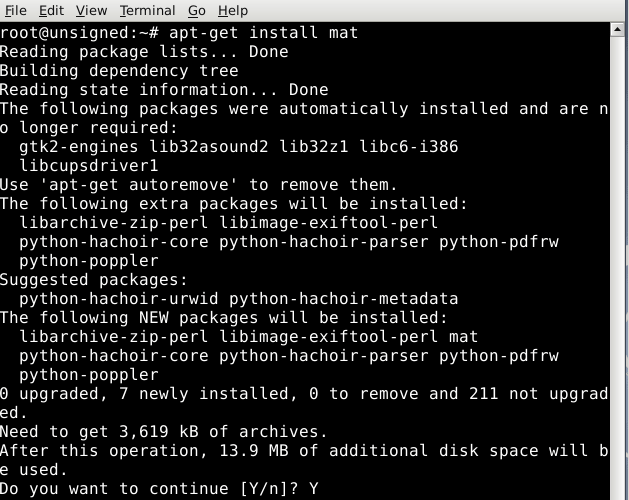
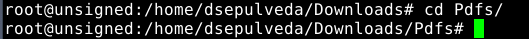
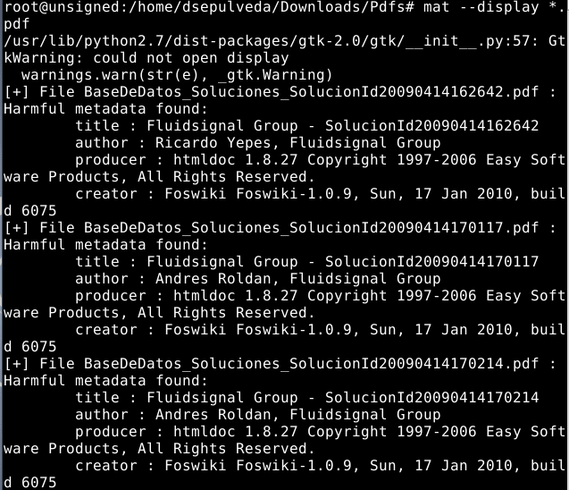
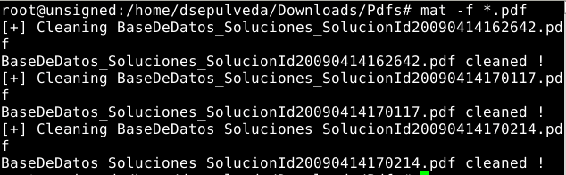
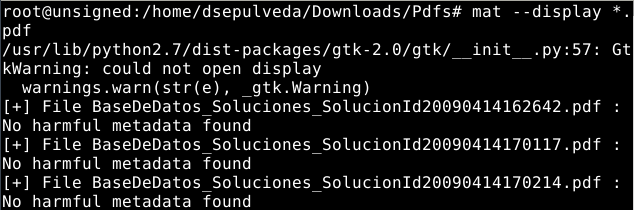

:slug: defends/linux/remover-metadatos/
:category: linux
:description: Nuestros ethical hackers explican como evitar vulnerabilidades de seguridad mediante la programacion segura en Linux al remover los metadatos de distintos tipos de archivos. Los metadatos pueden contener información sensible, por lo que es altamente recomendable eliminarlos.
:keywords: Linux, Eliminar, Metadatos, Archivos, Imágenes, Documentos
:defends: yes

= Remover Metadatos

== Necesidad

Eliminar metadatos en archivos de forma masiva.

== Contexto

A continuación se describe las circunstancias
bajo las cuales la siguiente solución tiene sentido:

. Se tiene un sistema operativo basado en +Linux+.

. Se debe eliminar los metadatos presentes
en los siguientes tipos de archivos previa a su exposición a internet:

* +Portable Document Format+ - .+pdf+.
* +Portable Network Graphics+ - +.png+.
* +JPEG+ - +.jpeg+ - +.jpg+.
* +Open Documents+ - +.odt+ - +.odx+ - +.ods+.
* +Office OpenXml+ - +.docx+ - +.pptx+ - +.xlsx+.
* +Tape ARchives+ - +.tar+ - +.tar.bz2+ - +.tar.gz+.
* +Zip+ - +.zip+.
* +MPEG Audio+ - +.mp3+ - +.mp2+ - +.mp1+.
* +Ogg Vorbis+ - +.ogg+.
* +Free Lossless Audio Codec+ - +.flac+.
* +Torrent+ - +.torrent+.

== Solución

Los metadatos pueden ser encontrados en una gran variedad de archivos,
y sirven para proporcionar información adicional
que facilite su ordenamiento de acuerdo a un criterio específico.
Entre los metadatos más comunes encontramos: Fecha de creación,
Fecha de modificación, Autor, Tamaño, Dimensiones, entre muchos otros.
Sin embargo, estos pueden representar una fuente de información sensible
a la espera de ser filtrada
y que en manos de un atacante
comprometería la seguridad de una aplicación.
Por ello es recomendable remover los metadatos
antes de exponer un archivo a Internet.
Para realizarlo contamos con muchas alternativas.
En este artículo nos enfocaremos en cómo realizar este procedimiento
con paquetes y librerías propias de +Linux+.
Para ello debemos seguir el siguiente procedimiento:

. Instalar la aplicación +Metadata Anonymisation Toolkit+ (+Mat+).
Podemos realizar la instalación ejecutando los siguientes comandos:
+
.Instalación Mat
[source, bash, linenums]
----
sudo apt-get update
sudo apt-get install mat
----
+
La siguiente imagen muestra el resultado
del procedimiento descrito anteriormente:
+
.Instalación del Paquete Mat

. Dirigirse a la carpeta que contiene los archivos
cuyos metadatos deben ser eliminados
+
[source, bash, linenums]
----
cd /home/dsepulveda/Downloads/Pdfs
----
+
Cambiar al directorio de destino.
Nuestro directorio de destino se ve así:
+
.Cambio de directorio

. Verificar que los archivos contienen metadatos utilizando un +wildcard+ (*)
y el tipo de formato a verificar.
Las extensiones soportadas se mencionan al inicio del artículo.
Para ello utilizamos el siguiente comando:
+
[source, bash, linenums]
----
mat --display *.pdf
----
+
Cuando el comando encuentra metadatos peligrosos,
arroja el siguiente resultado:
+
.Metadatos peligrosos en archivos

. Eliminar los metadatos de un tipo de archivo específico,
utilizando el siguiente comando:
+
[source, bash, linenums]
----
mat -f *.pdf
----
+
Al realizar la limpieza de los metadatos,
se despliegan los siguientes mensajes:
+
.Metadatos eliminados

+
. Una vez ejecutado el comando anterior
verificamos que los archivos quedaron libres de metadatos:
+
[source, bash, linenums]
----
mat --display *.pdf
----
+
Sabemos que los metadatos fueron eliminados exitosamente
si observamos el siguiente mensaje:
+
.Verificación de eliminación de metadatos

+
Este procedimiento se realizó con archivos +PDF+.
Para eliminar los metadatos de otro tipo de archivos
se repiten los pasos anteriores utilizando la extensión deseada.

== Referencias

. [[r1]] link:https://mat.boum.org/[Metadata Anonymisation Toolkit(Mat)].
. [[r2]] link:https://www.welivesecurity.com/la-es/2014/05/13/metadatos-fotos-podrian-mostrar-mas/[ESET - Metadatos: tus fotos podrían mostrar más de lo que ves].
. [[r3]] link:https://opendatasecurity.io/es/que-revelan-los-metadatos-en-las-fotos/[Open Data Security - ¿Qué revelan los metadatos en las fotos?].
. [[r4]] link:../../../rules/045/[REQ.045 Eliminar metadatos al compartir archivos].
