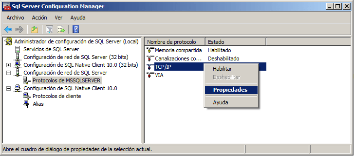
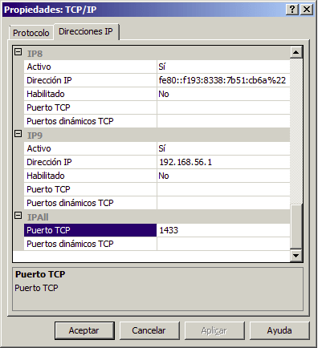

:slug: defends/sql-server/cambiar-puerto-default/
:category: sqlserver
:description: Nuestros ethical hackers explican como evitar vulnerabilidades de seguridad mediante la configuracion segura en Microsoft SQL Server 2008 al cambiar el puerto predeterminado. Las configuraciones predeterminadas usualmente son conocidas y  suponen una vulnerabilidad potencial para el sistema.
:keywords: SQL Server 2008, Cambiar, Puerto, Determinado, Configuración, Seguridad.
:defends: yes

= Cambiar Puerto Predeterminado

== Necesidad

Cambiar puerto predeterminado en +Microsoft SQL Server+.

== Contexto

A continuación se describe las circunstancias
bajo las cuales la siguiente solución tiene sentido:

. Se utiliza el servidor de bases de datos +SQL Server 2008+.
. Se desea cambiar el puerto predeterminado de +SQL Server 2008+.

== Solución

Los servidores por regla general utilizan puertos para ejecutar sus servicios.
Estos puertos son ocupados durante la instalación del servidor
y pueden ser modificados a lo largo del tiempo.
Mantener las configuraciones por defecto en las aplicaciones
es una práctica peligrosa, debido a que por lo general los atacantes
se aprovechan de esto para conocer el funcionamiento interno del sistema.

La configuración predeterminada de el servidor +SQL Server+
utiliza el puerto +TCP 1433+ para el servicio,
estos puertos son bien conocidos y son un blanco común para los atacantes.
Por esta razón se recomienda cambiar el puerto predeterminado
de la instalación de +SQL Server+
para mejorar la seguridad general del sistema.

Los siguientes pasos explican como cambiar el puerto predeterminado
utilizando el +SQL Server Manager+:

. Para acceder a las herramientas de configuración,
haga clic en el menú +Inicio+, +Todos los Programas+,
+Microsoft SQL Server 2008+, +Configuration Tools+,
+SQL Server Configuration Manager+.

. Expandir el nodo de +SQL Server 2008 Network Configuration+
y seleccione +Protocolos+.

. En el panel de la derecha,
haga clic secundario en el nombre del protocolo +TCP/IP+
y elija +Propiedades+,
como se muestra en la siguiente figura.
+
.SQL Server Configuration Manager

. En el cuadro de diálogos +TCP/IP Properties+,
seleccione la pestaña +Direcciones IP+.

. En la entrada correspondiente a la dirección +IP+ asignada al servidor.
Eliminar los valores para ambos puertos +TCP+ para cada dirección +IP+,
excepto para la dirección +IP+ bajo +IP ALL+.

. En la sección +IP All+ escriba el nuevo puerto
que desea usar en +SQL Server 2008+.
+
.Ventana de Propiedades TCP/IP

+
Cabe mencionar que el puerto seleccionado
debe estar libre para poder ser ocupado por el servidor,
en caso contrario la configuración fallará.
También es necesario elegir un puerto que utilice
el mismo protocolo de comunicación,
por lo que es altamente recomendable
revisar de antemano los puertos disponibles
así como los protocolos que utilizan
antes de finalizar la configuración.
Para mayor información sobre los puertos
y los protocolos que utilizan, puedes consultar <<r3, ^[3]^>>.

. Finalmente, para aplcar los cambios presione el botón +Aplicar+
y reinicie los servicios de +SQL+.

== Referencias

. [[r1]] link:../../../rules/033/[REQ.033 Restringir acceso administrativo].
. [[r2]] link:https://www.iana.org/assignments/service-names-port-numbers/service-names-port-numbers.xhtml[Service Name and Transport Protocol Port Number Registry].
. [[r3]] link:https://docs.microsoft.com/en-us/sql/database-engine/configure-windows/configure-a-server-to-listen-on-a-specific-tcp-port?view=sql-server-2017[Configure a Server to Listen on a Specific TCP Port]
