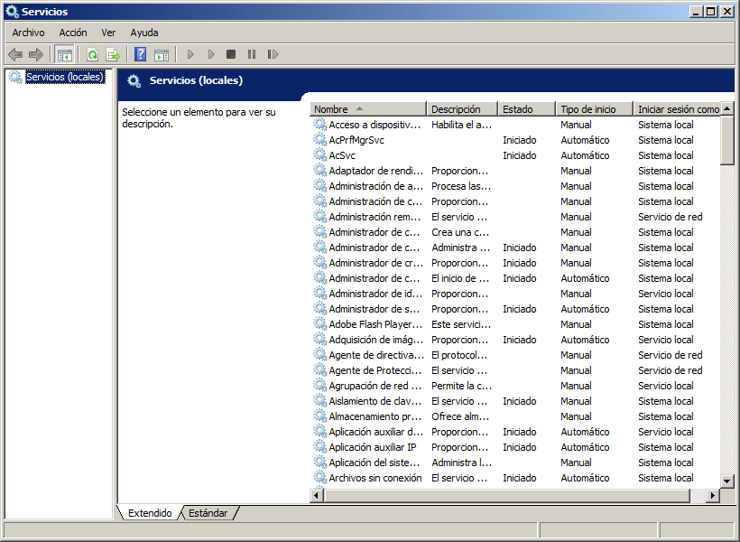
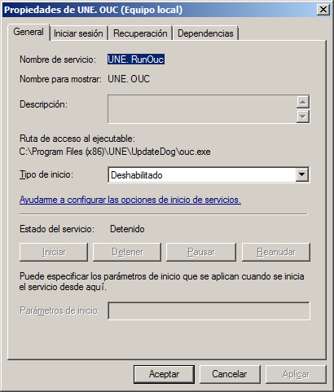
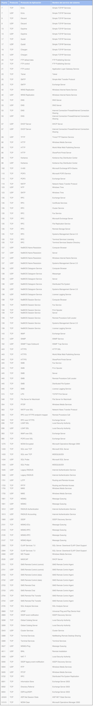
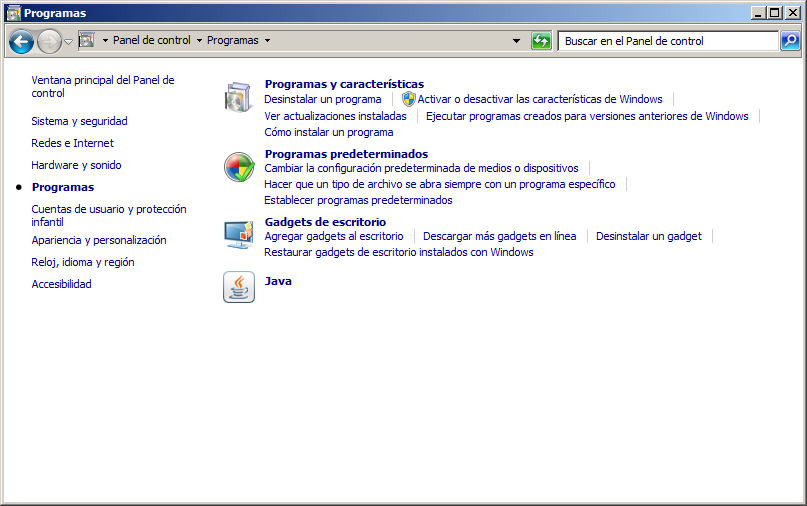
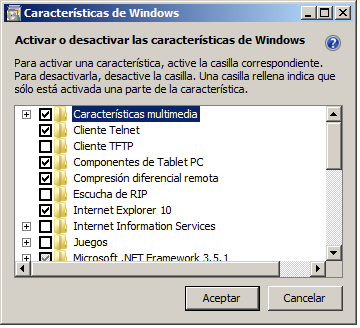

:slug: defends/windows/deshabilitar-serv-inseguro/
:category: windows
:description: Nuestros ethical hackers explican como evitar vulnerabilidades de seguridad mediante la configuracion segura de Windows. En este instructivo, explicaremos paso a paso cómo deshabilitar servicios inseguros en un sistema operativo Windows con el fin de evitar el ingreso de malware al equipo.
:keywords: Windows, Seguridad, Deshabilitar, Servicios, Inseguros, Windows 7.
:defends: yes

= Deshabilitar Servicios Inseguros

== Necesidad

Deshabilitar servicios inseguros en +Windows 7+.

== Contexto

A continuación se describen las circunstancias
bajo las cuales la siguiente solución tiene sentido:

. Se tiene instalado el sistema operativo +Windows 7+.
. Opcionalmente se desea propagar la configuración
a equipos pertenecientes a un dominio +Windows+.

== Solución

. Para deshabilitar servicios a través del directorio activo,
se deben seguir los siguientes pasos:

. Clic en +Start+, +Run+.
Allí ingresar +gpmc.msc+ y dar clic en +OK+.

. Allí ir al dominio al cual se le desea aplicar la configuración
y dar clic en +Group Policy Objects+.

. En el panel del lado derecho, dar clic derecho y seleccionar +New+.

. Asignar un nombre y en +Source Starter GPO+ seleccionar +none+.

. Dar clic derecho en la política creada y seleccionar +Edit+.

. Navegar hacia la ruta
+configuration\Policies\Windows Settings\Security Settings\System Services+.

. Allí seleccionar los servicios que se quiere habilitar o deshabilitar

. También es posible modificar la configuración
para máquinas localmente de la siguiente forma.

. Para desactivar los servicios que se consideren inseguros,
un usuario con rol de administrador
debe acceder a +Panel de Control \Herramientas Administrativas\Servicios+.
Luego de autenticarse si es el caso,
observará una ventana como la siguiente:
+

. Para deshabilitar un servicio haga clic secundario y pulse +Propiedades+.
En la opción tipo de inicio,
seleccione +Deshabilitado+ y pulse +Aceptar+.
+

. Al momento de deshabilitar un servicio,
asegúrese de que realmente no sea necesario
según el rol que el equipo vaya a cumplir dentro de la infraestructura.

. Ciertos servicios con alta probabilidad de no ser necesarios en +Windows 7+
se listan a continuación ^<<r1,[1]>>^:
* +IP Helper+
* +Offline Files+
* +Network Access Protection Agent+
* +Parental Controls+
* +Smart Card+
* +Smart Card Removal Policy+
* +Windows Media Center Receiver Service+
* +Windows Media Center Scheduler Service+
* +Windows Media Player Network Sharing Service+
* +Fax+
* +HomeGroup Listener+
* +HomeGroup Provider+
* +Tablet PC Input Service+

. A continuación, se muestran los servicios tradicionales de +Windows+.
En general son los más aptos a ser deshabilitados.
Estos servicios fueron adaptados de la solución referenciada en ^<<r2,[2]>>^.
+

. El listado mostrado para su sistema
dependerá de los servicios que se hayan instalado previamente.
Por ejemplo, el conjunto de servicios denominado +Simple TCP/IP Services+,
dependerá de la configuración en +Panel de Control\Programas+.
+

. Y, además, también dependerá de +características\Activar+ o +Desactivar+
las características de +Windows+.
+

. Es recomendable deshabilitar todos los servicios
que no sean necesarios para el sistema.
Puede encontrar más información de la relación
entre número de puerto y nombre del servicio en ^<<r3,[3]>>^.

== Referencias

. [[r1]] link:https://www.techrepublic.com/blog/10-things/10-plus-windows-7-services-you-may-not-need/[Services you may not need]
. [[r2]] link:../deshabilitar-puertos/[Deshabilitar puertos innecesarios]
. [[r3]] link:https://support.microsoft.com/es-es/help/832017/service-overview-and-network-port-requirements-for-windows[Network port requirements for Windows]
. [[r4]] link:../../../rules/266/[REQ.266 Deshabilitar funciones inseguras]
. [[r5]] link:../../../rules/267/[REQ.267 Deshabilitar funciones innecesarias]
