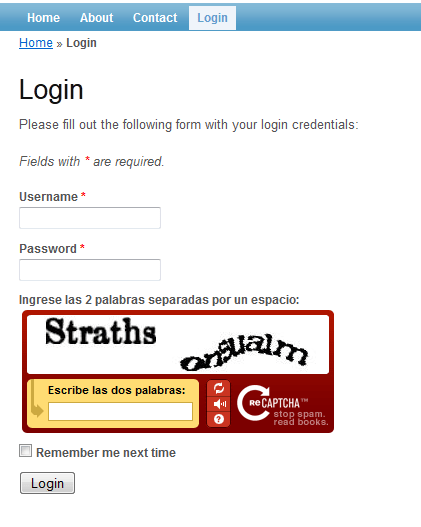

:slug: defends/yii/usar-recaptcha/
:category: yii
:description: Nuestros ethical hackers explican como evitar vulnerabilidades de seguridad mediante la programacion segura en PHP con el framework Yii al implementar recaptcha. Para evitar ataques de bots a la aplicación se recomienda el uso de CAPTCHAs para validar la identidad del usuario.
:keywords: Yii, PHP, CAPTCHA, Validación, Formularios, Humano.
:defends: yes

= Usar reCAPTCHA

== Necesidad

Utilizar +reCaptcha+ en los formularios sensibles de la aplicación.

Contexto

A continuación se describen las circunstancias
bajo las cuales la siguiente solución tiene sentido:

. Se utiliza el lenguaje de programación +PHP+.
. Se utiliza el +framework+ de desarrollo +Yii+.
. Se cuenta con credenciales de acceso al servicio +reCaptcha+
(clave pública y privada).
. Se desea verificar la identidad del usuario.
. Se desea restringir el uso y envío de formularios sensibles
únicamente a usuarios humanos.

== Solución

A la hora de pensar en la seguridad de la aplicación
existen muchas pautas a seguir para crear códigos y sistemas seguros.
Los +CAPTCHA+
(+Completely Automated Public Turing test to tell Computers and Humans Apart+)
fueron creados como una herramienta que permite distinguir
entre humanos y máquinas
a través de pruebas de reconocimiento de caracteres o imágenes.
Ésta herramienta puede utilizarse para incrementar la seguridad de un sistema
en determinadas secciones,
pues garantiza que quien esté realizando las acciones es un humano.
Se recomienda implementar este control en formularios sensibles
o modificaciones importantes del usuario,
para garantizar que no sean realizadas de forma automática.

En este artículo mostraremos como implementar +reCAPTCHA+
en formularios sensibles de la aplicación
para evitar el envío de formularios por parte de robots o autómatas,
restringiendo el uso únicamente a usuarios humanos.
Realizaremos esto haciendo uso del
+framework+ de desarrollo +Yii+ de +PHP+.
Para ello debemos seguir la siguiente serie de pasos:

. El primer paso es descargar la extensión reCaptcha para +Yii framework+
desde link:http://www.yiiframework.com/extension/recaptcha/[su página oficial].
La instalación se realiza copiando la carpeta
en la ruta +./protected/extensions/+.

. Para poder utilizar +reCaptcha+ en un formulario
se incluye el siguiente código en la vista:
+
.captcha-validation.php
[source, php, linenums]
----
<?php echo CHtml::activeLabel($model, 'validacion'); ?>
<?php $this->widget('application.extensions.recaptcha.EReCaptcha',
  array('model'=>$model, 'attribute'=>'validacion',
    'theme'=>'red', 'language'=>'es_ES',
    'publicKey'=>'6LcdEt0SAAAAAPllsWYqrE7IYD9hhJxrM69YjVKO')) //la clave pública del servicio reCaptcha?>
<?php echo CHtml::error($model, 'validacion'); ?>
----

. En el modelo del formulario se agrega el campo +validacion+.
Posteriormente se deben realizar modificaciones
al método rules +yattributeLabels+ del modelo
como se describirá en pasos posteriores.

. Se agrega el atributo +$validacion+ al modelo del formulario,
como se muestra en el siguiente código:
+
[source, php, linenums]
----
public $validacion;
----

. Se agrega la siguiente línea al método +rules()+ del modelo.
Como se muestra a continuación:
+
[source, php, linenums]
----
public function rules(){
  return array(
    ...
    array('validacion',
      'application.extensions.recaptcha.EReCaptchaValidator',
      'privateKey'=>'6LcdEt0SAAAAADFKwpo_juDPdAA9VxFW9fZd5o4Z'),//clave privada del servicio reCaptcha
      ...
  );
}
----

. Se agrega la siguiente línea al método +attributeLabels()+ del modelo.
Como se muestra en el siguiente fragmento de código:
+
[source, php, linenums]
----
public function attributeLabels(){
  return array(
  ...
  'validacion'=>Yii::t('demo', 'Ingrese las 2 palabras separadas por un espacio: '),
  ...
  );
}
----

. Como resultado del proceso anterior,
podemos observar que nuestro formulario ahora cuenta con un +reCAPTCHA+,
como se muestra en la siguiente imagen:
+
.reCAPTCHA Implementado en los formularios de la aplicación

. De esta manera el formulario será enviado únicamente
si el usuario completa satisfactoriamente el +reCAPTCHA+,
validando así la identidad del usuario como humano.

== Referencias

. [[r1]] link:http://www.yiiframework.com/extension/recaptcha/[Yii Framework reCAPTCHA extension].

. [[r2]] link:../../../rules/237/[REQ.237 Establecer acciones de usuario seguras].
